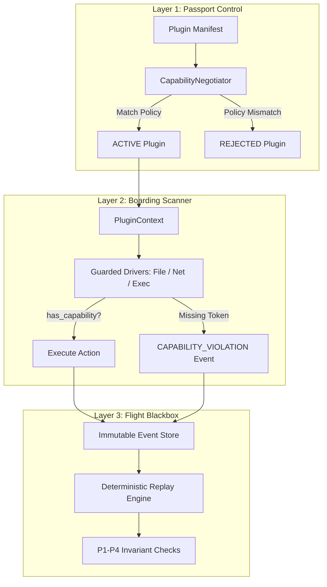

# Cortex Platform: Spatiotemporal Authority & Semantic Verification Framework

[](https://pypi.org/project/cortex-runtime/)
[](https://python.org)
[](LICENSE)
[](https://github.com/microsoft/pyright)

> **Cortex** is a spatiotemporal authority and semantic verification framework designed to enforce execution integrity, capability-negotiated sandboxing, and post-facto deterministic verification across autonomous software runtimes and AI agent architectures.

---

## 📖 Narrative Arc: Why Cortex Exists

### 1. The Problem at Scale
Traditional security systems rely on static user identities (POSIX permissions, IAM roles, cgroups). However, **autonomous AI agents and non-deterministic software break traditional security models**:
* **Ambient Authority Leakage**: Agents executing inside shell environments inherit full ambient process permissions, allowing unintended file access or dynamic execution.
* **Subshell Script Bypasses**: Malicious or miscalibrated agents can invoke shell scripts (`.sh`), subprocesses, or eval blocks to bypass high-level application checks.
* **Non-Deterministic State Drift**: Without causal trace verification, auditing *why* an autonomous agent performed an action after a failure or security breach is impossible.

### 2. The Cortex Value Proposition
Cortex replaces ambient authority with a **3-Layer Security Boundary**:
1. **Static Capability Negotiation**: Manifests declare required permissions before plugins access the kernel bus (`CapabilityNegotiator`).
2. **Runtime Sandbox Proxy**: Guarded resource drivers evaluate capability tokens before firing raw I/O system calls (`PluginContext`).
3. **Deterministic Replay Audit**: Post-execution trace verification validates $P1$–$P4$ invariants and causal lineage graphs (`cortex workflow replay`).

### 3. Dual-Layer Framing: Non-Technical Analogy vs. Technical Mechanics



| Security Layer | Non-Technical Analogy | Technical Mechanics |
| :--- | :--- | :--- |
| **Layer 1: Static Negotiation** | **Passport & Visa Check**<br/>Validates passport and visa credentials before granting entry into the country. | `CapabilityNegotiator.negotiate()` evaluates `PluginManifest.required_capabilities` against `platform_capabilities`. |
| **Layer 2: Runtime Sandbox Proxy** | **Boarding Gate Scanner**<br/>Ensures passengers present a valid boarding pass for that specific door before entering the aircraft. | `PluginContext.has_capability()` validates tokens before Guarded Resource Drivers fire I/O system calls. |
| **Layer 3: Verification & Trace Replay** | **Flight Blackbox Recorder**<br/>Records all flight telemetry in a tamper-evident blackbox for post-flight accident investigation. | `DeterministicReplayEngine` re-simulates event streams (`.cortex/events/*.json`), validating $P1$–$P4$ invariants. |

---

## 🚀 Quickstart & Developer Experience

### 1. Installation

Install via PyPI or fast package manager `uv`:

```bash
# Standard pip
pip install cortex-runtime

# Fast installation with Astral uv
uv pip install cortex-runtime

# Or run directly with uv tool
uvx cortex-runtime --help
```

### 2. Scaffold a New Project

```bash
cortex init my_app --type app
cd my_app
```

### 3. Execute, Inspect, and Replay Workflows

```bash
# Execute workflow
cortex workflow run workflow.json

# Inspect causal execution graph
cortex workflow inspect .cortex/events/<workflow_id>.json

# Perform 100% deterministic replay audit
cortex workflow replay .cortex/events/<workflow_id>.json
```

---

## 📚 Developer Portal & Quick Links

- 🚀 **[Developer Quickstart Guide](docs/quickstart.md)**: Install `cortex-runtime`, build workflows, and run plugins.
- 💻 **[CLI Reference Documentation](docs/cli.md)**: Standard CLI command usage (`init`, `workflow run`, `inspect`, `replay`).
- 🏛️ **[Architecture & Security Model](docs/architecture.md)**: 3-layer security boundary, dual-layer framing, and threat neutralization.
- 🔐 **[Capability Manifest Specification](docs/manifest_spec.md)**: `PluginManifest` schema and negotiation rules.
- 🔬 **[Research Documentation](Research/)**: Formal whitepapers, mathematical invariants ($P1$–$P4$), and CS literature taxonomy.
- 📐 **[Coq Proof Substrate](coq/)**: Interactive formal verification proof scripts.
- ⚡ **[Rust Emulator Engine](cortex-emulator/)**: Hardware state machine emulator.

---

## 🔬 Adversarial Systems Research: Working Hypothesis ($H_{\text{prop}}$)

This repository houses a rigorous, peer-reviewed adversarial falsification program for autonomous systems. The primary function of this research is to validate the **Working Hypothesis ($H_{\text{prop}}$)**:

> **Does an existing semantic preservation relation characterize when the externally observable effects of an execution remain within the authority constraints delegated to that execution under the stated threat model?**
>
> *We posit this may be expressible as a relational hyperproperty over operational traces, but leave its classification strictly open pending empirical literature analysis.*

If adversarial analysis reveals that a composition of existing CS frameworks satisfies all safety properties under $H_{\text{prop}}$, no new semantic layer is required. If the analysis exposes an irreducible semantic gap, that gap defines the formal requirements for a new candidate specification.

---

## 🛡️ The Safety Properties Catalog ($P1$–$P4$)

Every composition is evaluated against four orthogonal, non-overlapping safety properties under the **Generalized Semantic Transition Relation ($\Sigma; \Lambda \vdash I \Longrightarrow e$)** mapping input streams ($I$) to terminal target actions ($e$) through intermediate **Operational Artifacts ($\mathcal{A}$)**:

$$\frac{\Sigma; \Lambda \vdash I \xrightarrow{\text{derive}} \mathcal{A} \quad \quad \mathcal{A} \in \text{Adm}(\Lambda) \quad \quad \Sigma; \Lambda \vdash \mathcal{A} \xrightarrow{\text{enact}} e}{\Sigma; \Lambda \vdash I \Longrightarrow e}$$

*   **P1 — Authority Soundness:** Bounded authority must be delegable and attenuable across downstream context shifts such that a principal cannot execute or delegate permissions beyond its initial envelope.
*   **P2 — Execution Integrity:** The byte-level parameter state of an executed action must remain structurally unaltered between the generation boundary and the interface enforcement perimeters under the stated threat model.
*   **P3 — Semantic Consequence Preservation:** Every externally observable, irreversible effect must be demonstrably and traceably derivable from the active delegation constraints: $\Sigma \models \text{Preserves}(\Lambda, e)$.
*   **P4 — Independent Verifiability:** An external, post-facto verifier must be capable of establishing the validity of P3 without trusting the execution runtime beyond the boundaries of an explicitly declared Trusted Computing Base (TCB).

---

## 🔬 Literature Taxonomy (21 Disciplines)

The research program maps system interactions across 21 distinct computer science areas:
1. **Capability Security** (Confinement & Ambient Authority Elimination)
2. **Programming Languages** (Type Safety, Scoped-Use Semantics)
3. **Delegated Authorization** (Offline-Verifiable Attenuation)
4. **Authorization Engines** (Relationship Graphs & Relational Logic)
5. **Data Provenance** (Platform-Independent Derived Lineage)
6. **Whole-System Provenance** (Kernel-Level Telemetry Interception)
7. **Systemic Accountability** (Tamper-Evident Non-Repudiation Logs)
8. **Distributed Transactions** (Atomicity & Consistency Guarantees)
9. **Workflow Systems** (Durability & State Checkpointing)
10. **Formal Methods** (Process Calculi & Temporal Logic Modelling)
11. **Formal Verification** (Mathematical Correctness Proofs)
12. **Information Flow Control** (Integrity Boundaries & Labels)
13. **Trusted Computing** (Hardware Enclave Isolation)
14. **Language-Based Security** (Non-Interference & Secure Compilation)
15. **Operational Semantics** (Structural Operational Semantics, Evaluation Relations)
16. **Program Logics** (Hoare Logic, Separation Logic, Refinement Calculi)
17. **Static Analysis** (Abstract Interpretation, Monadic Effects)
18. **Proof-Producing Computation** (SMT Solvers, Certified Abstract Interpretation)
19. **Secure Compilation** (Robust Safety/Hyperproperty Preservation)
20. **Algebraic & Rewriting Frameworks** (Institution Theory, Maude, K Framework)
21. **Runtime Verification** (Online Trace Compliance & Enforcement Monitors)

---

## 📊 Evaluation Status Matrix

Evaluating candidate compositions over safety properties P1–P4 led to the lock phase, which confirmed the need for a unified spatiotemporal semantic layer incorporating versioned epochs and step-indexing. This has been formalized as the **Cortex Spatiotemporal Mechanics** (FC_01–FC_09):

| ID | Composition Structure | P1 | P2 | P3 | P4 | Verdict / Current Status |
| --- | --- | :---: | :---: | :---: | :---: | :---: |
| **CC-01** | Whole-System Provenance + Capability Security | **✓** | **✓** | **✗** | **✗** | **Complete (Partially Covered)** |
| **CC-04** | Capability Security + Program Logics | **✓** | **✓** | **~** | **✗** | **Complete (Partially Covered)** |
| **CC-05** | Language-Based Security + Trusted Computing | - | - | - | - | **FROZEN (Identified Semantic Gaps)** |
| **CC-08** | Runtime Verification + Capability Security | - | - | - | - | **FROZEN (Identified Semantic Gaps)** |
| **Cortex** | Spatiotemporal Preorders + Epoch-Indexed Value/Trace Relations | **✓** | **✓** | **✓** | **✓** | **FORMALLY PROVEN & ROADMAPPED** |

*Legend: **✓** (Success)  |  **✗** (Failed)  |  **~** (Partial Success)  |  **-** (Not yet evaluated / Frozen)*

---

## 🛠️ Repository Rules & Governance

1. **LOCKED State:** Foundational survey, model, and formal construction documents are frozen once complete to maintain strict control over confirmation bias.
2. **No Marketing Syntax:** Language remains strictly technical, quantitative, and neutral.
