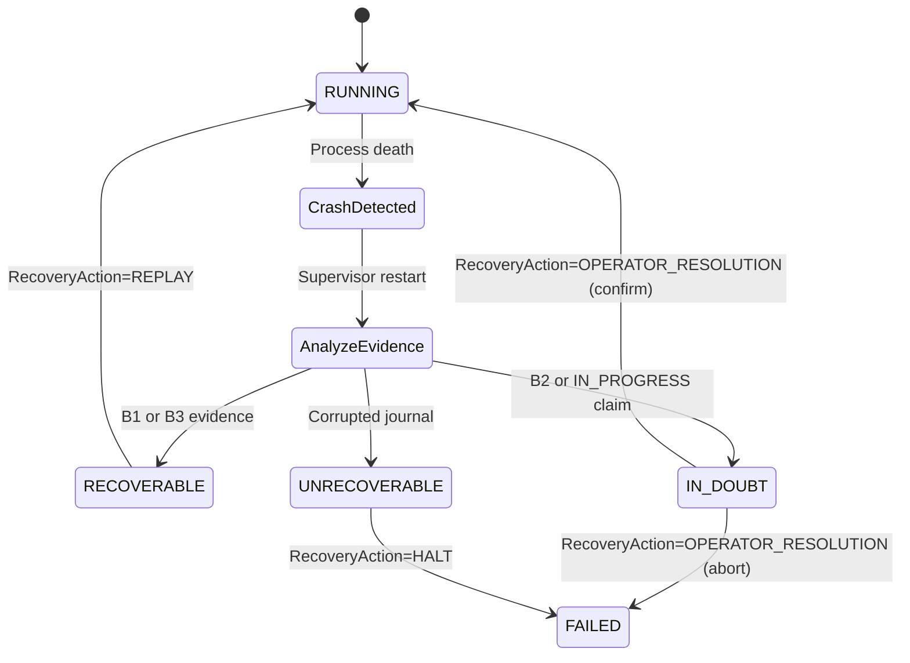

# ADR-003: Polyglot Execution Kernel & Language-Neutral Semantic Contract

**Status**: REVISION #5 — FROZEN  
**Date**: 2026-08-13  
**Authors**: Cortex Architecture & Core Engineering Teams  
**Supersedes**: N/A  
**Evidence Base**: Issues #10 (Telemetry), #11 (Crash Semantics), #12 (Timeout/Cancellation), #13 (Recovery & Side Effects)  
**Target Release**: v0.3.0  

---

## Executive Summary

This Architectural Decision Record (ADR) establishes the **Cortex Semantic Contract** — the authoritative, language-neutral specification that any execution kernel (Python, Rust, Go, Zig, C++, etc.) must conform to. The Python v0.2.x codebase is the **reference implementation**, not the ultimate authority. If Python behavior diverges from this contract, that is a bug in the reference implementation.

Based on empirical research from Issues #10-13, this ADR:

1. Defines core entities with journal-position-based causal ordering (not wall-clock timestamps)
2. Establishes an evidence-based recovery model using explicit command lifecycle transitions
3. Specifies an atomic idempotency claim protocol safe under concurrent workers
4. Defines a canonical value model (`CortexValue`) separating semantics from wire encoding
5. Defines conformance as normative test vectors plus property-based/state-machine verification

**Key Architectural Principle**: The Cortex Semantic Contract is the core product asset. Implementation languages, transports, and deployment choices are replaceable and must earn their place through empirical evidence.

### Document Layering

This ADR is structured in six levels to prevent technology choices from contaminating the semantic contract:

```
LEVEL 1  Semantic Contract        (this ADR, Sections 3–4)
LEVEL 2  Recovery & Security      (this ADR, Sections 4, 5.4)
LEVEL 3  Protocol Contract        (this ADR, Section 3.1.8, Appendix C)
LEVEL 4  Transport Candidates     (this ADR, Section 5 — not adopted)
LEVEL 5  Runtime Implementation   (candidate languages — not assigned)
LEVEL 6  Deployment Choices         (systemd, Kubernetes, etc. — illustrative only)
```

Levels 4–6 are explicitly non-normative for conformance. An independent engineer implementing from Levels 1–3 MUST NOT need to read Python source code.

### Architecture Hierarchy

```
                    CORTEX SEMANTIC CONTRACT  ← AUTHORITATIVE
                             │
                ┌────────────┴────────────┐
                │                         │
           WHAT IT MEANS             FAILURE SEMANTICS
                │                         │
          Events/Commands             Recovery
          Capabilities                Idempotency
          State                       Cancellation
          Lineage                     Faults
                │                         │
                └────────────┬────────────┘
                             ↓
                     PROTOCOL CONTRACT
                             │
                  Schema + framing + auth
                             │
              ┌──────────────┴──────────────┐
              ↓                             ↓
       Python Reference              Candidate Runtime
       Implementation               Rust / Go / Zig / C++
              │                             │
              └──────────────┬──────────────┘
                             ↓
                     CONFORMANCE VERIFICATION
                             │
              100% normative vectors + property tests
              performance evaluated separately
```

---

## Table of Contents

1. [Context & Problem Statement](#1-context--problem-statement)
2. [Claim Classification Framework](#2-claim-classification-framework)
3. [Language-Neutral Semantic Contract](#3-language-neutral-semantic-contract)
4. [Evidence-Based Recovery State Machine](#4-evidence-based-recovery-state-machine)
5. [IPC Transport & Security Boundary Analysis](#5-ipc-transport--security-boundary-analysis)
6. [Supervisor Failure Domains & External Integration](#6-supervisor-failure-domains--external-integration)
7. [Candidate Runtime Evaluation & Conformance Testing](#7-candidate-runtime-evaluation--conformance-testing)
8. [Decision](#8-decision)
9. [Consequences](#9-consequences)
10. [Appendices](#10-appendices)

---

## 1. Context & Problem Statement

### 1.1 Architectural Evolution

Cortex v0.2.x established:
- A capability-based security model with manifest negotiation
- Event-sourced workflow orchestration with causal lineage
- Plugin isolation and exception handling within single-process Python runtime

However, empirical research (Issues #10-13) revealed fundamental limitations:

**Issue #10 (Telemetry)** [PROVEN]: P50 latency of 0.226ms for in-process plugins is acceptable, but tail latencies (P99 = 4.089ms) suggest need for predictable resource isolation.

**Issue #11 (Crash Semantics)** [PROVEN]: Python exceptions are properly trapped and isolated, but low-level crashes (SIGSEGV, os._exit) kill the entire host process, affecting all workflows and plugins.

**Issue #12 (Timeout/Cancellation)** [PROVEN]: Cooperative cancellation works for well-behaved plugins, but non-cooperative blocking (time.sleep, GIL contention, infinite loops) stalls the main event loop. Hard preemption requires OS-level process isolation (SIGKILL).

**Issue #13 (Recovery & Side Effects)** [PROVEN]: Process death destroys 100% of in-memory state. The v0.2 EventStore is in-memory and loses volatile state when the host process terminates. Crash during mid-execution (after side-effect start, before event commit) creates operational ambiguity requiring explicit IN_DOUBT state management.

### 1.2 The Polyglot Execution Challenge

To enable v0.3 supervisor-worker architecture, we must answer:

1. **What behavioral contract must ALL execution kernels satisfy?**
2. **What evidence establishes recovery classification without querying external systems?**
3. **What atomic protocol prevents duplicate side effects under concurrent workers?**
4. **How do we verify conformance without coupling to Python implementation details?**

### 1.3 Requirements

**MUST HAVE** [REQUIREMENT]:
- Language-agnostic semantic contract precise enough for independent implementation
- Journal-position-based causal ordering (not wall-clock timestamps)
- Explicit command lifecycle evidence for recovery classification
- Atomic idempotency claim protocol safe under concurrency
- Conformance framework: normative vectors + property-based invariant testing

**MUST NOT** [REQUIREMENT]:
- Break existing 21-symbol public API contract (`len(cortex.__all__) == 21`)
- Modify runtime behavior of 172 canonical unit tests
- Use wall-clock timestamps as causal correctness mechanism
- Infer external side-effect status from unavailable audit logs
- Treat Python reference implementation as authoritative over the semantic contract

---

## 2. Claim Classification Framework

Every key architectural claim is classified using one of four tags:

| Tag | Meaning | Example |
|-----|---------|---------|
| **[PROVEN]** | Directly demonstrated by Issues #10–#13 | v0.2 EventStore loses in-memory state on process death |
| **[DERIVED]** | Logically follows from proven evidence | Volatile v0.2 state implies v0.3 must persist events for recovery |
| **[REQUIREMENT]** | A v0.3 architectural rule being imposed | Causal ordering established by journal_position, not timestamp_ns |
| **[RESEARCH QUESTION]** | Not yet experimentally resolved | Optimal performance tolerance thresholds for candidate runtimes |

**Additional tag**: **[PROVISIONAL REQUIREMENT]** — engineering target pending empirical validation.

**Usage Rule**: [PROVEN] facts MUST NOT be stated as v0.3 guarantees. [REQUIREMENT] rules MUST NOT be presented as empirically validated. [RESEARCH QUESTION] items MUST NOT be treated as decided. [DESIGN DECISION] values are normative constants assigned by this specification.

### 2.3 Core Epistemic Invariant

Recovery state represents what Cortex can establish from **Evidence Authority**; it does NOT necessarily represent what actually happened in the external world [REQUIREMENT]:

```
                 CORTEX EXECUTION
                       │
       ┌───────────────┼────────────────┐
       ▼               ▼                ▼
    COMMAND          EFFECT           EVIDENCE
    INTENT          REALITY           KNOWLEDGE
       │               │                │
       └───────────────┴────────────────┘
                       │
                       ▼
                 RECOVERY STATE
```

- **IN_DOUBT** ≠ effect happened
- **IN_DOUBT** ≠ effect did not happen
- **IN_DOUBT** = Cortex cannot prove external effect commitment from evidence alone

### 2.1 Contract Authority vs. Reference Implementation

**Authoritative** [REQUIREMENT]: The Cortex Semantic Contract (this ADR + JSON spec) is the sole normative specification.

**Reference** [REQUIREMENT]: Python v0.2.x is the reference implementation used to validate and illustrate the contract.

**Conflict resolution** [REQUIREMENT]:
```
If Python behavior ≠ Semantic Contract:
    → Python has a bug (or contract is ambiguous)
    → Architecture review required
    → Update reference implementation AND/OR contract AND normative test vectors
    → Candidate runtimes MUST conform to the contract, NOT to Python bugs
```

### 2.2 Three Authorities of State

Recovery, idempotency, and side-effect classification depend on distinguishing three separate authorities [REQUIREMENT]. Conflating them produces circular or unimplementable specifications.

| Authority | Component | Responsibility | Truth Domain |
|-----------|-----------|----------------|--------------|
| **1. Semantic Authority** | Cortex Semantic Contract | Defines valid state transitions, invariants, lifecycle phases, and protocol boundaries | **What Cortex means** |
| **2. Evidence Authority** | Durable EventStore + idempotency claim table | Provides immutable, ordered proof of emitted events and claim states | **What Cortex can prove happened** |
| **3. External-Effect Authority** | External system / transactional API / payment gateway / idempotency registry | Tracks actual mutations outside the Cortex boundary | **What actually happened outside Cortex** |

**Classification rules** [REQUIREMENT]:
- Recovery classification (RecoveryState) MUST be determined solely from **Evidence Authority** (lifecycle events + claim table)
- **External-Effect Authority** MAY assist operator resolution of IN_DOUBT but MUST NOT be a required input to automated classification
- **Semantic Authority** defines what each lifecycle phase means and which RecoveryState it implies

**Example** [DERIVED]:
```
Cortex Evidence Authority records:
    EXECUTION_STARTED
        ↓
    worker dies

Cortex knows (Evidence Authority):
    "Execution began."

Cortex does NOT know (External-Effect Authority unavailable at classification time):
    "The payment/database/API mutation definitely happened."

Therefore (Semantic Authority):
    RecoveryState = IN_DOUBT
    RecoveryAction = OPERATOR_RESOLUTION
```

---

## 3. Language-Neutral Semantic Contract

### 3.1 Core Entity Specifications

#### 3.1.1 Event (Universal Envelope)

**Purpose**: Immutable message carrying workflow correlation and causal lineage.

**Required Fields**:
```
Event {
    event_id: UUID                    // globally unique identifier
    workflow_id: UUID | null
    journal_position: int64           // monotonically increasing per workflow journal [REQUIREMENT]
    causation_id: UUID | null         // parent event in causal DAG
    correlation_id: string            // workflow-scoped correlation group
    root_id: string                   // top-level initiating event
    timestamp_ns: int64               // observational telemetry metadata [PROVEN]
    metadata: CortexValueMap          // see Section 3.1.8
}
```

**Invariants** [REQUIREMENT]:
- `event_id` MUST be globally unique
- `journal_position` MUST be assigned atomically by the EventStore on append; strictly monotonically increasing per workflow journal
- If `causation_id` is non-null, the referenced event MUST exist in EventStore AND `journal_position(E) > journal_position(parent(E))`
- Events MUST be immutable after creation

**Observational metadata** [PROVEN]:
- `timestamp_ns` is wall-clock time for telemetry, SLAs, and debugging
- `timestamp_ns` MUST NOT be used to establish causal ordering or recovery classification
- Different workers/processes MAY have clock skew; this MUST NOT affect correctness

**Derived Event Types**: IntentEvent, CommandIssuedEvent, VerificationResultEvent, CommandLifecycleEvent, etc.

#### 3.1.2 Command (Execution Directive)

**Required Fields**:
```
Command {
    command_id: UUID
    workflow_id: UUID
    causation_id: UUID
    action: string
    parameters: CortexValueMap
    required_capabilities: set<string>
    effect_class: EffectClass              // REQUIRED — see Section 3.1.7
    replay_property: ReplayProperty        // REQUIRED for EXTERNAL_SIDE_EFFECT
    recovery_property: RecoveryProperty    // REQUIRED for EXTERNAL_SIDE_EFFECT
    idempotency_token: UUID | null         // REQUIRED per Section 3.1.7 rules
}
```

**Invariants** [REQUIREMENT]:
- Every command MUST declare explicit `effect_class`, and side-effect commands MUST declare `replay_property` and `recovery_property`
- Side effects MUST NOT be inferred from action name strings
- `required_capabilities` MUST be validated before execution
- Command execution MUST emit lifecycle events (Section 3.1.9) and exactly one terminal outcome
- Commands MUST be executed at-most-once per `command_id`

#### 3.1.3 VerificationResult (Invariant Assertion)

```
VerificationResult extends Event {
    passed: boolean
    rule_id: string
    details: CortexValueMap
    metrics: map<string, numeric>
}
```

**Invariants** [REQUIREMENT]: Workflows MUST transition to FAILED if any VerificationResult has `passed=false`.

#### 3.1.4 CapabilitySet (Security Boundary)

```
CapabilitySet {
    granted_capabilities: immutable_set<string>
    has_capability(cap: string) -> boolean
    intersect(other: CapabilitySet) -> CapabilitySet
    is_subset_of(other: CapabilitySet) -> boolean
}
```

**Invariants** [REQUIREMENT]: Immutable after negotiation; escalation impossible.

#### 3.1.5 RecoveryState & RecoveryAction

Recovery classification and recovery action are **separate concepts** [REQUIREMENT]:

```
enum RecoveryState {
    RECOVERABLE      // Evidence sufficient for deterministic recovery decision
    IN_DOUBT         // Epistemic uncertainty — see definition below
    UNRECOVERABLE    // Journal corrupted or causality chain broken
}
```

**Epistemic definition of IN_DOUBT** [REQUIREMENT]:

`IN_DOUBT` means: **Cortex cannot prove whether the external effect committed.**

Formal invariant:
```
IN_DOUBT ⟺ Evidence(EXECUTION_STARTED) ∧ ¬Proof(SIDE_EFFECT_COMMITTED)
```

**Critical distinctions** [REQUIREMENT]:
- `IN_DOUBT` ≠ `SIDE_EFFECT_COMMITTED` — IN_DOUBT does NOT assert the side effect happened
- `IN_DOUBT` ≠ `RECOVERABLE` — automated replay MUST halt until resolved
- `IN_DOUBT` halts automated state transitions; resolution requires operator action or External-Effect Authority lookup (idempotency registry, payment API status query, etc.)

**What Cortex knows at IN_DOUBT** [DERIVED]: Execution began (Evidence Authority confirms EXECUTION_STARTED). What happened externally is unknown until operator or External-Effect Authority provides confirmation.

```
enum RecoveryAction {
    REPLAY                   // Resume via EventStore replay with idempotency
    OPERATOR_RESOLUTION      // Human confirms or aborts ambiguous operation
    HALT                     // Permanent stop; no automatic recovery
}
```

**Mapping** [REQUIREMENT]:

| RecoveryState | Permitted RecoveryActions |
|---------------|---------------------------|
| RECOVERABLE | REPLAY |
| IN_DOUBT | OPERATOR_RESOLUTION |
| UNRECOVERABLE | HALT |

**Removed**: `REPLAYABLE` — it was a synonym for RECOVERABLE and created state-machine ambiguity.

#### 3.1.6 IdempotencyToken & Operation Identity

**Purpose**: Unique, runtime-independent identifier for duplicate detection.

**Canonical Rule** [REQUIREMENT]: Every `EXTERNAL_SIDE_EFFECT` command MUST carry an explicit `idempotency_token: UUID` on the Command payload. This token is the **sole authoritative identity** for idempotency across all runtimes. Consumers MUST use the explicit field; MUST NOT independently re-derive with alternate algorithms.

##### Operation Identity [REQUIREMENT]

`operation_identity` is the canonical identity of the **logical external operation** — the stable key that determines whether two command executions represent the same side effect for deduplication purposes.

```
operation_identity =
    UTF-8( operation_namespace || ":" || action || ":hex:" || hex(canonical_bytes(parameters)) )
```

Where:
- `operation_namespace`: logical namespace (e.g., `"payment.charge"`)
- `action`: command verb identifier (e.g., `"charge_card"`)
- `canonical_bytes(parameters)`: Cortex Canonical Byte Encoding (Cortex-CBE) per Section 3.1.8
- `hex(...)`: lowercase hexadecimal encoding of raw bytes (no `0x` prefix, no separators)

**Same token MUST result when** [REQUIREMENT]: Same `workflow_id`, `command_type`, `causation_id`, and `operation_identity`.

**Different token MUST result when** [REQUIREMENT]: Any of `workflow_id`, `causation_id`, or `operation_identity` differs.

##### UUID v5 Derivation [REQUIREMENT]

```
name = UTF-8( workflow_id || ":" || command_type || ":" || causation_id || ":" || operation_identity )
idempotency_token = UUID_v5( NAMESPACE_CORTEX_IDEMPOTENCY, name )
```

**Root Causation Sentinel** [REQUIREMENT]: If an event or command has no antecedent parent event (i.e. a root event), `causation_id` MUST be set to the Nil UUID string: `"00000000-0000-0000-0000-000000000000"`. This guarantees deterministic identity derivation across all polyglot runtimes.

**[DESIGN DECISION]** Reserved as the normative Cortex v0.3 Idempotency Namespace:

```
NAMESPACE_CORTEX_IDEMPOTENCY = a1b2c3d4-0000-5000-8000-000000000001
```

This is a Cortex-specific UUID constant (not an ISO/RFC-assigned namespace). Fixed for cross-runtime parity once Architecture Gate approves; changing it invalidates all derived tokens.

**Normative test vectors** [REQUIREMENT] — independently computed via Python 3 standard library (`uuid.uuid5`, `struct`, `hashlib`), NOT Cortex runtime code:

| Vector | workflow_id | command_type | causation_id | operation_identity (abbrev.) | Expected UUID v5 |
|--------|-------------|--------------|--------------|------------------------------|------------------|
| TV-A | `wf-101` | `payment:charge` | `caus-999` | `payment:charge:hex:4d323a5361...` | `8e1a7dc4-0791-5262-a32b-d9b20c23039a` |
| TV-B | `wf-102` | `file:write` | `caus-1000` | `file:write:hex:4d313a5341...` | `966583be-6276-57d9-9bd0-5927477e3b17` |
| TV-C | `wf-103` | `email:send` | `caus-1001` | `email:send:hex:4d313a5332...` | `cb2f83ca-dd94-5332-9347-347c5854c3ac` |

Full canonical inputs and independent validation data in Appendix H.

#### 3.1.7 Command Property Taxonomy (Three Orthogonal Dimensions)

Side-effect semantics are expressed through **three orthogonal dimensions**, not a single overloaded enum [REQUIREMENT]. Replay characteristics, effect mutability, and recovery capability are distinct concerns.

**Dimension 1 — EffectClass** (what kind of operation):
```
enum EffectClass {
    PURE                  // No observable side effects
    READ_ONLY             // Reads external state; no mutations
    EXTERNAL_SIDE_EFFECT  // Mutates systems outside Cortex boundary
}
```

**Dimension 2 — ReplayProperty** (how replay behaves):
```
enum ReplayProperty {
    IDEMPOTENT       // Safe to replay with token deduplication
    NON_IDEMPOTENT   // Replay MUST be rejected or deduplicated
}
```

**Dimension 3 — RecoveryProperty** (how failures are resolved):
```
enum RecoveryProperty {
    NONE                            // No special recovery needed
    COMPENSATABLE                   // Operation can be undone via compensation
    OPERATOR_RESOLUTION_REQUIRED    // Ambiguity requires human/external confirmation
}
```

**Required declarations** [REQUIREMENT]:
- `PURE` and `READ_ONLY`: `replay_property` and `recovery_property` MUST be `NONE` (or omitted, defaulting to NONE)
- `EXTERNAL_SIDE_EFFECT`: `replay_property` and `recovery_property` MUST both be explicitly declared

**Token requirements** [REQUIREMENT]:

| EffectClass | ReplayProperty | Token Required? |
|-------------|--------------|-----------------|
| PURE | (N/A) | No |
| READ_ONLY | (N/A) | No |
| EXTERNAL_SIDE_EFFECT | IDEMPOTENT | **Yes** |
| EXTERNAL_SIDE_EFFECT | NON_IDEMPOTENT | **Yes** |

**Expressiveness examples** [REQUIREMENT]:

| Operation | EffectClass | ReplayProperty | RecoveryProperty |
|-----------|-------------|----------------|------------------|
| Deterministic computation | PURE | NONE | NONE |
| Read database row | READ_ONLY | NONE | NONE |
| Credit card charge (with idempotency key) | EXTERNAL_SIDE_EFFECT | IDEMPOTENT | OPERATOR_RESOLUTION_REQUIRED |
| Create temporary cloud bucket | EXTERNAL_SIDE_EFFECT | NON_IDEMPOTENT | COMPENSATABLE |
| Send one-time notification | EXTERNAL_SIDE_EFFECT | NON_IDEMPOTENT | OPERATOR_RESOLUTION_REQUIRED |

**Enforcement** [REQUIREMENT]:
- Runtime rejects `EXTERNAL_SIDE_EFFECT` commands missing `idempotency_token` with `CAPABILITY_VIOLATION`
- Runtime MUST NOT infer any property dimension from action name patterns
- `COMPENSATABLE` recovery does NOT make duplicate execution safe — token deduplication is still required

#### 3.1.8 CortexValue & Cortex-CBE (Canonical Byte Encoding)

**Purpose**: Language-neutral value representation with a **Cortex-specific** canonical byte encoding [REQUIREMENT].

**Canonicalization Authority** [REQUIREMENT]: Cortex defines its own normative encoding called **Cortex-CBE**. It is **NOT** RFC 8785/JCS. JCS MAY be used for optional human-readable wire/debug representations, but hashing, idempotency derivation, and parity comparison MUST use Cortex-CBE bytes only.

**Semantic Model**:
```
CortexValue = Null | Bool | Int | Float | String | Bytes | List | Dict
```

**Algorithm `canonical_bytes(v, depth=0)`** [REQUIREMENT]:

| Type | Encoding | Example value | Canonical bytes (hex) | SHA-256 |
|------|----------|---------------|----------------------|---------|
| **Null** | `N` | `null` | `4e` | `8ce86a6ae65d3692e7305e2c58ac62eebd97d3d943e093f577da25c36988246b` |
| **Bool** | `T` / `F` | `true` | `54` | `e632b7095b0bf32c260fa4c539e9fd7b852d0de454e9be26f24d0d6f91d069d3` |
| **Bool** | `F` | `false` | `46` | `f67ab10ad4e4c53121b6a5fe4da9c10ddee905b978d3788d2723d7bfacbe28a9` |
| **Int** | `I` + decimal ASCII | `42` | `49 34 32` (`I42`) | `7e17d4a69592e86c52611548055bd68011368bf9840111ffe4fc126c072882b1` |
| **Int** | `I` + decimal ASCII | `-1` | `49 2d 31` (`I-1`) | `2e0b84651af14e405ffcb3c178182dcb204362245705ea5929b1d8b43c3fb951` |
| **Float** | `D` + 16 hex digits (IEEE 754 Big-Endian 64-bit) | `1.0` | `44 33 66 66 30 30 30 30 30 30 30 30 30 30 30 30` (`D3ff0000000000000`) | `d5db61c62e0f195f5438b5c9da4a010c062dbff9cefcc92c464b04eef8b1c505` |
| **Float** | `-0.0` normalized to `+0.0` | `-0.0` | `44 30 30 30 30 30 30 30 30 30 30 30 30 30 30 30 30` (`D0000000000000000`) | `a06fcf9e17290abc6da061c27ea4e2bd9856f424eb723fe9d61b9272a1bcfff4` |
| **String** | `S` + byte_len + `:` + UTF-8 NFC bytes | `"hello"` | `53 35 3a 68 65 6c 6c 6f` (`S5:hello`) | `c951f2abd096f335328e569c74847f56842a0f6391c258bd417312141bfdfe0c` |
| **String** | `S` + byte_len + `:` + UTF-8 NFC bytes | `"café"` | `53 35 3a 63 61 66 c3 a9` (`S5:café`) | `61adb5cd6816d9f821c6c908da2dd17e26d397ab53087b4c9a06380ae990d2c4` |
| **Bytes** | `B` + byte_len + `:` + raw octets | `0xDEAD` | `42 32 3a de ad` (`B2:..`) | (computed per value) |
| **List** | `L` + count + `:` + elements (no separators) | `[1,2]` | `4c 32 3a 49 31 49 32` (`L2:I1I2`) | `63558096b14342694568dbb9edfea10e89e7183efc800d080c70ccfabe64a875` |
| **List** | empty | `[]` | `4c 30 3a` (`L0:`) | `dd99cc1c3aff5db4ef9c515f39a127c118d1e6bd93965d164be7dda9164edafe` |
| **Dict** | `M` + count + `:` + key-value pairs (no separators) | `{"b":2,"a":1}` | `4d 32 3a 53 31 3a 61 49 31 53 31 3a 62 49 32` (`M2:S1:aI1S1:bI2`) | `49ce1c8a037f70a25bab64f317568566ef86673e00337d443bf22dde3c5b7786` |
| **Dict** | empty | `{}` | `4d 30 3a` (`M0:`) | `7c067c1cf48862a412110fabc351b8ecffd7c53f1cc7a49ebe48324a204586ac` |

**Formal rules** [REQUIREMENT]:
- **Canonical Count Grammar**: `ByteLen ::= "0" | ([1-9] [0-9]*)`, `ElemCount ::= "0" | ([1-9] [0-9]*)`, `PairCount ::= "0" | ([1-9] [0-9]*)`. Leading zeros in count prefixes (e.g., `L00:`, `S00:`) are STRICTLY PROHIBITED and MUST be REJECTED.
- **Integers**: Signed 64-bit `[-9223372036854775808, 9223372036854775807]`. Encoded as `I` + base-10 ASCII digits. Zero is `I0`. Leading zeros (e.g. `I01`) and explicit plus signs (e.g. `I+42`) are REJECTED. Unsigned 64-bit integers (`> 2^63-1`) are NOT a distinct Cortex-CBE type and MUST BE REJECTED at the boundary.
- **Floats**: Encoded as `D` followed by 16 lowercase hex digits representing IEEE 754 Big-Endian 64-bit double precision bytes. `-0.0` (`0x8000000000000000`) MUST be normalized to `+0.0` (`D0000000000000000`). Subnormal floats (e.g., 5e-324 -> `D0000000000000001`) are encoded per their exact IEEE 754 bit layout. Every IEEE 754 NaN bit pattern (quiet or signaling), `+Infinity`, and `-Infinity` MUST BE REJECTED at the decoding boundary.
- **Strings**: Length $N$ in `S<N>:<bytes>` is strictly UTF-8 byte count (not code points or grapheme clusters).
  - **Encoder Contract**: Accepts valid Unicode -> transforms to NFC -> encodes as UTF-8 bytes.
  - **Decoder Contract**: Reads raw UTF-8 bytes -> verifies well-formed UTF-8 -> verifies NFC canonicality. Decoders MUST REJECT non-NFC or malformed UTF-8 bytes with a `CBE_NON_CANONICAL_UNICODE` error. Zero-length string encoded as `S0:`.
- **Empty & Minimal Values**: Null is `N`, Bool True is `T`, Bool False is `F`, Empty String is `S0:`, Empty List is `L0:`, Empty Dict is `M0:`.
- **Containers**: Fully compositional length-prefixed arrays with ZERO delimiters (no commas, semicolons, or equals signs). `LIST := "L" + Count + ":" + (CortexValue)*`. `DICT := "M" + PairCount + ":" + (StringVal + CortexValue)*`.
- **Dict Key Canonicality**: Map keys MUST be unique and sorted in strictly ascending lexicographical order of raw UTF-8 bytes of key canonical representation. Decoders MUST REJECT non-ascending or duplicate keys with a `CBE_NON_CANONICAL_MAP` error.
- **Recursion depth limit**: 32 (REJECTED if exceeded).
- **Max canonical byte length**: 16 MiB (REJECTED if exceeded) [REQUIREMENT].
- **Type distinction**: `1` (`I1`), `1.0` (`D3ff0000000000000`), and `"1"` (`S1:1`) MUST produce distinct canonical bytes.


**Wire encoding** [REQUIREMENT]: Protobuf/JSON wire formats MUST round-trip CortexValue semantics. Wire encoding ≠ Cortex-CBE. Parity and hashing use Cortex-CBE only.

#### 3.1.9 CommandExecutionLifecycle (Evidence Model)

**Purpose**: Explicit lifecycle transitions that provide recovery evidence without querying external systems [REQUIREMENT].

```
enum CommandLifecyclePhase {
    INTENT_RECORDED         // Command accepted and persisted in journal
    EXECUTION_STARTED       // Worker acknowledged begin execution
    SIDE_EFFECT_COMMITTED   // External effect durably recorded (idempotency claim COMMITTED)
    COMPLETION_RECORDED     // Terminal outcome event persisted
}
```

**Taxonomy-aware lifecycle paths** [REQUIREMENT]:

| EffectClass | Lifecycle path |
|-------------|----------------|
| `PURE` | INTENT_RECORDED → EXECUTION_STARTED → COMPLETION_RECORDED |
| `READ_ONLY` | INTENT_RECORDED → EXECUTION_STARTED → COMPLETION_RECORDED |
| `EXTERNAL_SIDE_EFFECT` | INTENT_RECORDED → EXECUTION_STARTED → SIDE_EFFECT_COMMITTED → COMPLETION_RECORDED |

`SIDE_EFFECT_COMMITTED` MUST NOT be emitted for `PURE` or `READ_ONLY` commands. For side-effect commands, `SIDE_EFFECT_COMMITTED` MUST precede `COMPLETION_RECORDED`.

**Lifecycle Events** [REQUIREMENT]:
```
CommandLifecycleEvent extends Event {
    command_id: UUID
    phase: CommandLifecyclePhase
    idempotency_token: UUID | null
}
```

**Crash-Cut Matrix** [REQUIREMENT] — every crash boundary for `EXTERNAL_SIDE_EFFECT` commands:

| Crash after phase | Evidence in EventStore | Claim status | RecoveryState | RecoveryAction | Replay side effect? |
|-------------------|------------------------|--------------|---------------|----------------|---------------------|
| Before INTENT_RECORDED | None | UNCLAIMED | RECOVERABLE | REPLAY | Yes (safe — not started) |
| After INTENT_RECORDED | INTENT only | UNCLAIMED | RECOVERABLE | REPLAY | Yes (safe — not started) |
| After EXECUTION_STARTED | INTENT + EXECUTION_STARTED | UNCLAIMED or IN_PROGRESS | IN_DOUBT | OPERATOR_RESOLUTION | **No** — ambiguity window |
| After SIDE_EFFECT_COMMITTED | Through SIDE_EFFECT_COMMITTED | COMMITTED or IN_PROGRESS | RECOVERABLE | REPLAY | No — skip via token dedup |
| After COMPLETION_RECORDED | Full lifecycle | COMMITTED | RECOVERABLE | REPLAY | No — complete |

**Crash-Cut Matrix for `PURE` / `READ_ONLY`** [REQUIREMENT]:

| Crash after phase | RecoveryState | RecoveryAction | Replay? |
|-------------------|---------------|----------------|---------|
| Before INTENT_RECORDED | RECOVERABLE | REPLAY | Yes |
| After INTENT_RECORDED | RECOVERABLE | REPLAY | Yes |
| After EXECUTION_STARTED | RECOVERABLE | REPLAY | Yes (no external effect) |
| After COMPLETION_RECORDED | RECOVERABLE | REPLAY | No — complete |

**Critical** [REQUIREMENT]:
- Recovery classification MUST be determined solely from **Evidence Authority** (persisted lifecycle events + idempotency claim table)
- `IN_DOUBT` at EXECUTION_STARTED means epistemic uncertainty — NOT an assertion that the side effect committed
- `IN_DOUBT` ≠ `SIDE_EFFECT_COMMITTED`
- **External-Effect Authority** MUST NOT directly mutate RecoveryState; external proof enters via `ExternalProofAppended` event (Section 4.5)

**Mapping to Issue #13 crash windows** [DERIVED]:
- B1 (pre-execution) → last phase ≤ INTENT_RECORDED → RECOVERABLE
- B2 (mid-execution) → last phase = EXECUTION_STARTED (EXTERNAL_SIDE_EFFECT only) → IN_DOUBT
- B3 (post-commit) → last phase ≥ SIDE_EFFECT_COMMITTED → RECOVERABLE (with idempotency)

### 3.2 Three-Tier Ordering & Identity Model

Three ordering concepts MUST NOT be conflated [REQUIREMENT]:

#### 3.2.1 Journal Order (Total Linear Persistence Order)

**Definition**: Total linear sequence of events as persisted in the EventStore, established by monotonically increasing `journal_position` (int64).

```
journal_position: 100 → Event A
journal_position: 101 → Event B
journal_position: 102 → Event C
```

Journal order answers: **"In what sequence were events persisted?"**

It does NOT imply causal relationship. Events A and B may be causally unrelated even if A precedes B in journal order.

#### 3.2.2 Causal Order (Partial Order via Lineage)

**Definition**: Partial order derived from explicit parent-child links in the causation graph.

**Field semantics** [REQUIREMENT]:

| Field | Meaning |
|-------|---------|
| `event_id` | Unique identity of this event |
| `causation_id` | Immediate causal predecessor (`event_id` of the event that directly caused this one) |
| `correlation_id` | Workflow/operation correlation group — NOT causal lineage |
| `journal_position` | Physical persistence order — NOT causal lineage |
| `root_id` | Identity of the top-level initiating event |

**Causal graph reconstruction** [REQUIREMENT]:
```
For each event E with causation_id = P:
    add directed edge P → E in the causation graph
Verify: graph is acyclic
Verify: journal_position(E) > journal_position(P) for all edges
```

Example — journal order ≠ causal order:
```
journal_position: 100  Event A
journal_position: 101  Event B
journal_position: 102  Event C

Causal graph:
    A ──────┐
            ├──→ C
    B ──────┘

A and B are concurrent (no causation between them).
C is caused by both A and B (if multi-parent supported) or by one with correlation to both.
```

**Note**: Current contract specifies single `causation_id` (immediate predecessor). Correlation groups related events without implying causation.

#### 3.2.3 Observational Order (Non-Causal Temporal Metadata)

**Definition**: Wall-clock time in `timestamp_ns` for telemetry, SLAs, and debugging [PROVEN].

Observational order MUST NOT be used for causal ordering, lineage verification, or recovery classification [REQUIREMENT].

#### 3.2.4 Correlation vs. Causation

**Correlation** [REQUIREMENT]: All events derived from the same initial IntentEvent share `correlation_id`. This groups events belonging to the same workflow/operation scope.

**Causation** [REQUIREMENT]: `causation_id` identifies the immediate causal predecessor. The causation graph is derived from these links; it is NOT the same as correlation grouping.

**Lineage Verification**:
```python
def verify_lineage(events: List[Event]) -> bool:
    graph = build_dag(events, edge_fn=lambda e: e.causation_id)
    return (
        graph.is_acyclic() and
        all(e.journal_position > parent.journal_position
            for e, parent in graph.edges) and
        all(e.root_id in graph.nodes for e in events if e.root_id)
    )
```

**Explicitly forbidden** [REQUIREMENT]: Using `timestamp_ns` or `correlation_id` as causal ordering mechanisms.

#### 3.2.5 Event Identity Model & Decoupled Lineage

**Identity Domain Separation Taxonomy** [REQUIREMENT]:

To eliminate systemic ambiguity across candidate runtimes, the specification strictly separates four distinct identity domains:

| Identity Domain | Deterministic? | Generated By | Primary Purpose & Scope |
|-----------------|----------------|--------------|-------------------------|
| `logical_event_id` | **Yes** (UUIDv5) | Cortex Contract Kernel | Causal / DAG execution lineage identity |
| `idempotency_token` | **Yes** (UUIDv5) | Cortex Contract Kernel | External mutation deduplication identity |
| `application_idempotency_key` | Caller-defined | Application / User Payload | Optional business/request key carried in command payload metadata |
| `runtime_event_id` | **No** (v4/v7 UUID) | Runtime EventStore | Ephemeral physical storage & DB primary key identity |

**Logical Event Identity (`logical_event_id`)** [REQUIREMENT]:
`logical_event_id` is a deterministic UUIDv5 value derived across all runtimes using `NAMESPACE_CORTEX_SYSTEM` (`a1b2c3d4-0000-5000-8000-000000000001`):
```
logical_event_id = UUID_v5(NAMESPACE_CORTEX_SYSTEM, workflow_id || ":" || command_type || ":" || causation_id || ":hex:" || hex(canonical_bytes(payload)))
```
`causation_id` MUST reference the antecedent `logical_event_id` (or `"00000000-0000-0000-0000-000000000000"` for root events).

**Idempotency Token (`idempotency_token`)** [REQUIREMENT]:
`idempotency_token` is a deterministic UUIDv5 value derived across all runtimes for `EXTERNAL_SIDE_EFFECT` commands using `NAMESPACE_CORTEX_IDEMPOTENCY` (`a1b2c3d4-0000-5000-8000-000000000002`):
```
idempotency_token = UUID_v5(NAMESPACE_CORTEX_IDEMPOTENCY, "idempotency:" || workflow_id || ":" || command_type || ":" || op_identity_hash)
```
Where `op_identity_hash = lowercase_hex(SHA256(canonical_bytes(operation_identity_cortex_value)))`.
If an optional `application_idempotency_key` is supplied by the caller, it is stored in payload metadata as business correlation data, but MUST NOT replace or mutate `idempotency_token` or `logical_event_id`.

**Semantic Parity Formula $P_{\text{semantic}}$** [REQUIREMENT]:
Two runtime replay traces $A$ and $B$ achieve parity if and only if $P_{\text{semantic}}(A) == P_{\text{semantic}}(B)$, where $P_{\text{semantic}}$ is the ordered sequence tuple of canonical event fields:
```
P_semantic(trace) = [ (logical_event_id, causation_id, logical_sequence_index, payload_hash, lifecycle_phase, recovery_state, idempotency_token), ... ]
```

**Runtime Ephemeral Identity** [REQUIREMENT] — permissible divergence (normalized in parity):

| Field | Description |
|-------|-------------|
| `event_id` / `runtime_event_id` | Storage-local/ephemeral UUID (e.g., v4/v7 UUID or database PK) |
| `journal_position` | Physical storage offset (EventStore-local sequence counter) |
| `timestamp_ns` | Wall-clock observation |
| `worker_id` / `worker_session_id` | Runtime process identity |
| `process_id` | OS process identifier |

`runtime_event_id` and physical `journal_position` generation are **NOT** required to be deterministic across runtimes [REQUIREMENT]. Parity compares semantic identity via `P_semantic()` (Section 7.3), using `logical_sequence_index` instead of storage-local `journal_position`.

### 3.3 Workflow State Machine

```
PENDING → RUNNING → {COMPLETED | FAILED | ABORTED}
                ↓
            IN_DOUBT (recovery classification — requires operator resolution)
```

### 3.4 EventStore Contract

#### v0.2 Reference Implementation [PROVEN]

In-memory append-only journal. Process death destroys all state. No process-crash durability.

#### v0.3 Production Semantic Contract [REQUIREMENT]

```
EventStore {
    append(event: Event) -> Result<journal_position: int64, Error>
    get_log() -> List<Event>
    get_by_workflow(workflow_id: UUID) -> List<Event>
    get_by_causation_chain(event_id: UUID) -> List<Event>
}
```

**Guarantees** (v0.3 production only):
- **Atomicity**: `append()` all-or-nothing
- **Ordering**: `journal_position` strictly monotonic per workflow
- **Durability**: survives process crash (persist before return) — NOT a v0.2 property
- **Immutability**: appended events cannot be modified or deleted

**Persistence Mechanism** [RESEARCH QUESTION]: WAL, SQLite, embedded KV, etc.

---

## 4. Evidence-Based Recovery State Machine

### 4.1 Recovery Classification Algorithm

**Input** [REQUIREMENT]: EventStore journal (lifecycle events), idempotency claim table  
**Output**: `(RecoveryState, RecoveryAction)`

**NOT required inputs**: External side-effect audit logs, external system queries

```python
def classify_recovery(workflow_id: UUID, event_log: List[Event], claims: IdempotencyClaimTable) -> tuple[RecoveryState, RecoveryAction]:
    if not verify_lineage(event_log):
        return (RecoveryState.UNRECOVERABLE, RecoveryAction.HALT)

    side_effect_commands = [
        cmd for cmd in get_commands(event_log)
        if cmd.effect_class == EffectClass.EXTERNAL_SIDE_EFFECT
    ]

    for cmd in side_effect_commands:
        last_phase = get_last_lifecycle_phase(event_log, cmd.command_id)
        claim_status = claims.get_status(cmd.idempotency_token)

        if last_phase is None or last_phase == CommandLifecyclePhase.INTENT_RECORDED:
            continue  # B1: RECOVERABLE

        if last_phase == CommandLifecyclePhase.EXECUTION_STARTED:
            # Epistemic uncertainty: execution began, cannot prove external effect committed
            # IN_DOUBT ≠ SIDE_EFFECT_COMMITTED
            return (RecoveryState.IN_DOUBT, RecoveryAction.OPERATOR_RESOLUTION)  # B2

        if last_phase == CommandLifecyclePhase.SIDE_EFFECT_COMMITTED:
            if claim_status == ClaimStatus.IN_PROGRESS:
                return (RecoveryState.IN_DOUBT, RecoveryAction.OPERATOR_RESOLUTION)  # Worker died mid-claim
            continue  # B3: RECOVERABLE with idempotency

        if last_phase == CommandLifecyclePhase.COMPLETION_RECORDED:
            continue  # B3: fully committed

    return (RecoveryState.RECOVERABLE, RecoveryAction.REPLAY)
```

### 4.2 Atomic Idempotency Claim Protocol

**Problem** [PROVEN]: SELECT-then-INSERT is not concurrency-safe. Two workers can both execute a side effect before either INSERT completes.

#### 4.2.1 Persistence Authority [REQUIREMENT]

Claim state MUST live in the **Evidence Authority**, NOT in process RAM:

| Component | Role |
|-----------|------|
| **EventStore** | Durable lifecycle events (`CommandLifecycleEvent`) |
| **Idempotency Claim Log** | Durable claim state (UNCLAIMED/IN_PROGRESS/COMMITTED/FAILED) |

Process death MUST NOT destroy claim state. v0.2 in-memory implementations do not satisfy this [PROVEN]; v0.3 production requires durable persistence [REQUIREMENT].

**Claim commit semantics** [REQUIREMENT]: Atomic compare-and-swap (CAS) or equivalent single atomic operation:
```
INSERT INTO idempotency_claims (token, status, ...) VALUES (:token, 'IN_PROGRESS', ...)
ON CONFLICT (token) DO NOTHING RETURNING token
```
If no row returned → token already claimed → reject or route to IN_DOUBT.

#### 4.2.2 Atomicity Boundary [REQUIREMENT]

**The Cortex transaction and the external side effect CANNOT be atomically committed together** unless the external system participates in a distributed transaction (rare) [DERIVED].

```
1. Claim = IN_PROGRESS          (Evidence Authority — durable)
2. Execute external side effect (External-Effect Authority — outside Cortex)
3. Emit SIDE_EFFECT_COMMITTED   (Evidence Authority — durable)
4. Claim = COMMITTED            (Evidence Authority — durable)
```

If crash occurs between steps 2 and 3:
- Evidence Authority shows: IN_PROGRESS (or EXECUTION_STARTED)
- External-Effect Authority may or may not have committed the effect
- Cortex CANNOT determine external outcome from Evidence Authority alone
- **Therefore: IN_DOUBT** — this is the unavoidable ambiguity window

The architecture explicitly rejects the assumption that EventStore persistence and external side effects form one atomic transaction [REQUIREMENT].

#### 4.2.3 Claim State Machine

```
States: UNCLAIMED → IN_PROGRESS → COMMITTED | FAILED
```

**Atomic claim operation**:
```
claim(token, command_id, workflow_id, worker_session_id) -> Result<ClaimStatus, Error>
    UNCLAIMED → IN_PROGRESS: success, set claim_owner, claim_lease_expires_at
    IN_PROGRESS (same worker, valid lease): success, resume
    IN_PROGRESS (different worker OR expired lease): reject → IN_DOUBT
    COMMITTED: skip execution, return cached result
    FAILED: require operator resolution
```

**Execution sequence for EXTERNAL_SIDE_EFFECT**:
```
1. Emit CommandLifecycleEvent(INTENT_RECORDED)        — if not already persisted
2. Emit CommandLifecycleEvent(EXECUTION_STARTED)
3. claim(idempotency_token) → IN_PROGRESS
4. Execute external side effect                        — External-Effect Authority
5. Emit CommandLifecycleEvent(SIDE_EFFECT_COMMITTED)
6. commit(idempotency_token) → COMMITTED
7. Emit CommandLifecycleEvent(COMPLETION_RECORDED)
```

#### 4.2.4 Lease & Fencing Semantics [REQUIREMENT]

Claims in `IN_PROGRESS` MUST include:

```
claim_owner: worker_session_id
claim_lease_expires_at: timestamp
fencing_token: int64          // monotonically increasing per claim token
```

**Fencing invariants** [REQUIREMENT]:
- `fencing_token` MUST monotonically increase on each claim acquisition for the same `idempotency_token`
- Any commit/write with `fencing_token` < current claim fencing_token MUST be rejected with `STALE_FENCING_TOKEN`
- Lease expiration alone MUST NOT authorize un-fenced re-execution
- A stale worker (A) that resumes after lease expiry MUST NOT commit; its writes with stale fencing token are rejected
- External systems that support version checks SHOULD validate fencing_token where applicable

**Lease TTL** [PROVISIONAL REQUIREMENT / RESEARCH QUESTION]: Numeric `claim_lease_ttl_ms` is configurable operational policy, NOT a semantic invariant.

**IN_PROGRESS recovery paths**:

```
IN_PROGRESS (lease valid, same worker)     → resume execution
IN_PROGRESS (lease expired)                → IN_DOUBT
IN_PROGRESS + ExternalProofAppended        → EFFECT_CONFIRMED_COMMITTED or EFFECT_CONFIRMED_ABSENT
IN_PROGRESS + operator RETRY_AUTHORIZED    → RETRY_MUTATION (new fencing_token)
Stale worker commit attempt                → STALE_FENCING_TOKEN rejection
```

### 4.3 Recovery State Transition Diagram



### 4.4 Idempotency Claim Table Schema

```sql
CREATE TABLE idempotency_claims (
    token UUID PRIMARY KEY,
    command_id UUID NOT NULL,
    workflow_id UUID NOT NULL,
    operation_namespace VARCHAR(255) NOT NULL,
    status VARCHAR(20) NOT NULL,  -- 'IN_PROGRESS', 'COMMITTED', 'FAILED'
    worker_session_id UUID,
    fencing_token BIGINT NOT NULL,
    claim_lease_expires_at TIMESTAMP,
    claimed_at TIMESTAMP NOT NULL,
    completed_at TIMESTAMP,
    result_payload JSONB,
    UNIQUE (token)  -- Atomic claim enforced by PK constraint + INSERT semantics
);
```

**Empirical Evidence** [PROVEN] (Issue #13, Experiment C): Without idempotency, crash replay caused duplicate mutations. With idempotency, duplicates were prevented.

### 4.5 External-Effect Authority Integration

**Rule** [REQUIREMENT]: External-Effect Authority data MUST NOT directly mutate `RecoveryState`. External proof MUST enter the system as a durable event in the Evidence Authority.

```
External system confirms outcome
        ↓
ExternalProofAppended event → EventStore (Evidence Authority)
        ↓
Evidence projection / recovery classifier re-evaluates
        ↓
RecoveryState transition (e.g., IN_DOUBT → EFFECT_CONFIRMED_COMMITTED)
        ↓
ReplayScope (e.g., REPLAY_COMPLETION or RETRY_MUTATION per resolution)
```

**ExternalProofAppended event** [REQUIREMENT]:
```
ExternalProofAppended extends Event {
    command_id: UUID
    idempotency_token: UUID
    proof_source: string          // e.g., "payment_api", "operator", "idempotency_registry"
    proof_outcome: enum { COMMITTED, NOT_COMMITTED, UNKNOWN }
    proof_payload: CortexValueMap
}
```

**Resolution epistemics** [REQUIREMENT] — distinguish proof from authorization:

| Resolution | Meaning | Evidence required |
|------------|---------|-------------------|
| `EFFECT_CONFIRMED_ABSENT` | Verifiable proof the external effect did NOT occur | External-Effect Authority lookup or idempotent query returning NOT_COMMITTED |
| `EFFECT_CONFIRMED_COMMITTED` | Verifiable proof the external effect DID occur | External-Effect Authority lookup returning COMMITTED |
| `RETRY_AUTHORIZED` | Operator/policy permits retry **despite lingering ambiguity** | Operator command; does NOT prove absence of original effect |

**Critical** [REQUIREMENT]: `RETRY_AUTHORIZED` ≠ `EFFECT_CONFIRMED_ABSENT`. Operator approval to retry does NOT prove the first payment/email/mutation did not happen.

**Resolution transitions** [REQUIREMENT]:

| Prior state | Resolution event | New resolution | ReplayScope |
|-------------|-----------------|---------------|---------------|
| IN_DOUBT | ExternalProof COMMITTED | EFFECT_CONFIRMED_COMMITTED | REPLAY_COMPLETION |
| IN_DOUBT | ExternalProof NOT_COMMITTED | EFFECT_CONFIRMED_ABSENT | RETRY_MUTATION |
| IN_DOUBT | Operator RETRY_AUTHORIZED | RETRY_AUTHORIZED | RETRY_MUTATION (with new fencing_token) |
| IN_DOUBT | UNKNOWN | IN_DOUBT (unchanged) | OPERATOR_RESOLUTION |

The original IN_DOUBT classification is NOT retroactively invalidated.

### 4.6 Replay Scope Taxonomy [REQUIREMENT]

`RecoveryAction = REPLAY` is insufficient alone. Implementations MUST specify **ReplayScope**:

| ReplayScope | Description | Safe when | MUST NOT |
|-------------|-------------|-----------|----------|
| `REPLAY_COMPUTATION` | Re-evaluate pure CPU/workflow logic up to uncommitted boundary | PURE/READ_ONLY paths; pre-execution | Re-execute external mutations |
| `REPLAY_COMPLETION` | Synthesize completion events from durable evidence | SIDE_EFFECT_COMMITTED exists; effect proven | Re-execute external mutations |
| `RETRY_MUTATION` | Re-issue external mutation with same idempotency_token + incremented fencing_token | EFFECT_CONFIRMED_ABSENT or RETRY_AUTHORIZED | Execute without token/fencing |

**Preconditions** [REQUIREMENT]:
- `REPLAY_COMPUTATION`: last phase ≤ EXECUTION_STARTED for PURE/READ_ONLY, OR ≤ INTENT for unstarted side effects
- `REPLAY_COMPLETION`: SIDE_EFFECT_COMMITTED or EFFECT_CONFIRMED_COMMITTED in evidence
- `RETRY_MUTATION`: EFFECT_CONFIRMED_ABSENT or RETRY_AUTHORIZED resolution recorded in EventStore

Escalation to more dangerous scopes is NOT automatic [REQUIREMENT].

---

## 5. IPC Transport & Security Boundary Analysis

> **Document Level**: LEVEL 4 — Transport candidates. Not normative for semantic conformance.

### 5.1 IPC Requirements [REQUIREMENT]

Causal ordering (via journal_position), backpressure, schema evolution, debuggability, security.

### 5.2 Transport Candidates [RESEARCH QUESTION]

| Option | Status |
|--------|--------|
| Raw UDS | Candidate — benchmark required |
| Length-prefixed framed binary over UDS | Candidate — benchmark required |
| gRPC over UDS | Primary Candidate / Baseline Recommendation — NOT adopted |
| JSON over UDS | Debug/control plane only |

**Required benchmarking** [REQUIREMENT]: Raw UDS vs. framed binary vs. gRPC/UDS under Cortex workload.

### 5.3 IPC Security Mechanisms

#### 5.3.1 Process Authentication [REQUIREMENT]

Unix domain socket permissions + peer credential verification (SO_PEERCRED). Illustrative deployment patterns in Level 6 (Appendix G).

#### 5.3.2 Capability Binding [REQUIREMENT]

Session token bound to worker initialization. Token validated on every request.

#### 5.3.3 Replay Prevention [REQUIREMENT]

Timestamp-only replay prevention is insufficient [DERIVED]. Required mechanism:

```
ReplayKey = (worker_session_id, session_epoch, sequence_number)
```

- `worker_session_id`: UUID assigned at worker initialization
- `session_epoch`: monotonically increasing per worker restart; supervisor invalidates prior epochs on restart
- `sequence_number`: monotonically increasing per (workflow_id, worker_session_id)

**Supervisor replay state** [REQUIREMENT]:
- Persist `(worker_session_id, session_epoch, last_sequence_number)` durably
- Reject commands where `session_epoch` < current epoch for that worker slot
- Reject commands where `sequence_number` ≤ last processed for `(workflow_id, session_epoch)`

**Post-restart session validity** [RESEARCH QUESTION]: Exact epoch invalidation semantics under supervisor restart require empirical testing in Issues #14–#16.

---

## 6. Supervisor Failure Domains & External Integration

> **Document Level**: LEVEL 6 — Deployment illustrations. Non-normative for conformance.

### 6.1 Failure Domain Hierarchy

```
Infrastructure Orchestrator → Cortex Supervisor (candidate) → Worker Processes (candidate)
```

Each layer handles failures in the layer below [REQUIREMENT].

### 6.2 Failure Handling

#### 6.2.1 Worker Death → Supervisor Handles [REQUIREMENT]

**Detection**: Socket health, waitpid(), heartbeat timeout.

**Response** (corrected — does NOT immediately mark IN_DOUBT):
```python
def handle_worker_death(worker_id: str, exit_code: int):
    for cmd in get_inflight_commands(worker_id):
        state, action = classify_recovery(cmd.workflow_id, event_log, claims)
        mark_workflow(cmd.workflow_id, state, action)
        # RECOVERABLE → schedule replay
        # IN_DOUBT → flag for operator
        # UNRECOVERABLE → halt

    spawn_replacement_worker(worker_id, capabilities)

    for wf in get_workflows_with_action(wf, RecoveryAction.REPLAY):
        replay_engine.resume(wf)
```

Worker death triggers **evidence-based classification**, not blanket IN_DOUBT assignment.

#### 6.2.2 Supervisor Death → OS/Orchestrator Handles

Supervisor restart reads durable EventStore, classifies all workflows per Section 4.1, resumes RECOVERABLE workflows, flags IN_DOUBT for operator.

#### 6.2.3 Host Death → Infrastructure Handles

EventStore on shared storage, idempotency claims in replicated database [REQUIREMENT for v0.3 production].

### 6.3 IN_DOUBT Operator Escalation

When RecoveryState = IN_DOUBT, automated replay MUST halt [REQUIREMENT]. Resolution paths:

1. **External-Effect Authority lookup**: Query external system (payment API, idempotency registry, email service) using `idempotency_token` to determine if effect actually committed
2. **Operator resolution**: Human confirms or aborts via explicit command

External-Effect Authority assists **operator judgment** but is NOT an input to automated classification (Section 4.1). The operator command records the resolution in Evidence Authority.

---

## 7. Candidate Runtime Evaluation & Conformance Testing

### 7.1 Runtime Candidates

| Candidate | Potential Subsystems | Decision |
|-----------|---------------------|----------|
| Python Reference | SDK, reference implementation | KEEP |
| Rust / Go / Zig / C++ | Any subsystem | EVALUATE per subsystem |

No language is pre-assigned to any subsystem [REQUIREMENT].

### 7.2 Conformance Definition

**100% conformance** [REQUIREMENT] means:

1. **Normative test vectors**: 100% pass on the defined conformance suite (115+ vectors)
2. **Property-based / state-machine tests**: Invariants hold under generative testing (random crash injection, concurrent claim races, lifecycle phase interruption)

**What 100% conformance does NOT mean** [REQUIREMENT]: Passing 115/115 vectors does not prove equivalence over all possible behaviors. It proves conformance to the **defined normative suite**. Property-based tests extend coverage over state-space transitions not captured by static vectors.

### 7.3 Canonical Semantic Projection P_semantic

**Formal definition** [REQUIREMENT]:

```
P_semantic(runtime_output) =
    ordered list of {
        event_type,
        logical_sequence_index,      // zero-based relative workflow sequence index
        causation_structure,         // logical parent references in projection
        workflow_state,
        recovery_state,
        recovery_action,
        replay_scope,                // replay_scope_A[i] == replay_scope_B[i]
        effect_class, replay_property, recovery_property,
        capability_decision,
        lifecycle_phase,
        idempotency_claim_outcome,
        error_classification,
        payload_hash                 // SHA-256(canonical_bytes(payload))
    }
    with ephemeral fields stripped:
        event_id, timestamp_ns, worker_id, worker_session_id, process_id, journal_position
```

**Parity equation** [REQUIREMENT]:

```
ParityPass ⟺ P_semantic(Runtime_A) ≡ P_semantic(Runtime_B)
```

Two implementations claiming "100% parity" MUST produce identical `P_semantic` projections on the normative conformance suite. Raw event JSON byte equality is NOT required.

### 7.4 Parity Matrix: Deterministic vs. Permissible Divergence

**MUST MATCH EXACTLY** [REQUIREMENT] — 100% semantic conformance required:

| Dimension |
|-----------|
| RecoveryState |
| RecoveryAction |
| EffectClass |
| ReplayProperty |
| RecoveryProperty |
| Capability decision (grant/deny) |
| Command acceptance / rejection |
| Event ordering (journal_position sequence) |
| Causal relationships (causation graph structure) |
| Idempotency claim outcome |
| Lifecycle phase sequence |
| Error classification (rule_id) |
| Idempotency token value |

**PERMISSIBLE DIVERGENCE** [REQUIREMENT] — normalize before comparison:

| Dimension |
|-----------|
| timestamp_ns (wall-clock) |
| event_id (use positional index) |
| command_id (use positional index) |
| worker_id / worker_session_id |
| process_id |
| claim_lease_expires_at (absolute time) |
| Error trace formatting / stack traces |
| Memory allocation metrics |
| Implementation-specific diagnostics |

### 7.5 Canonicalization Pipeline

```
Runtime Output → Canonicalization → Semantic Projection → Comparison
```

**Normalize**: timestamp_ns, event_id, command_id, worker_id, process_id  
**Exact match**: event type, causation structure, journal_position ordering, capability decisions, recovery classification, lifecycle phases, idempotency claim outcomes, command property taxonomy (effect_class + replay_property + recovery_property)

### 7.6 Conformance Test Categories

| Category | Vectors | Pass Criteria |
|----------|---------|---------------|
| Causal Ordering (journal_position) | 25 | 100% |
| State Transitions | 30 | 100% |
| Capability Checks | 20 | 100% |
| Recovery Classification (lifecycle) | 15 | 100% |
| Idempotency Claims | 10 | 100% |
| Command Property Taxonomy | 10 | 100% |
| Lifecycle Phase Evidence | 10 | 100% |
| **Property-based** | N/A | All invariants hold under generative crash/concurrency testing |

**Total normative vectors**: 120

### 7.7 Performance Evaluation [PROVISIONAL REQUIREMENT]

Performance is evaluated **independently** from semantic conformance [REQUIREMENT].

| Metric | Provisional Target | Classification |
|--------|-------------------|----------------|
| P50 latency | ≤ 2× Python reference | [PROVISIONAL REQUIREMENT] |
| P99 latency | ≤ 2× Python reference | [PROVISIONAL REQUIREMENT] |
| Throughput | ≥ 50% Python reference | [PROVISIONAL REQUIREMENT] |

These thresholds are engineering targets pending benchmarking validation [RESEARCH QUESTION]: Why 2× and 50%? Empirical measurement in Issues #14–#16 will confirm or revise.

### 7.8 Contract Authority in Conformance Testing

```
Semantic Contract (normative)
        ↓
Normative test vectors + property tests
        ↓
Python reference MUST pass (validates vectors, not vice versa)
        ↓
Candidate runtime MUST pass
        ↓
If Python fails but candidate passes: Python bug → fix Python
If both fail: contract ambiguity → architecture review
```

---

## 8. Decision

### 8.1 Semantic Contract as Authoritative Specification [REQUIREMENT]

The Cortex Semantic Contract is the sole normative specification. Python v0.2.x is the reference implementation.

### 8.2 Causal Ordering [REQUIREMENT]

Established by `journal_position` + `causation_id` DAG. `timestamp_ns` is observational metadata only.

### 8.3 Recovery Evidence Model [REQUIREMENT]

Command lifecycle phases (INTENT_RECORDED → EXECUTION_STARTED → SIDE_EFFECT_COMMITTED → COMPLETION_RECORDED) provide deterministic recovery classification without external audit log dependency.

### 8.4 Atomic Idempotency Protocol [REQUIREMENT]

UNCLAIMED → IN_PROGRESS → COMMITTED | FAILED with atomic claim operation. Worker death during IN_PROGRESS → IN_DOUBT.

### 8.5 Command Property Taxonomy [REQUIREMENT]

Three orthogonal dimensions: EffectClass (PURE, READ_ONLY, EXTERNAL_SIDE_EFFECT), ReplayProperty (IDEMPOTENT, NON_IDEMPOTENT), RecoveryProperty (NONE, COMPENSATABLE, OPERATOR_RESOLUTION_REQUIRED).

### 8.6 Three Authorities of State [REQUIREMENT]

Semantic Authority (contract), Evidence Authority (EventStore + claims), External-Effect Authority (external systems). Recovery classification uses Evidence Authority only.

### 8.7 Canonical Value Model [REQUIREMENT]

CortexValue tagged union with deterministic Cortex-CBE canonical byte encoding (NOT RFC 8785/JCS). Wire encodings must round-trip without type loss.

### 8.8 Conformance [REQUIREMENT]

100% normative vector pass + property-based invariant verification. Performance evaluated separately with provisional thresholds.

### 8.9 Transport [RESEARCH QUESTION]

gRPC/UDS is Primary Candidate / Baseline Recommendation. Not adopted until benchmarked.

---

## 9. Consequences

### 9.1 Positive

✅ Independent engineers can implement from contract without reading Python  
✅ Causal ordering survives multi-process clock skew  
✅ Recovery classification is deterministic from persisted evidence  
✅ Idempotency protocol is concurrency-safe  
✅ Contract authority prevents bug propagation across runtimes  

### 9.2 Negative

⚠️ Lifecycle events add journal overhead  
⚠️ Atomic claim protocol requires durable storage from day one in v0.3  
⚠️ Canonical value model adds encoding complexity  
⚠️ Property-based testing adds conformance infrastructure cost  

### 9.3 Migration Path

**Phase 1 (v0.3.0)**: Smallest experimentally testable worker boundary (Issue #14, contingent on Review #3 pass)  
**Phase 2 (v0.3.x)**: Conformance suite + candidate evaluation  
**Phase 3 (v0.4.0)**: Production polyglot deployment per validated subsystem assignments  

### 9.4 Public API Stability [REQUIREMENT]

`len(cortex.__all__) == 21` — FROZEN. Internal implementation may change; public API surface remains compatible.

---

## 10. Appendices

### Appendix A: Glossary

| Term | Definition |
|------|------------|
| **CortexValue** | Canonical tagged-union value model (Null, Bool, Int, Float, String, Bytes, List, Dict) |
| **journal_position** | Monotonically increasing int64 assigned by EventStore; sole causal ordering mechanism |
| **CommandLifecyclePhase** | Evidence transitions: INTENT_RECORDED → EXECUTION_STARTED → SIDE_EFFECT_COMMITTED → COMPLETION_RECORDED |
| **IN_DOUBT** | Epistemic uncertainty: Cortex cannot prove external effect committed. IN_DOUBT ≠ SIDE_EFFECT_COMMITTED |
| **Three Authorities** | Semantic (contract), Evidence (EventStore), External-Effect (outside systems) |
| **ReplayProperty** | IDEMPOTENT or NON_IDEMPOTENT — orthogonal to EffectClass and RecoveryProperty |
| **RecoveryProperty** | NONE, COMPENSATABLE, or OPERATOR_RESOLUTION_REQUIRED — orthogonal recovery dimension |
| **RecoveryAction** | REPLAY, OPERATOR_RESOLUTION, or HALT — separate from RecoveryState |
| **Idempotency Claim** | Atomic UNCLAIMED → IN_PROGRESS → COMMITTED/FAILED state machine |
| **Semantic Contract** | Authoritative specification — the core Cortex product asset |
| **Reference Implementation** | Python v0.2.x — illustrates and validates the contract |

### Appendix B: Related Issues

Issues #10–#13 [PROVEN]. Issues #14–#16 [RESEARCH QUESTION] for transport, concurrency, and worker boundary validation.

### Appendix C: Protocol Schema (Reference — Level 3)

Wire schema reference. Uses CortexValue tagged union, NOT `map<string, string>`:

```protobuf
syntax = "proto3";
package cortex.ipc.v1;

message CortexValue {
    oneof value {
        bool bool_value = 1;
        int64 int_value = 2;
        double float_value = 3;
        string string_value = 4;
        bytes bytes_value = 5;
        CortexList list_value = 6;
        CortexDict dict_value = 7;
        bool null_value = 8;  // true when present means null
    }
}

message CortexList { repeated CortexValue elements = 1; }
message CortexDict { map<string, CortexValue> entries = 1; }

message Event {
    string event_id = 1;
    string workflow_id = 2;
    int64 journal_position = 3;
    string causation_id = 4;
    string correlation_id = 5;
    string root_id = 6;
    int64 timestamp_ns = 7;  // observational only
    map<string, CortexValue> metadata = 8;
}

message CommandIssuedEvent {
    string command_id = 1;
    string action = 2;
    map<string, CortexValue> parameters = 3;
    string effect_class = 4;       // PURE | READ_ONLY | EXTERNAL_SIDE_EFFECT
    string replay_property = 5;    // IDEMPOTENT | NON_IDEMPOTENT | NONE
    string recovery_property = 6;  // NONE | COMPENSATABLE | OPERATOR_RESOLUTION_REQUIRED
    string idempotency_token = 7;
}

message CommandLifecycleEvent {
    string command_id = 1;
    string phase = 2;  // INTENT_RECORDED | EXECUTION_STARTED | SIDE_EFFECT_COMMITTED | COMPLETION_RECORDED
    string idempotency_token = 3;
}
```

### Appendix D: Empirical Evidence Summary

| Issue | Key Finding | Classification |
|-------|-------------|----------------|
| #10 | P50=0.226ms, P99=4.089ms | [PROVEN] |
| #11 | SIGSEGV kills host; exceptions trapped | [PROVEN] |
| #12 | Non-cooperative blocking stalls event loop | [PROVEN] |
| #13 | v0.2 volatile; B2 ambiguity; idempotency prevents duplicates | [PROVEN] |

### Appendix E: Formal Invariants

P1–P4 from v0.2.x verification framework [REQUIREMENT]. Extended:

**P5 (Journal Ordering)**: `journal_position` strictly monotonic per workflow.  
**P6 (Lifecycle Evidence)**: Recovery classification determined solely from Evidence Authority (lifecycle events + claim table).  
**P7 (Contract Authority)**: Semantic contract is normative; reference implementation is illustrative.  
**P8 (Epistemic IN_DOUBT)**: IN_DOUBT ⟺ Evidence(EXECUTION_STARTED) ∧ ¬Proof(SIDE_EFFECT_COMMITTED). IN_DOUBT ≠ SIDE_EFFECT_COMMITTED.  
**P9 (Authority Separation)**: External-Effect Authority MUST NOT be required input to automated recovery classification.

### Appendix F: Test Coverage Matrix

| Category | v0.2.x Tests | v0.3 Vectors | Property Tests |
|----------|--------------|--------------|----------------|
| Existing categories | 172 | 120 | Required |
| **Total** | **172** | **120** | **Generative crash/concurrency** |

v0.2.x tests remain unchanged.

### Appendix G: Deployment Illustrations (Level 6 — Non-Normative)

Illustrative patterns only: systemd `Restart=always`, Kubernetes probes, PostgreSQL-compatible claim table DDL. Conformance does not require any specific deployment technology.

### Appendix H: Independent Validation Data (Revision #5 Correction)

All values below were independently computed using Python 3 standard library (`uuid`, `struct`, `hashlib`). No Cortex runtime imports were used.

**UUID v5 domain namespaces** [DESIGN DECISION]:
- `NAMESPACE_CORTEX_SYSTEM`: `a1b2c3d4-0000-5000-8000-000000000001` (Causal DAG & Event Identity)
- `NAMESPACE_CORTEX_IDEMPOTENCY`: `a1b2c3d4-0000-5000-8000-000000000002` (External Side-Effect Tokens)

**Root Causation Sentinel**: `00000000-0000-0000-0000-000000000000`

**TV-A**:
- `workflow_id`: `wf-101`
- `command_type`: `payment:charge`
- `causation_id`: `caus-999`
- `parameters`: `{"amount": 100, "currency": "USD"}`
- `canonical_bytes(parameters)` (hex): `4d323a53363a616d6f756e744931303053383a63757272656e637953333a555344`
- `cbe_string`: `M2:S6:amountI100S8:currencyS3:USD`
- **Canonical input string**: `wf-101:payment:charge:caus-999:hex:4d323a53363a616d6f756e744931303053383a63757272656e637953333a555344`
- **Expected UUID v5**: `707e3a2b-053a-5b51-bcc3-62a65cd45adf` — **MATCH**

**TV-B**:
- `workflow_id`: `wf-102`
- `command_type`: `file:write`
- `causation_id`: `caus-1000`
- `parameters`: `{"path": "/tmp/data.txt"}`
- `canonical_bytes(parameters)` (hex): `4d313a53343a706174685331333a2f746d702f646174612e747874`
- `cbe_string`: `M1:S4:pathS13:/tmp/data.txt`
- **Canonical input string**: `wf-102:file:write:caus-1000:hex:4d313a53343a706174685331333a2f746d702f646174612e747874`
- **Expected UUID v5**: `e4ee954f-347f-5c47-9f2f-20fd07f4263b` — **MATCH**

**TV-C**:
- `workflow_id`: `wf-103`
- `command_type`: `email:send`
- `causation_id`: `caus-1001`
- `parameters`: `{"to": "user@example.com"}`
- `canonical_bytes(parameters)` (hex): `4d313a53323a746f5331363a75736572406578616d706c652e636f6d`
- `cbe_string`: `M1:S2:toS16:user@example.com`
- **Canonical input string**: `wf-103:email:send:caus-1001:hex:4d313a53323a746f5331363a75736572406578616d706c652e636f6d`
- **Expected UUID v5**: `cb2f83ca-dd94-5332-9347-347c5854c3ac` — **MATCH**

**Cortex-CBE byte examples** (see Section 3.1.8 table for full SHA-256 digests).

---

## References

1. Cortex Architecture & Security Model (docs/architecture.md)
2. v0.3 Process & Recovery Research Synthesis (docs/architecture/v0.3_process_and_recovery_synthesis.md)
3. Architecture Gate Specification JSON (docs/operations/v03_architecture_gate_spec.json)
4. Public API Surface Contract (tests/regression/test_v020_public_api_surface.py)

---

**Document Status**: REVISION #5 — FROZEN  
**Next Phase**: Polyglot Execution Kernel Implementation (Issue #14)  
**Sign-off**: Approved
