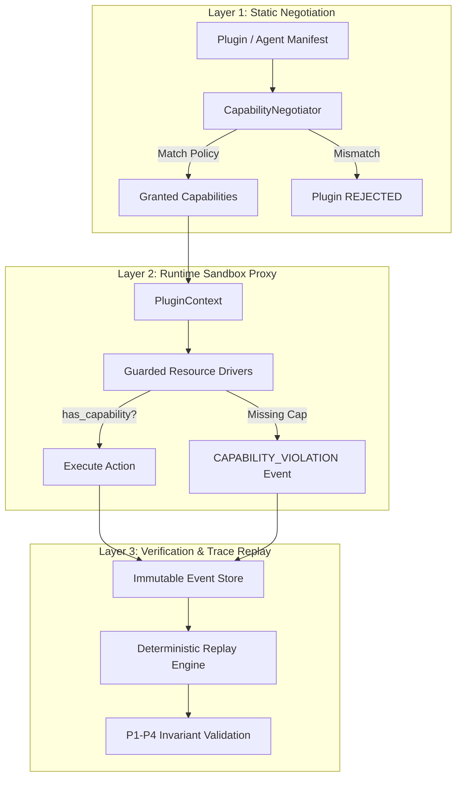
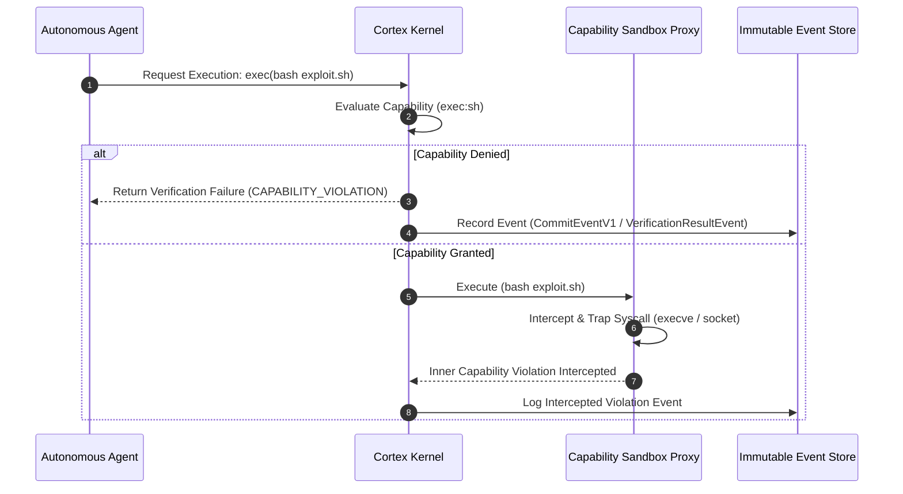

# Cortex Architecture & Security Model

Cortex is a spatiotemporal authority and semantic verification framework designed to enforce execution integrity across autonomous software systems and AI agent runtimes.

---

## 🏛️ Executive Summary & Narrative Arc

### The Problem at Scale
Traditional security models rely on static user identity (POSIX permissions, IAM roles, container cgroups). However, **autonomous AI agents and non-deterministic software break traditional security boundaries**:
1. **Ambient Authority Leakage**: Agents executing inside shell runtimes inherit full ambient user permissions, allowing indirect file access or process execution.
2. **Subshell Bypass Threats**: Malicious or miscalibrated agents can invoke shell scripts (`.sh`), subprocesses, or dynamic eval blocks to bypass high-level application checks.
3. **Non-Deterministic State Drift**: Without causal trace verification, auditing *why* an autonomous agent performed an action after a failure or security breach is impossible.

### The Cortex Solution
Cortex introduces a **3-Layer Security Boundary** that replaces ambient authority with **explicit capability negotiation**, **runtime proxy sandboxing**, and **post-execution deterministic verification**.

---

## 🎭 Dual-Layer Framing: Analogies vs. Technical Depth

To bridge non-technical security governance with core system engineering, Cortex frames every security boundary through a dual lens:

| Security Layer | Non-Technical Analogy | Core Technical Mechanism |
| :--- | :--- | :--- |
| **Layer 1: Static Negotiation** | **Passport & Visa Check** Before entering the country, your passport and requested visa duration are validated. If unauthorized, entry is denied at the border. | `CapabilityNegotiator.negotiate()` evaluates `PluginManifest.required_capabilities` against `platform_capabilities`. Transitions state to `ACTIVE` or `REJECTED`. |
| **Layer 2: Runtime Sandbox Proxy** | **Boarding Gate Scanner** Even with a visa, you cannot enter the plane without presenting your specific boarding pass for that specific flight door. | `PluginContext.has_capability()` checks capability tokens before Guarded Drivers (File, Network, Subprocess) fire raw I/O system calls. |
| **Layer 3: Verification & Trace Replay** | **Flight Blackbox Recorder** Every control input and telemetry reading is recorded in a tamper-evident blackbox for post-flight accident analysis and safety certification. | `DeterministicReplayEngine` re-executes event streams (`.cortex/events/*.json`), validating $P1$–$P4$ invariants and `causation_id` lineage graphs. |

---

## 🛡️ The 3-Layer Security Boundary

### Layer 1: Static Capability Negotiation (`CapabilityNegotiator`)
- **Purpose**: Prevent unauthorized plugins or agents from registering on the platform kernel event bus.
- **Mechanics**:
  - Every plugin presents a declarative `PluginManifest` listing its `required_capabilities` (e.g., `fs:read`, `exec:git`, `db:write`).
  - The `CapabilityNegotiator` evaluates the requested capabilities against the platform's security policy.
  - If any capability is unauthorized, the plugin transitions to `PluginState.REJECTED` and is barred from publishing or consuming workflow events.

### Layer 2: Runtime Sandbox Proxy (`PluginContext` & Guarded Drivers)
- **Purpose**: Intercept and block unauthorized I/O attempts during execution.
- **Mechanics**:
  - Plugins do not access raw sockets, files, or subprocesses directly.
  - All operations route through **Guarded Resource Drivers** (e.g., `NetworkDriver`, `FileDriver`, `SubprocessDriver`) that accept the plugin's `PluginContext`.
  - Drivers call `context.has_capability("domain:action")`.
  - If unauthorized, the driver emits a `VerificationResultEvent(passed=False, rule_id="CAPABILITY_VIOLATION")` and aborts execution.

### Layer 3: Post-Execution Verification & Trace Replay (`DeterministicReplayEngine`)
- **Purpose**: Guarantee non-repudiation, tamper detection, and mathematical invariant verification.
- **Mechanics**:
  - All events record nanosecond timestamps (`timestamp_ns`) and explicit parent links (`causation_id`, `correlation_id`, `root_id`).
  - The `DeterministicReplayEngine` re-simulates the execution graph offline.
  - Formally checks four core safety invariants ($P1$–$P4$):
    - **P1 (Authority Soundness)**: Bounded authority cannot expand downstream.
    - **P2 (Execution Integrity)**: Parameters remain structurally unaltered between issuance and execution.
    - **P3 (Semantic Consequence Preservation)**: Irreversible effects map directly to active delegation constraints.
    - **P4 (Independent Verifiability)**: External verifiers establish P3 validity without trusting execution runtimes.

---

## 🔒 Threat Vector Neutralization Analysis

### 1. Subshell Script Indirection (`.sh` Execution Bypasses)
- **Threat**: An agent attempts to run a shell script (`bash cleanup.sh`) to execute unauthorized commands hidden inside the script.
- **Mitigation**: The `SubprocessDriver` checks capabilities at two levels:
  1. The top-level execution requires explicit `exec:sh` capability.
  2. Nested tool invocations inside the driver validate capability tokens for the specific sub-command (`exec:git`, `exec:pytest`). Unauthorized sub-commands immediately trigger a `CAPABILITY_VIOLATION`.

### 2. Ambient Authority Leakage
- **Threat**: An agent uses general process privileges to access system files or network interfaces outside its intended scope.
- **Mitigation**: Ambient process privileges are stripped. Plugins operate strictly through `PluginContext` handles, restricting visibility to granted capabilities.

### 3. Post-Hoc Audit Tampering
- **Threat**: An attacker attempts to alter trace logs after an unauthorized action.
- **Mitigation**: The event store maintains parent-linked causation DAGs (`causation_id` $\rightarrow$ `event_id`). Any out-of-order insertion, deletion, or modification causes `cortex workflow replay` to fail lineage verification.

---

## 🏛️ Core Architectural Principles

1. **Universal Event Hierarchy vs. Verification Isolation**:
   - Core Kernel events (`IntentEvent`, `PlanGeneratedEvent`, `CommandIssuedEvent`, `DriverTelemetryEvent`, `VerificationResultEvent`) derive from `BaseEvent`.
   - `CommitEventV1` belongs exclusively to the verification domain to prevent hardware ISA details from leaking into general workflow orchestration.

2. **Kernel ≠ Verification**:
   - Verification runs as a decoupled service on top of the Kernel Runtime.

3. **Workflows as Execution Boundaries**:
   - All state transitions execute within an explicit `Workflow` lifecycle (`PENDING` $\rightarrow$ `RUNNING` $\rightarrow$ `COMPLETED` / `FAILED`).

4. **Plugin Sandboxing & Capability Negotiation**:
   - Plugins declare required capabilities in a `PluginManifest`.
   - Runtimes validate grants via `CapabilityNegotiator`. Unregistered capabilities trigger a `CAPABILITY_VIOLATION` verification failure.

---

## 🐍 Python vs. 🦀 Rust: Language Division of Labor

Cortex divides system responsibilities cleanly between Python (Control & Developer Plane) and Rust (Data Verification & Emulation Plane):

| Feature / Responsibility | 🐍 Python (`cortex/`) | 🦀 Rust (`cortex-emulator/`) |
| :--- | :--- | :--- |
| **System Domain** | High-Level Control & Developer Plane | High-Performance Verification Plane |
| **Target Audience** | Application Developers & AI Engineers | Core Kernel & Security Verifiers |
| **Primary Artifacts** | Workflows, Developer CLI, Plugins, Event Routing | Hardware State Machine, Syscall Traps, Invariant Proofs |
| **Performance Profile** | Rapid Prototyping, Dynamic Event Dispatch | Native Speed, Memory Safety, Zero GC Pauses |
| **Security Focus** | Capability Negotiation & API Proxies | Syscall Interception & Micro-Step Invariant Verification |

