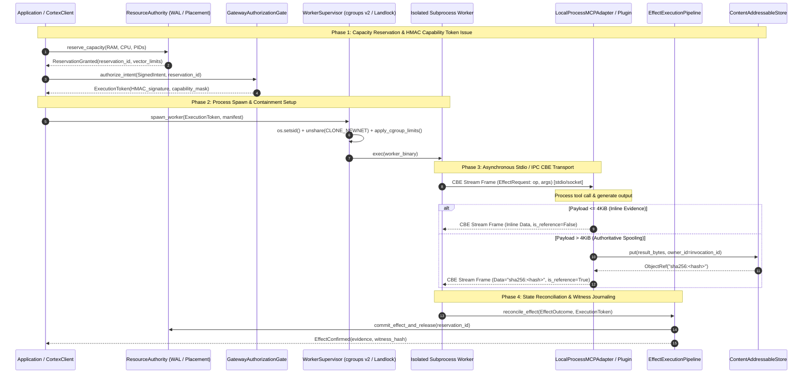
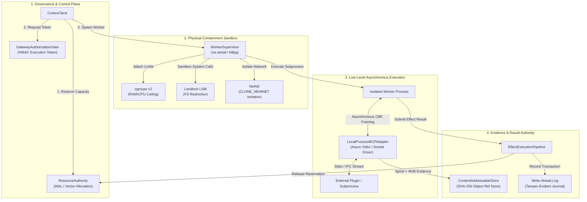

# Cortex Low-Level Asynchronous Component Communication Topology

> **Document Version**: `1.0.0` | **Target Architecture**: `v0.7.0rc1`  
> **Classification**: Normative Systems Engineering Specification | **Transport Protocol**: CBE Wire Grammar Over Stdio / IPC

---

## 1. Executive Overview

Cortex provides a zero-trust, spatiotemporally governed execution framework for autonomous workflows and microservices. To achieve physical isolation without sacrificing asynchronous execution performance, Cortex decouples the **Control & Governance Plane** from the **Low-Level Plugin Execution Plane** via non-blocking IPC framing and Canonical Binary Encoding (CBE).

$$\boxed{\textbf{Authority Decides}} \quad \Longleftrightarrow \quad \boxed{\textbf{Asynchronous Worker Executes}}$$

---

## 2. Comprehensive System Component Topology (Mermaid Diagram)



---

## 3. Detailed Component Interaction Architecture



---

## 4. Low-Level Asynchronous Communication Mechanics

### A. Framing Protocol & Wire Grammar
Lower-level plugin transport uses **Canonical Binary Encoding (CBE)** framing over non-blocking standard I/O streams (`stdin` / `stdout`) or Unix domain sockets.

$$\text{Frame Layout} = \underbrace{\text{Magic Header (4B)}}_{\texttt{0x43 0x42 0x45 0x31}} \,||\, \underbrace{\text{Frame Length (4B)}}_{\text{Big-Endian uint32}} \,||\, \underbrace{\text{Payload Bytes (Var)}}{CBE(\text{EffectRequest / Outcome})} \,||\, \underbrace{\text{CRC32 (4B)}}_{\text{Checksum}}$$

### B. Asynchronous Non-Blocking Event Loop
1. **Multiplexed I/O**: The `LocalProcessMCPAdapter` uses an asynchronous event loop (`asyncio` reader/writer streams) to pipeline multiple concurrent requests over a single subprocess channel without head-of-line blocking.
2. **Correlation Headers**: Every `EffectRequest` frame carries a unique `request_id: UUID128` and `invocation_id: UUID128`, allowing response frames to be matched asynchronously out-of-order.

### C. Large Evidence Boundary Contract
* **Inline Threshold ($\le 4\text{KiB}$)**: Small results are framed directly inside `EvidencePayload(data=raw_bytes, is_reference=False)` for minimum latency.
* **Content Addressable Storage ($> 4\text{KiB}$)**: Payloads exceeding $4096\text{ bytes}$ are spooled directly into `ContentAddressableStore` using `sha256:<hash>` keying scoped by `owner_id=ctx.invocation_id`. The returned frame contains only `EvidencePayload(data="sha256:<hash>", is_reference=True)`.

---

## 5. Synchronous vs. Asynchronous Communication Matrix

Cortex explicitly segregates **Synchronous Governance** from **Asynchronous Execution**:

| Component Boundary | Sync / Async Mode | Rationale & Mechanism |
| :--- | :---: | :--- |
| **Admission & Reservation** (`ResourceAuthority`) | **SYNCHRONOUS** | Pre-execution safety cannot be eventual. Vector limits (RAM/CPU) are locked synchronously in `WAL` before process spawn. |
| **Capability Authorization** (`GatewayAuthorizationGate`) | **SYNCHRONOUS** | HMAC execution tokens must be verified and signed synchronously to ensure fail-closed security. |
| **Worker Subprocess Execution** (`WorkerSupervisor`) | **ASYNCHRONOUS** | Processes are spawned asynchronously; stdin/stdout pipes are managed via non-blocking `asyncio` event loops. |
| **Plugin IPC Transport** (`LocalProcessMCPAdapter`) | **ASYNCHRONOUS** | CBE stream frames use correlation IDs (`request_id`, `invocation_id`) to multiplex multiple tool calls without blocking. |
| **Evidence CAS Spooling** (`ContentAddressableStore`) | **ASYNCHRONOUS** | Payload writes $> 4\text{KiB}$ occur asynchronously to prevent thread blocking during I/O persistence. |
| **Effect Reconciliation & Journaling** (`EffectExecutionPipeline`) | **ASYNCHRONOUS** | Outcome state changes and witness chain updates are committed asynchronously upon stream completion. |

---

## 6. Real-Time Machine Learning & Computer Vision Streaming Architecture

High-throughput, low-latency workloads (e.g. 60 FPS 1080p/4K video streams, PyTorch/TensorRT inference, GPU tensor buffers) are handled efficiently in Cortex via a **Decoupled Data-Plane & Zero-Copy Reference Architecture**:

```
                       REAL-TIME COMPUTER VISION STREAMING TOPOLOGY

[ Video Camera / RTSP Stream ]
              │ (Raw Video Frames)
              ▼
[ Worker Process (ONNX / TensorRT) ] ─── Shared Memory IPC (shm / FD) ───► [ ContentAddressableStore ]
              │                                                              (Zero-Copy Frame Buffer)
              │ (CBE Metadata Stream: bounding_box, confidence, class_id)
              ▼
[ LocalProcessMCPAdapter ] ─── Async Non-Blocking Pipe ───► [ Cortex Control Plane ]
```

### Key Engineering Invariants for Real-Time ML:
1. **GPU Vector Capacity Reservation (`ResourceAuthority`)**:
   Before spawning ML workers, `ResourceAuthority` synchronously reserves GPU VRAM (`vram_mib`) and compute units (`gpu_count`). This guarantees that concurrent vision models (e.g. YOLOv8, Segment Anything) do not trigger CUDA Out-Of-Memory (OOM) driver crashes.
2. **Zero-Copy Frame Offloading**:
   Raw image/tensor buffers exceed the $4\text{KiB}$ inline evidence ceiling. Workers write frame buffers directly to shared memory (`/dev/shm` or Unix file descriptors) or CAS, returning lightweight `ObjectRef("sha256:<hash>")` references over the CBE stream pipe.
3. **Asynchronous Metadata Pipelining**:
   Detection boxes, tracking vectors, and inference classification results are serialized into lightweight CBE metadata frames and pushed asynchronously without blocking frame capture loops.
4. **Fault-Isolated Subprocess Boundaries**:
   Heavy native C++/CUDA dependencies (PyTorch, TensorRT, OpenCV) execute inside sandboxed subprocesses created by `WorkerSupervisor`. A C++ segfault or CUDA error terminates only the isolated worker process group (`os.killpg`), leaving the host control plane fully operational.

---

## 7. Reliability & Process Group Fencing Invariants

1. **Process Group Teardown**: `WorkerSupervisor` calls `os.setsid()` during subprocess creation to establish a distinct process group. On termination or timeout, `os.killpg(proc.pid, SIGTERM/SIGKILL)` is executed to guarantee zero orphan process accumulation.
2. **Bounded Allocation Defense**: Go and Python CBE decoders enforce pre-allocation ceilings ($\min(\text{declared\_count}, 1024)$) to prevent OOM denial-of-service attacks from untrusted framing streams.
3. **Fence-Out Stale Incarnations**: The `EffectExecutionPipeline` rejects duplicate or delayed response frames from dead worker incarnations by verifying monotonic epoch counters against `ResourceAuthority`.
