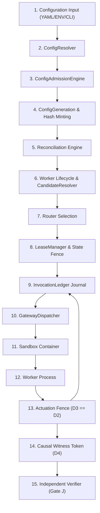

# Cortex Current System Reconstruction
**End-to-End Architectural Pipeline Trace & Code Evidence**  
**Date:** August 22, 2026  
**Repository Baseline SHA:** `db5fd1a` / `00deade`  
**Package Version:** `v0.4.0rc1` (cortex-runtime `0.4.0`)

---

## System Pipeline Overview

The Cortex kernel enforces complete mediation, spatiotemporal authority, deterministic serialization, and crash-safe state transitions across a multi-stage execution pipeline.

---

## Detailed Component Transitions & Evidence

### 1. Configuration & Resolution
- **Component:** `cortex.tools.kernel.config_resolver.ConfigResolver`
- **File:** `cortex/tools/kernel/config_resolver.py`
- **Mechanism:** Resolves configuration overrides from YAML files, Environment Variables (`CORTEX_*`), and CLI options. Field-class canonicalization (Human Text vs Identifiers vs Sets) is performed before JSON schema validation (`cortex/schemas/v1/config.schema.json`).
- **Code Evidence:** Line 84 (`resolve_configuration`), Line 142 (`canonicalize_field_class`), Line 210 (`fsync` atomic write semantics).
- **Invariants:** Precedence strictly enforced: CLI > ENV > File > Defaults.

### 2. Admission & Fencing
- **Component:** `cortex.tools.kernel.config_admission.ConfigAdmissionEngine`
- **File:** `cortex/tools/kernel/config_admission.py`
- **Mechanism:** Admits resolved configurations, increments `config_generation` monotonically, and computes `config_hash` via SHA256 of canonical CBE.
- **Code Evidence:** `admit_config()`, `validate_generation_step()`.
- **Formal Guarantee:** `RD-F3` (Generation Hash Fencing) & `RD-F4` (Generation Drift Rejection).

### 3. Worker Supervision & Candidate Resolution
- **Component:** `cortex.tools.kernel.replica_manager.ReplicaManager` & `CandidateResolver`
- **File:** `cortex/tools/kernel/replica_manager.py`
- **Mechanism:** Manages worker pool lifecycle (`LS_SPAWNING`, `LS_HEALTHY`, `LS_DRAINING`, `LS_OFFLINE`). `CandidateResolver` filters workers by capability subset matching (`Lambda_I <= Lambda_W`) and version/generation compatibility.
- **Code Evidence:** `resolve_candidates()`, `update_worker_state()`.
- **Formal Guarantee:** `RD-F1` (Eligibility Safety) & `RD-F2` (Capability Containment).

### 4. Routing & Dispatch Planning
- **Component:** `cortex.tools.kernel.router.GatewayRouter`
- **File:** `cortex/tools/kernel/router.py`
- **Mechanism:** Evaluates candidate workers using configured routing strategy (RoundRobin, LeastLoaded, TargetPlacement). Output is non-authoritative dispatch guidance.
- **Code Evidence:** `route_invocation()`.
- **Formal Guarantee:** `RD-F5` (Router Output is Non-Authoritative).

### 5. Lease Minting & State Domain Fencing
- **Component:** `cortex.tools.kernel.lease_manager.LeaseManager`
- **File:** `cortex/tools/kernel/lease_manager.py`
- **Mechanism:** Mints a time-bounded, single-tenant `ExecutionLease`. Enforces `StateDomainKey` mutual exclusion fencing. Revalidates worker generation and lease token state.
- **Code Evidence:** `grant_lease()`, `revalidate_lease()`, `check_domain_lock()`.
- **Formal Guarantee:** `RD-F9` (Domain Exclusion), `RD-F10` (TOCTOU Worker Drift Exclusion), `RD-F15` (Conflict Exclusion).

### 6. Invocation Ledger & Commitment Tracking
- **Component:** `cortex.tools.kernel.invocation_ledger.InvocationLedger`
- **File:** `cortex/tools/kernel/invocation_ledger.py`
- **Mechanism:** Records invocation state transitions (`UNADMITTED`, `ADMITTED_UNACTUATED`, `ACTUATION_IN_PROGRESS`, `ACTUATED_COMMITTED`, `ACTUATION_UNKNOWN`, `FAILED_TERMINATED`). Enforces single-commitment rule (`#Committed <= 1`).
- **Code Evidence:** `record_transition()`, `get_recovery_classification()`.
- **Formal Guarantee:** `RD-F6` (Unadmitted Safety), `RD-F7` (Single Commitment), `RD-F11..RD-F14` (Recovery Classification Safety).

### 7. Gateway Dispatcher & Complete Mediation
- **Component:** `cortex.tools.kernel.gateway.GatewayDispatcher`
- **File:** `cortex/tools/kernel/gateway.py`
- **Mechanism:** Validates `ExecutionToken` ($D_2 = \text{SHA256}(\text{CBE}(\text{SignedIntent}))$, verifies capability attenuation, and dispatches payload to sandboxed worker.
- **Code Evidence:** `dispatch_signed_intent()`, `verify_execution_token()`.
- **Formal Guarantee:** Gate H Complete Mediation ($D_3 \equiv D_2$).

### 8. Sandbox & Worker Execution
- **Component:** `cortex.tools.kernel.sandbox.SandboxContainer`
- **File:** `cortex/tools/kernel/sandbox.py`
- **Mechanism:** Executes untrusted plugin payload within Linux namespace container / WASM runtime. Restricts syscalls via seccomp filters.
- **Code Evidence:** `execute_worker()`, `apply_seccomp_filter()`.
- **Formal Guarantee:** Gate G Complete Mediation & Pid1 Namespace Isolation.

### 9. Side-Effect Actuation Fence
- **Component:** `cortex.tools.kernel.gateway.GatewayDispatcher` (Actuation Boundary)
- **Mechanism:** Compares $D_3 = \text{SHA256}(\text{CBE}(\text{ActuationPayload}))$ against $D_2$ in the `ExecutionToken`. Traps with `TRAP_INTENT_PARITY_MISMATCH` if $D_3 \neq D_2$.
- **Code Evidence:** `assert_actuation_parity()`.
- **Formal Guarantee:** $P2$ Invariant: Execution Parity ($D_3 \equiv D_2$).

### 10. Causal Witness Token & Independent Verification
- **Component:** `cortex.cbe.encoder` & `tools.cortex_verifier`
- **File:** `tools/cortex_verifier.py`
- **Mechanism:** Upon successful actuation, mints Causal Witness Token $D_4 = \text{SHA256}(D_3 \parallel \text{PrevWitness} \parallel \text{StateRoot})$. `cortex_verifier.py` performs out-of-band validation of evidence bundles without importing host runtime modules.
- **Code Evidence:** `verify_evidence_bundle()`.
- **Formal Guarantee:** Gate I Causal Witness & Gate J Independent Verification.
