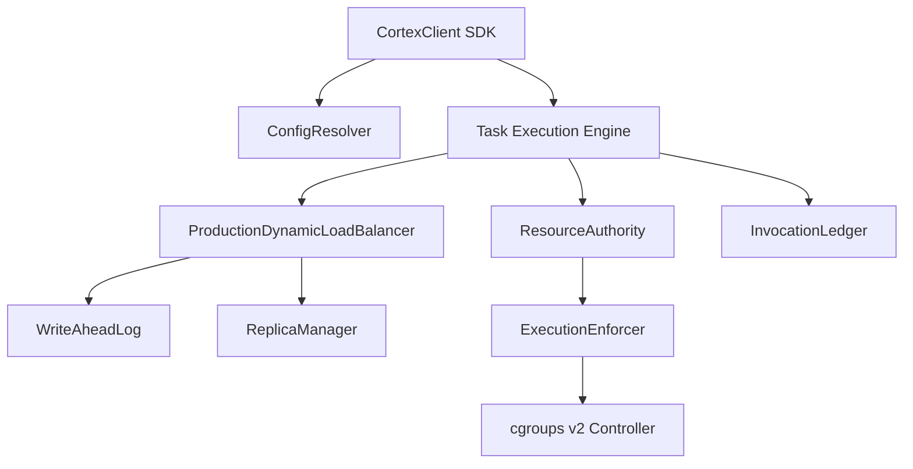

# Cortex Dependency & Ownership Graph

> **State Ownership Invariant**: Every piece of system state MUST have exactly ONE authoritative owner module.  
> **Lock Coupling Rule**: Inter-subsystem operations MUST NOT acquire locks across subsystem boundaries to prevent deadlocks.  

---

## 1. System State Ownership Graph

```
                                GATEWAY TCB BOUNDARY
 ┌─────────────────────────────────────────────────────────────────────────────┐
 │                                                                             │
 │  [ ConfigResolver ] ──► Owns: System Configuration, Field Classes, File Path│
 │                                                                             │
 │  [ LoadBalancer ]   ──► Owns: Worker Registry, CapabilityIndex, LeaseEpoch, │
 │                               Quarantines, Worker Status FSM                │
 │                                                                             │
 │  [ ResourceAuthority]─► Owns: Vector Budgets, Active Reservations, cgroups  │
 │                                                                             │
 │  [ WriteAheadLog ]  ──► Owns: Disk Frame Sequence, CRC Checksums, WAL Tail  │
 │                                                                             │
 │  [ InvocationLedger]──► Owns: Idempotency Keys, Execution Results, TTL      │
 │                                                                             │
 └─────────────────────────────────────────────────────────────────────────────┘
                                       │
                                       ▼
                             EXTERNAL WORKER RUNTIME
 ┌─────────────────────────────────────────────────────────────────────────────┐
 │                                                                             │
 │  [ Worker Instance ]──► Owns: Task Execution Attempt, Ephemeral Workspace   │
 │                                                                             │
 └─────────────────────────────────────────────────────────────────────────────┘
```

---

## 2. State Ownership & Lock Matrix

| System State | Authoritative Owner Module | Lock Mechanism | Access Pattern | Linearization Point |
| :--- | :--- | :--- | :--- | :--- |
| **Worker Registry ($W$)** | `ProductionDynamicLoadBalancer` | `self._lock` (`RLock`) | Mutate on register/deregister; read on selection | `register_worker()` under lock |
| **Capability Index ($W_c$)** | `CapabilityIndex` inside LoadBalancer | `self._lock` (`RLock`) | Mutate on cap change; read on scheduling | `assign_execution()` under lock |
| **Lease Epoch ($e$)** | `ProductionDynamicLoadBalancer` | `self._lock` (`RLock`) | Increment on worker reassignment / lease renewal | Epoch increment under lock |
| **Vector Resource Budget** | `ResourceAuthority` | `self._lock` (`RLock`) | Reserve / commit / release | `commit_reservation()` under lock |
| **WAL Disk Frames** | `WriteAheadLog` | File system lock / append atomic handle | Append frame + fsync | `append_record()` after `fsync()` |
| **Idempotency Keys** | `InvocationLedger` | `self._lock` (`Lock`) | Check presence / store result | `record_invocation()` under lock |
| **Configuration State** | `CortexConfigResolver` | File atomic swap + internal snapshot | Read configuration; mutate via CLI/Env | Atomic `os.replace()` on disk |

---

## 3. Dependency Fan-In & Fan-Out Graph


