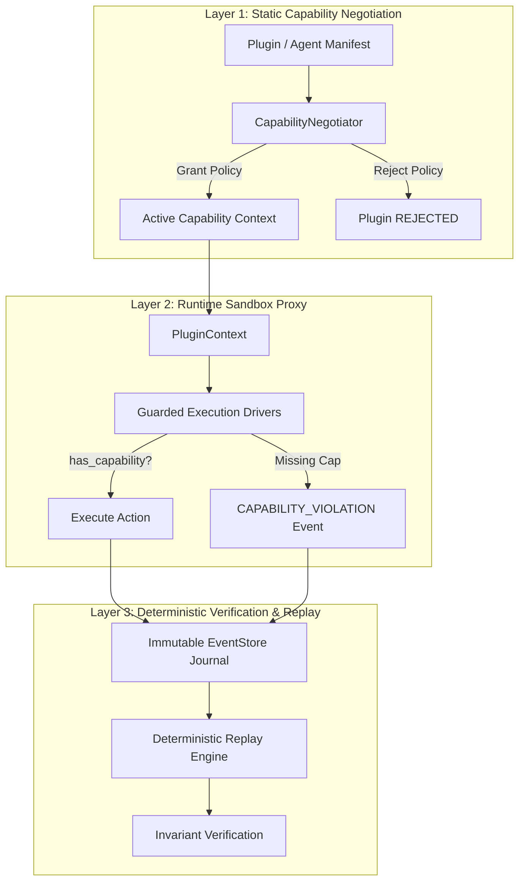

# Cortex System Architecture Overview

> **Version**: 0.2.0  
> **Status**: Hardened Core Release  
> **API Boundary**: Frozen (`cortex.__all__`, 21 symbols)

---

## 🏛️ System Philosophy & Narrative Arc

Cortex is a **spatiotemporal authority and semantic verification framework** designed to enforce execution integrity across autonomous software systems, background workers, and AI agent runtimes.

### The Security Challenge in Autonomous Systems

Traditional operating system security relies on static identity (POSIX permissions, IAM roles, container cgroups). However, autonomous AI agents and dynamic workflow engines introduce fundamental security gaps:

1. **Ambient Authority Leakage**: Agents running inside user shells inherit full ambient user permissions, allowing indirect file modifications or arbitrary process execution.
2. **Subshell & Tool Bypass**: Autonomous agents invoking shell commands or dynamic scripts can bypass high-level application assertions.
3. **Non-Deterministic State Drift**: Without causal event tracking, auditing *why* an autonomous system took a specific action after a failure or security breach is impossible.

### The Cortex Solution

Cortex replaces ambient authority with **explicit capability negotiation**, **runtime proxy sandboxing**, and **post-execution deterministic verification**.



---

## 🎭 Dual-Layer Framing: Analogies vs. Technical Depth

To bridge high-level security governance with core system engineering, Cortex frames every architectural layer through a dual lens:

| Security Layer | Non-Technical Analogy | Core Technical Mechanism |
|:---|:---|:---|
| **Layer 1: Static Negotiation** | **Passport & Visa Check**<br/>Before entering a country, your passport and requested visa duration are validated at border control. Entry is denied if unauthorized. | `CortexClient.register_plugin()` evaluates `PluginManifest.required_capabilities` against platform policies, transitioning plugin status to `ACTIVE` or `REJECTED`. |
| **Layer 2: Runtime Sandbox Proxy** | **Boarding Gate Scanner**<br/>Even with a visa, you cannot enter a flight without presenting a boarding pass for that specific gate door. | `PluginContext.has_capability()` validates capability tokens before Guarded Drivers (File, Subprocess, Network) execute system calls. |
| **Layer 3: Verification & Replay** | **Flight Blackbox Recorder**<br/>Every control input and telemetry reading is recorded in a tamper-evident blackbox for post-flight accident analysis. | `client.replay_workflow()` re-executes event streams, asserting lineage graphs (`event_id` → `causation_id`) and deterministic state parity. |

---

## 🛡️ The 3-Layer Security Boundary

### Layer 1: Static Capability Negotiation (`PluginManifest`)

Every component presents a declarative `PluginManifest` detailing its identity, event contracts, and requested capabilities:

```python
from cortex import PluginManifest

manifest = PluginManifest(
    name="file-scanner",
    version="0.2.0",
    description="Read-only file inspector",
    consumes_events=["IntentEvent"],
    produces_events=["DriverTelemetryEvent"],
    required_capabilities=["fs:read"],
)
```

The kernel negotiates this manifest before granting event bus access.

---

### Layer 2: Runtime Sandbox Proxy (`PluginContext`)

Active plugins receive a `PluginContext` through which all platform interaction flows:

```python
from cortex import BaseEvent, BasePlugin, IntentEvent, DriverTelemetryEvent
from cortex.compat import override

class GuardedScannerPlugin(BasePlugin):
    @override
    def on_event(self, event: BaseEvent) -> None:
        match event:
            case IntentEvent() if self.context and self.context.has_capability("fs:read"):
                telemetry = DriverTelemetryEvent(
                    workflow_id=event.workflow_id,
                    causation_id=event.event_id,
                    driver_id="fs_reader",
                    status="ok",
                    payload={"path": "."},
                )
                self.context.publish(telemetry)
            case _:
                pass
```

---

### Layer 3: Deterministic Verification & Trace Replay (`EventStore`)

All domain events are appended to an immutable `EventStore` journal. The `CortexClient` can save execution traces to disk and replay them deterministically to verify that event sequences and causal lineage graphs remain 100% reproducible.

```python
from cortex import CortexClient

client = CortexClient()
# ... execute workflow ...

# Save execution trace
trace_path = client.save_trace("/tmp/workflow_trace.json")

# Replay trace deterministically
replay_result = client.replay_workflow(trace_path)
print(f"Replay Status: {replay_result['deterministic']}")
```

---

## 📐 Component Topology

```
┌─────────────────────────────────────────────────────────────────────────────┐
│                            CORTEX APPLICATION HOST                          │
│                                                                             │
│   ┌─────────────────────────────────────────────────────────────────────┐   │
│   │                            CortexClient                             │   │
│   └─────────────────────────────────────────────────────────────────────┘   │
│          │                                          │                       │
│          ▼                                          ▼                       │
│   ┌───────────────┐                          ┌───────────────┐              │
│   │ Plugin A      │                          │ Plugin B      │              │
│   │ (Planner)     │                          │ (Executor)    │              │
│   └───────────────┘                          └───────────────┘              │
│          │                                          │                       │
│          └──────────────────┬───────────────────────┘                       │
│                             ▼                                               │
│             ┌───────────────────────────────┐                               │
│             │     EventStore (Journal)      │                               │
│             └───────────────────────────────┘                               │
│                             │                                               │
│                             ▼                                               │
│             ┌───────────────────────────────┐                               │
│             │ Deterministic Replay Engine   │                               │
│             └───────────────────────────────┘                               │
└─────────────────────────────────────────────────────────────────────────────┘
```

---

## 🔗 Related Documentation

- [API Stability Policy](api-stability-policy.md) — SemVer rules, deprecation grace periods, public symbol set.
- [Plugin Authoring Guide](../guides/plugin-authoring.md) — Canonical guide for building custom Cortex plugins.
- [Developer Setup Guide](../development/setup.md) — Contributor environment and verification workflow.
