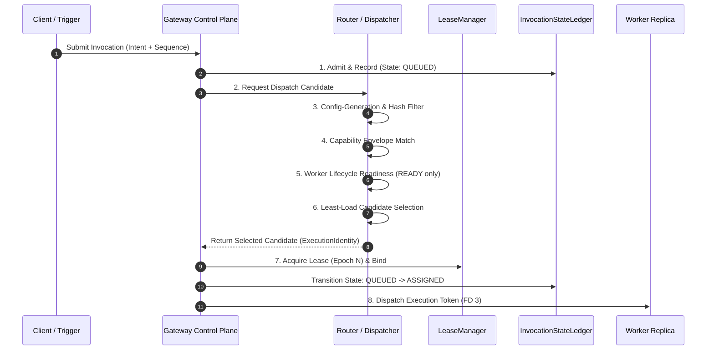

# Phase 4 Routing & Dispatch Architecture Specification

> **Specification Status**: `DESIGN REVIEW DRAFT` — Implementation strictly blocked  
> **Governance Authority**: Locked Cortex Control Plane Model (Phase 1–3 Baseline SHA: `56afb86`)  
> **Target Subsystem**: Gateway Control Plane Routing & Dispatcher (`cortex/tools/kernel/replica/router.py`)

---

## 1. Architectural Mandate & Governance

### 1.1 Non-Authority Principle

> **Fundamental Invariant (TCB Boundary Isolation)**:  
> *The Router may choose where execution happens, but it must NEVER own authority, lease fencing, commit state, or witness logging.*

The Router is an **unprivileged candidate selector** operating inside the Gateway control plane. All authority over execution tokens, lease epochs, invocation state transitions, and witness verification remains strictly residing within the Gateway TCB components (`LeaseManager`, `InvocationStateLedger`, `WorkerLifecycleTracker`).

```text
                             GATEWAY TCB BOUNDARY
   ┌──────────────────────────────────────────────────────────────────────┐
   │                                                                      │
   │   ┌──────────────────┐    ┌─────────────────┐   ┌────────────────┐   │
   │   │  Configuration   │    │  LeaseManager   │   │ Invocation     │   │
   │   │  Resolver        │    │  (Linearizable) │   │ Ledger (WAL)   │   │
   │   └────────┬─────────┘    └────────┬────────┘   └───────┬────────┘   │
   │            │                       │                    │            │
   └────────────┼───────────────────────┼────────────────────┼────────────┘
                │                       │                    │
                ▼                       ▼                    ▼
   ┌──────────────────────────────────────────────────────────────────────┐
   │                       Router / Dispatcher                            │
   │             (Candidate Selection & Routing Pipeline)                 │
   └──────────────────────────────────┬───────────────────────────────────┘
                                      │
                                      ▼
                        ┌───────────────────────────┐
                        │ Eligible Replica Candidate │
                        └─────────────┬─────────────┘
                                      │ (IPC FD 3 / CBE)
                                      ▼
                        ┌───────────────────────────┐
                        │   Worker Sandbox Engine   │
                        └─────────────┬─────────────┘
                                      │
                                      ▼
   ┌──────────────────────────────────────────────────────────────────────┐
   │                      Gateway Commit & Witness                        │
   │                   (CommitSequence / WitnessLedger)                   │
   └──────────────────────────────────────────────────────────────────────┘
```

---

## 2. The 8-Stage Dispatch Pipeline

Every inbound invocation processed by the Gateway passes sequentially through eight deterministic stages. If any stage fails, the pipeline fails closed immediately without side effects.



### Stage Description & Gate Enforcement

1. **Stage 1: Admission & Ledger Registration**  
   - Invocation is parsed, CBE-checked, and recorded in `InvocationStateLedger` with state `QUEUED`.
   - `ClientInvocationSequence` is checked for strict monotonicity ($S_{\text{client}} = S_{\text{last}} + 1$).

2. **Stage 2: Dispatch Trigger**  
   - Gateway passes `InvocationID` and `RequiredCapabilities` to the `Router`.

3. **Stage 3: Config-Generation & Hash Filter**  
   - Router filters candidate workers. A worker is eligible **only** if:
     $$\text{Worker.config\_generation} == \text{ActiveDeployment.config\_generation}$$
     $$\text{Worker.config\_hash} == \text{ActiveDeployment.config\_hash}$$

4. **Stage 4: Capability & Sandbox Filter**  
   - Capability envelope containment assertion:
     $$\Lambda_{\text{invocation}} \subseteq \Lambda_{\text{worker}} \subseteq \Lambda_{\text{deployment}}$$

5. **Stage 5: Worker Lifecycle Filter**  
   - Lifecycle stage assertion:
     $$\text{Worker.stage} == \text{WorkerLifecycleStage.READY}$$
   - Workers in `DRAINING`, `FORCED_RECOVERY`, `QUIESCED`, `TERMINATING`, or `TERMINATED` are strictly excluded.

6. **Stage 6: Least-Load Candidate Selection**  
   - Selects the eligible worker with the minimum active inflight invocations.
   - Deterministic tie-breaking by `instance_id` lexicographical ordering.

7. **Stage 7: Lease Grant & Ledger Assignment**  
   - Gateway calls `LeaseManager.grant_lease(invocation_id, selected_worker_id)` to atomically issue `OwnershipIdentity` with monotonic `LeaseEpoch`.
   - Ledger state transitions `QUEUED` $\to$ `ASSIGNED`.

8. **Stage 8: Token Dispatch & Actuation**  
   - Execution token and parameters dispatched over isolated IPC `FD 3` channel.

---

## 3. Worker Candidate Eligibility & Selection Semantics

### 3.1 Eligibility Predicate Matrix

A worker instance $W_i$ is eligible for invocation $I_j$ if and only if all five predicates hold:

$$\text{Eligible}(W_i, I_j) \iff P_{\text{config}}(W_i) \land P_{\text{hash}}(W_i) \land P_{\text{cap}}(W_i, I_j) \land P_{\text{life}}(W_i) \land P_{\text{load}}(W_i)$$

Where:
- $P_{\text{config}}(W_i) \equiv (W_i.\text{config\_generation} == G_{\text{active}})$
- $P_{\text{hash}}(W_i) \equiv (W_i.\text{config\_hash} == H_{\text{active}})$
- $P_{\text{cap}}(W_i, I_j) \equiv (\Lambda_{I_j} \subseteq \Lambda_{W_i})$
- $P_{\text{life}}(W_i) \equiv (W_i.\text{stage} == \text{READY})$
- $P_{\text{load}}(W_i) \equiv (W_i.\text{inflight} < \text{MaxWorkerInflight})$

### 3.2 Selection Algorithm (Least-Inflight with Capability Affinity)

When multiple candidates satisfy $\text{Eligible}(W_i, I_j)$:

```python
def select_candidate(candidates: list[WorkerRef], invocation: Invocation) -> WorkerRef:
    # Filter by eligibility predicate
    eligible = [w for w in candidates if is_eligible(w, invocation)]
    
    if not eligible:
        raise NoEligibleWorkerError("ERR_NO_ELIGIBLE_WORKER: No ready replica satisfies config and capabilities")
    
    # Sort by (inflight_count ASC, instance_id ASC)
    eligible.sort(key=lambda w: (w.inflight_count, w.instance_id))
    return eligible[0]
```

### 3.3 Zero-Candidate Behavior (Backpressure Rejection)

When zero candidates are eligible:
1. If Queue Capacity permits: Invocation remains `QUEUED` until `queue_timeout_sec` expires.
2. If Queue Capacity is full or Timeout expires: Invocation transitions immediately to `REJECTED` with error code `ERR_NO_ELIGIBLE_WORKER`.
3. **No Unbounded Spawning**: The router never dynamically spawns workers outside the control plane's desired state.

---

## 4. Lease Interaction & Atomic Assignment Boundary

### 4.1 Lease Acquisition Timing

```text
  [Router Selection]  --->  [Candidate Selected]  --->  [Gateway Grant Lease]  --->  [Ledger ASSIGNED]
         (1)                         (2)                        (3)                       (4)
```

- **Lease is NOT acquired during candidate search**: Searching candidate lists does not lock or mutate lease epochs.
- **Atomic Grant Post-Selection**: Once the candidate is chosen, `LeaseManager.grant_lease()` is invoked inside the Gateway TCB lock.
- **Race Prevention**: If two routing requests choose the same worker simultaneously, each invocation receives its own distinct `InvocationID` and independent `LeaseEpoch` counter ($E_{\text{invA}}$ vs $E_{\text{invB}}$).

### 4.2 Worker Failure Post-Assignment

If a worker crashes or loses IPC connectivity immediately after Stage 7 (`ASSIGNED` state) before acknowledging execution:
1. Heartbeat or IPC read error detects worker loss.
2. Gateway revokes the active lease epoch ($E$).
3. Invocation state in ledger is classified:
   - State `ASSIGNED` $\to$ `RecoveryBucket.UNADMITTED`.
   - Re-queued for dispatch with incremented attempt counter ($a_{n+1} = a_n + 1$). Zero side effects occurred.

---

## 5. Integration with the 5 Sequence Ordering Domains

Phase 4 preserves the strict 5-domain ordering model established in Section 3 of the Replica Scaling Specification:

```
Domain 1: ClientInvocationSequence (Monotonic per client session)
Domain 2: ExecutionCompletionOrder (Observed gateway arrival)
Domain 3: CommitSequence           (Authoritative canonical commit log)
Domain 4: WitnessSequence          (Merkle audit trace)
Domain 5: StateSequenceDomain      (Monotonic state mutation fences)
```

### Routing Rules per Ordering Domain

| Ordering Domain | Router Role | Invariant |
| :--- | :--- | :--- |
| **ClientInvocationSequence** | Preserved | Invocations from the same client sequence domain must be dispatched in sequence order or queued. |
| **ExecutionCompletionOrder** | Observed | Worker completion order is non-deterministic; Gateway re-orders completions against `LeaseEpoch`. |
| **CommitSequence** | Enforced | Commit sequence is assigned exclusively at the Gateway commit boundary, never by the Router. |
| **WitnessSequence** | Enforced | Routing decision provenance events (`RoutingDecisionEvent`) are appended to `WitnessSequence`. |
| **StateSequenceDomain** | Enforced | Stateful mutations carry monotonic `StateSequenceVersion`. Replicas with stale version fence are rejected. |

---

## 6. State Conflict & Concurrency Fencing

### 6.1 Preventing Incompatible Concurrent Mutations

When two replica workers attempt to process invocations affecting the same stateful resource domain:

```text
Invocation A (Worker 1, Lease Epoch 10)  ───┐
                                            ├───> Gateway State Fence  ───>  Only Epoch 10 or 11
Invocation B (Worker 2, Lease Epoch 11)  ───┘     (Linearizable)             succeeds; stale epoch
                                                                             raises StaleLeaseError
```

1. **State Version Fencing**: Stateful invocations carry a `TargetStateVersion`.
2. **Lease Epoch Mutual Exclusion**: `LeaseManager` permits exactly one active worker lease per `InvocationID`.
3. **Commit Atomicity**: `LeaseManager.commit_invocation()` asserts active epoch match. If Worker 1 was revoked due to delay, its commit attempt fails with `StaleLeaseError` (ERR_STALE_LEASE_EPOCH). Zero partial state writes.

---

## 7. Bounded Backpressure & Resource Ceiling

To prevent resource exhaustion under heavy dispatch load, the Router enforces five non-bypassable resource ceilings:

```math
\text{Memory}_{\text{router}} = O(\text{ActiveInvocations} + \text{ReadyWorkers})
```

| Parameter | Ceiling / Bound | Default | Breach Action |
| :--- | :--- | :---: | :--- |
| `MaxQueueDepth` | Maximum invocations in `QUEUED` state | `1,000` | Reject immediately with `ERR_QUEUE_FULL` |
| `MaxWorkerInflight` | Maximum active invocations per worker replica | `10` | Exclude worker from candidate pool |
| `QueueTimeoutSec` | Maximum wait time in `QUEUED` state | `30.0s` | Transition to `REJECTED` (`ERR_QUEUE_TIMEOUT`) |
| `DispatchDeadlineSec` | Max time between `ASSIGNED` and `RUNNING` ACK | `5.0s` | Revoke lease $\to$ re-queue or recover |
| `RetentionWindowSec` | In-memory retention of completed routing records | `300.0s` | Compacted to journal via `compact_terminated()` |

---

## 8. Failure Modes & Recovery Matrix

| Scenario | State at Failure | Detection Mechanism | Gateway Recovery Action | Terminal Invariant |
| :--- | :--- | :--- | :--- | :--- |
| **F-01: Worker Crash Pre-ACK** | `ASSIGNED` | IPC pipe disconnect / EOF | Lease revoked. Ledger state $\to$ `UNADMITTED`. Safe to re-queue with attempt $a+1$. | `COMMITTED` or `REJECTED` |
| **F-02: Worker Crash Mid-Execution** | `RUNNING` | Heartbeat timeout / process exit | Lease revoked. Ledger state $\to$ `ADMITTED_UNACTUATED`. Re-queued if idempotent. | `COMMITTED` or `REJECTED` |
| **F-03: Worker Crash Mid-Actuation** | `ACTUATING` | Process exit / IPC disconnect | Lease revoked. Ledger state $\to$ `ACTUATION_UNKNOWN` $\to$ `INDETERMINATE`. Manual/operator audit required. | `INDETERMINATE` |
| **F-04: Stale Lease Commit Attempt** | `RUNNING` / `ACTUATING` | `LeaseManager.commit_invocation()` | Raises `StaleLeaseError`. Commit rejected. Zero state side effects. | `REJECTED` |
| **F-05: Stale Config Worker Response** | `RUNNING` | Gateway generation handshake check | Worker evicted (`FORCED_RECOVERY`). Invocations re-queued under active generation. | `COMMITTED` or `REJECTED` |
| **F-06: Gateway Restart Mid-Dispatch** | `QUEUED` / `ASSIGNED` | WAL Journal replay on startup | Journal replayed. Invocations in `QUEUED`/`ASSIGNED` reset to `QUEUED`. | `COMMITTED`, `REJECTED`, or `INDETERMINATE` |
| **F-07: All Candidates Ineligible** | `QUEUED` | Candidate search yields 0 items | Held in queue until timeout, then `REJECTED` (`ERR_NO_ELIGIBLE_WORKER`). | `REJECTED` |

---

## 9. Observability & Audit Traceability

Every routing decision emits a structured `RoutingDecisionEvent` to the Gateway audit log and `WitnessSequence`:

```json
{
  "event_type": "RoutingDecisionEvent",
  "invocation_id": "inv-9021",
  "client_sequence": 104,
  "selected_worker_id": "w-payments-02",
  "execution_identity": "payments:w-payments-02:g1:cfg18:h3a9f1b2c:a1",
  "lease_ownership": "inv:inv-9021:lease:l-4402:ep1",
  "config_generation": 18,
  "config_hash": "3a9f1b2c...",
  "candidate_pool_size": 4,
  "selected_worker_inflight": 2,
  "routing_latency_us": 142,
  "timestamp_ns": 1776624000000000000
}
```

---

## 10. Proposed Phase 4 Verification Gates (RD-1 to RD-12)

When Phase 4 implementation is authorized, the implementation must pass all 12 proposed verification gates:

| Gate ID | Test Focus | Target Invariant / Assertion |
| :--- | :--- | :--- |
| **RD-1** | Unprivileged Router Boundary | Assert Router cannot mutate `LeaseManager` or `InvocationStateLedger` directly |
| **RD-2** | Monotonic ConfigGeneration Filter | Assert worker with stale `config_generation` is excluded from candidate list |
| **RD-3** | ConfigHash Mismatch Filter | Assert worker with matching generation but wrong `config_hash` is excluded |
| **RD-4** | Capability Envelope Containment | Assert worker missing required capabilities is excluded from candidate list |
| **RD-5** | Worker Lifecycle Readiness Filter | Assert workers in `DRAINING` / `QUIESCED` are excluded from candidate list |
| **RD-6** | Least-Inflight Selection Policy | Assert router selects candidate with minimum active inflight count |
| **RD-7** | Zero-Candidate Backpressure Rejection | Assert zero eligible candidates produces `ERR_NO_ELIGIBLE_WORKER` |
| **RD-8** | Atomic Lease Grant Post-Selection | Assert lease is granted only after worker candidate selection completes |
| **RD-9** | Post-Assignment Worker Crash Recovery | Assert worker crash in `ASSIGNED` state safely transitions to `UNADMITTED` and re-queues |
| **RD-10** | State Version Fencing Mutual Exclusion | Assert concurrent mutations with stale version fences are rejected |
| **RD-11** | Queue Capacity Ceiling Enforcement | Assert exceeding `MaxQueueDepth` rejects with `ERR_QUEUE_FULL` |
| **RD-12** | Routing Decision Event Provenance | Assert every dispatch emits a valid `RoutingDecisionEvent` to witness log |

---

## 11. Implementation Readiness Checklist

- [x] Phase 1–3 Baseline locked and frozen (`SHA: 56afb86`, 307/307 tests pass)
- [x] Phase 4 Architecture & Dispatch Pipeline Specification drafted
- [ ] Architecture Review Approval by Governance Authority
- [ ] Authorization to begin Phase 4 code implementation (`cortex/tools/kernel/replica/router.py`)
