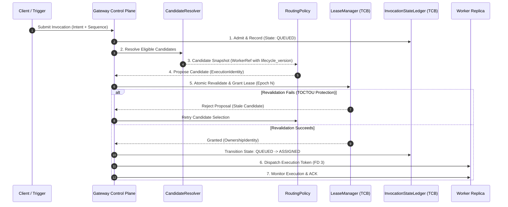

# Phase 4 Routing & Dispatch Architecture Specification

> **Specification Status**: `DESIGN APPROVED` — Implementation strictly blocked pending explicit authorization  
> **Governance Authority**: Locked Cortex Control Plane Model (Phase 1–3 Baseline SHA: `56afb86`)  
> **Target Subsystem**: Gateway Control Plane Routing & Dispatcher (`cortex/tools/kernel/replica/router.py`)

---

## 1. Fundamental Principles & Zero-Authority Boundary

### 1.1 Non-Authority & Revocable Proposal Principle

> **Fundamental Invariant (TCB Boundary Isolation)**:  
> *Routing decisions are revocable proposals, not execution authority. A routing decision has no authorization effect until a LeaseManager admission succeeds against current Gateway state.*

The Router is an **unprivileged candidate selector** operating inside the Gateway control plane. All authority over execution tokens, lease epochs, invocation state transitions, and witness verification remains strictly residing within the Gateway TCB components (`LeaseManager`, `InvocationStateLedger`, `WorkerLifecycleTracker`).

### 1.2 Router Possession Prohibition

The Router is explicitly **prohibited** from holding, generating, or inspecting:
1. `ExecutionToken` or bearer authorization tokens.
2. Capability secrets or private cryptographic keying material.
3. Gateway TCB state-mutation APIs (e.g. direct ledger or lease modification).

---

## 2. Component Architecture Decomposition

To preserve separation of concerns and prevent monolithic design creep, Phase 4 decomposes routing and dispatch into six distinct, single-responsibility components:

```text
               INVOCATION
                   │
                   ▼
           CandidateResolver  ─────────> "Who is eligible?" (Metadata Filter)
                   │
                   ▼
             RoutingPolicy    ─────────> "Which eligible worker should we propose?"
                   │
                   ▼
             LeaseManager     ─────────> "Is this assignment permitted right now?" (TCB Revalidation)
                   │
        ┌──────────┴──────────┐
        │                     │
     granted               rejected
        │                     │
        ▼                     ▼
            Dispatcher        RecoveryEngine  ─> "What happened if delivery failed?"
                │
                ▼
             WORKER
                │
                ▼
          CommitSequencer     ─────────> "What is allowed to become committed state?"
                │
        ┌───────┴───────┐
        ▼               ▼
   Effect Ledger    Witness Chain
```

### Component Responsibility Matrix

| Component | Role | Authority Level | Key Invariant |
| :--- | :--- | :---: | :--- |
| **CandidateResolver** | Filters worker pool against metadata criteria | Zero Authority | Evaluates derived eligibility snapshots |
| **RoutingPolicy** | Applies selection algorithms (Least-Inflight + FIFO) | Zero Authority | Deterministic proposal selection |
| **LeaseManager** | Authoritative atomic revalidation & lease grant | TCB Authoritative | Atomic revalidation inside Gateway lock |
| **Dispatcher** | Delivers token & parameters over IPC `FD 3` | Execution Engine | Unprivileged delivery mechanism |
| **RecoveryEngine** | Classifies orphaned/failed invocations | TCB Authoritative | Classifies into exact `RecoveryBucket` |
| **CommitSequencer** | Authoritative commit log & witness emission | TCB Authoritative | Final serialization boundary |

---

## 3. The 8-Stage Dispatch Pipeline & Atomic Lease Revalidation



### TOCTOU Prevention (Atomic Candidate Revalidation)

To eliminate Time-of-Check / Time-of-Use races between Router snapshot filtering and Gateway lease assignment, **`LeaseManager.grant_lease()` atomically revalidates the candidate inside the Gateway TCB lock** against current Gateway state rather than trusting the router snapshot:

$$\text{Revalidate}(W_{\text{candidate}}) \iff \begin{cases}
W_{\text{candidate}}.\text{exists} == \text{True} \\
W_{\text{candidate}}.\text{lifecycle\_version} == \text{CurrentLifecycleVersion}(W) \\
W_{\text{candidate}}.\text{stage} == \text{READY} \\
W_{\text{candidate}}.\text{config\_generation} == G_{\text{active}} \\
W_{\text{candidate}}.\text{config\_hash} == H_{\text{active}} \\
W_{\text{candidate}}.\text{sandbox\_profile\_hash} == P_{\text{active}} \\
W_{\text{candidate}}.\text{capability\_envelope\_hash} == C_{\text{active}} \\
W_{\text{candidate}}.\text{inflight} < \text{MaxWorkerInflight} \\
\text{Lease}_{\text{invocation}} \text{ is uncommitted \& available}
\end{cases}$$

If revalidation fails, the proposed lease is rejected, the stale candidate is evicted from the candidate list, and the `RoutingPolicy` selects the next best candidate without altering TCB authority state.

---

## 4. Worker Configuration Identity & Candidate Selection

### 4.1 Immutable Worker Ref & Versioned Snapshot Identity

Every candidate worker reference evaluated by `CandidateResolver` carries an explicit `lifecycle_version`:

```python
@dataclass(frozen=True)
class WorkerRef:
    instance_id: str
    group_id: str
    lifecycle_version: int
    config_generation: int
    config_hash: str
    sandbox_profile_hash: str
    capability_envelope_hash: str
    observed_inflight: int
```

### 4.2 Canonical Inflight Definition

To ensure absolute semantic parity across the Router, Lifecycle Tracker, and Gateway TCB, `Inflight(W)` is defined as:

$$\text{Inflight}(W) \equiv \big| \{ I \mid I \in \text{InvocationRecords} \land I.\text{state} \notin \text{TERMINAL\_STATES} \land I.\text{assigned\_worker\_id} == W \} \big|$$

### 4.3 Queue Fairness Semantics (Bounded FIFO per ReplicaGroup)

When multiple workloads wait in `QUEUED` state:
- **Baseline Queue Policy**: Bounded **FIFO per `ReplicaGroup`**.
- **Fairness Guarantee**: Invocations within the same `ReplicaGroup` are dispatched strictly in order of Gateway admission timestamp.
- **Priority Isolation**: Priority scheduling is deferred to future phases; Phase 4 strictly enforces deterministic FIFO queue fairness.

---

## 5. Sequence Ordering & State Conflict Fencing

### 5.1 Authoritative Gateway Commit Path Invariant

> **Commit Path Invariant**:  
> *Routing proposals and worker completion signals can NEVER bypass Gateway commit verification. Commitment occurs exclusively at the CommitSequencer boundary.*

The authoritative commit path remains strictly linear:
$$\text{Router Proposal} \longrightarrow \text{LeaseManager} \longrightarrow \text{Worker Execution} \longrightarrow \text{Gateway Verification} \longrightarrow \text{CommitSequencer} \longrightarrow \text{Witness}$$

### 5.2 Concrete State Domain Key Schema

For stateful invocations, state conflict boundaries are uniquely derived using a deterministic state domain key:

```python
@dataclass(frozen=True)
class StateDomainKey:
    resource_namespace: str
    target_path: str
    state_key: str

    def domain_hash(self) -> str:
        """Returns SHA-256 state domain identifier for conflict serialization."""
        raw = f"{self.resource_namespace}:{self.target_path}:{self.state_key}"
        return hashlib.sha256(raw.encode("utf-8")).hexdigest()
```

### 5.3 Execution Classes & Conflict Policy

| Class | Semantics | Routing & Serialization Contract |
| :--- | :--- | :--- |
| **Unordered / Commutative** | Read-only or commutative ops | Parallel dispatch to any eligible worker |
| **Ordered** | Client-sequenced ops | Dispatched sequentially by `ClientInvocationSequence` |
| **Version-Fenced** | Optimistic concurrency ops | Carries `TargetStateVersion`. Mismatched version rejected |
| **Serialized State Domain** | Exclusive stateful mutation | Serialized using `StateDomainKey.domain_hash()` state lock |

---

## 6. Bounded Memory & Telemetry Compaction

### 6.1 Memory Bounds

```math
\text{Memory}_{\text{router}} = O(\text{ActiveInvocations} + \text{ReadyWorkers})
```

- **Observability Retention**: `RoutingDecisionEvent` instances stream to disk journal / audit log immediately. Resident memory retention is capped at $O(\text{ActiveInvocations})$.
- **Candidate Caches**: Flushed automatically upon completion or compaction (`compact_terminated()`).

---

## 7. Proposed Phase 4 Verification Gates (RD-1 to RD-22)

| Gate ID | Test Focus | Assertion Target |
| :--- | :--- | :--- |
| **RD-1** | Unprivileged Router Boundary | Router cannot mutate TCB state directly |
| **RD-2** | Monotonic ConfigGeneration Filter | Stale `config_generation` worker excluded |
| **RD-3** | ConfigHash Mismatch Filter | Mismatched `config_hash` worker excluded |
| **RD-4** | Capability Envelope Containment | Worker missing capability excluded |
| **RD-5** | Lifecycle Readiness Filter | `DRAINING` / `QUIESCED` workers excluded |
| **RD-6** | Least-Inflight Selection Policy | Selects worker with minimum `Inflight(W)` |
| **RD-7** | Bounded FIFO Queue Handling | Enqueues in FIFO order until `QueueTimeoutSec` $\to$ `ERR_QUEUE_TIMEOUT` |
| **RD-8** | Atomic Revalidation Gate | `grant_lease()` revalidates candidate & `lifecycle_version` inside TCB lock |
| **RD-9** | Post-Assignment Worker Crash | Safe transition to `UNADMITTED` and re-queue |
| **RD-10** | State Domain Key Conflict Fencing | Concurrent stateful mutations serialized by `StateDomainKey` |
| **RD-11** | Queue Capacity Ceiling | `MaxQueueDepth` breach returns `ERR_QUEUE_FULL` |
| **RD-12** | Routing Decision Provenance | Appends valid `RoutingDecisionEvent` to witness |
| **RD-13** | TOCTOU Candidate Draining Race | Candidate becomes `DRAINING` mid-selection $\to$ revalidation fails $\to$ next candidate |
| **RD-14** | TOCTOU ConfigGen Change Race | Generation increments mid-selection $\to$ revalidation fails |
| **RD-15** | TOCTOU ConfigHash Mismatch Race | Hash changes mid-selection $\to$ revalidation fails |
| **RD-16** | Pre-Grant Worker Death Race | Worker dies before `grant_lease()` $\to$ revalidation fails |
| **RD-17** | Pre-Grant Inflight Limit Race | Worker hits max inflight mid-selection $\to$ revalidation fails |
| **RD-18** | Parallel State Conflict Fencing | Concurrent stateful mutations serialized |
| **RD-19** | Per-Invocation Lease Scope Isolation | Unrelated invocation lease epochs independent |
| **RD-20** | Bounded Metadata Memory | Router memory remains $O(\text{Active} + \text{Ready})$ under load |
| **RD-21** | Deterministic Tie-Breaking | Identical load candidate selection strictly deterministic |
| **RD-22** | Router Zero-Token Possession Isolation | Router holds zero bearer tokens or capability keys |

---

## 8. Governance & Implementation Status

```text
PHASE 1–3 CONTROL PLANE KERNEL:  FROZEN & APPROVED (SHA: 56afb86, 307/307 PASS)
PHASE 4 ARCHITECTURE SPEC:       DESIGN APPROVED
PHASE 4 AUDIT REPORT:            APPROVED (12/12 AUD4 findings resolved in spec)
PHASE 4 CODE IMPLEMENTATION:     STRICTLY BLOCKED PENDING AUTHORIZATION
LOAD BALANCING & AUTOSCALING:    STRICTLY BLOCKED
```
