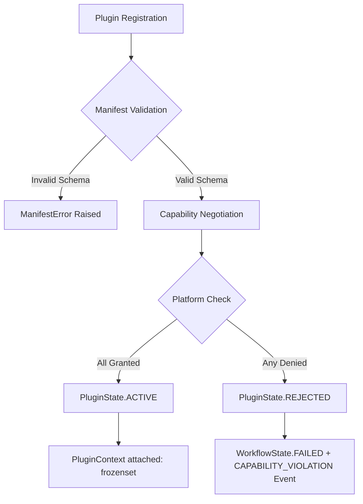

# Cortex Plugin Runtime Threat Model

> **Status**: Formal Architecture & Security Specification  
> **Target Version**: Cortex v0.2.1 Core (Updated for Gate A Physical Enforcement Baseline)  
> **Empirical Foundation**: Issue #18 Capability Enforcement Security Audit (`c8f7a96`)  
> **Scope**: In-Memory Plugin Capability Security & Physical Execution Enforcement Boundaries  

---

## 1. Executive Summary & Security Scope

Cortex is a spatiotemporal authority and semantic verification framework designed to enforce capability-negotiated sandboxing and post-facto deterministic replay across autonomous software workflows.

In **Cortex v0.2.1**, all plugins execute **in-process** within a single Python interpreter runtime. The Cortex Kernel acts as an in-memory mediator that negotiates security capabilities declared in a `PluginManifest` prior to granting runtime resource handles or context references.

> [!IMPORTANT]
> **Defensible Security Boundary Definition**  
> The Cortex v0.2.1 capability-enforcement boundary is **empirically proven against in-process adversarial capability misuse and manifest edge-cases (Matrix A–M)**. It does **not** claim to provide OS-level hardware sandboxing, process memory isolation, or protection against untrusted native C-extensions executing within the same process.

---

## 2. Proven Capability Enforcement Guarantees (Issue #18 Empirical Evidence)

The security guarantees established in Cortex v0.2.1 are derived directly from the automated adversarial test suite ([`tests/regression/test_v021_security_audit.py`](../../tests/regression/test_v021_security_audit.py)) executed during Issue #18:



### Verified Security Invariants Matrix (Categories A–M)

| Category | Invariant Title | Threat / Attack Vector | Verified Security Behavior | Status |
| :---: | :--- | :--- | :--- | :--- |
| **A** | Authorized Capability | Legitimate plugin requires platform capability | Granted capability set matches request exactly; workflow completes to `COMPLETED`. | **PROVEN** |
| **B** | Unauthorized Capability | Plugin requests forbidden or ungranted capability | Platform rejects registration (`REJECTED`), emits `CAPABILITY_VIOLATION` event, sets workflow state to `FAILED`. | **PROVEN** |
| **C** | Empty Capability Set | Unprivileged plugin registered | Plugin receives empty `frozenset()`. All `has_capability()` checks evaluate to `False`. | **PROVEN** |
| **D** | Unknown Capability | Manifest requests invalid capability namespace | Unknown capability is added to `denied_capabilities` and plugin is `REJECTED` without runtime exceptions. | **PROVEN** |
| **E** | Duplicate Capabilities | Manifest contains duplicate capability entries | Capability set is deduplicated deterministically during negotiation. | **PROVEN** |
| **F** | Malformed Manifest | Non-string, empty, or whitespace capability values | Pre-negotiation validation in `validate_manifest()` raises `ManifestError` immediately. | **PROVEN** |
| **G** | Request Mismatch | Plugin attempts undeclared capability at runtime | `PluginContext.has_capability()` checks only granted capabilities; unrequested permissions return `False`. | **PROVEN** |
| **H** | Post-Negotiation Mutation | Plugin attempts `context.granted_capabilities.add(...)` | `granted_capabilities` is an immutable `frozenset`. In-process set mutation raises `AttributeError`. | **PROVEN (FIXED)** |
| **I** | Multi-Plugin Isolation | Plugin A attempts to claim Plugin B's capabilities | Plugin contexts are strictly independent objects scoped per plugin instance. | **PROVEN** |
| **J** | Registration Idempotency | Re-registering the same plugin instance | Registration is idempotent; existing handler references are preserved without duplicate subscriptions. | **PROVEN** |
| **K** | Workflow Failure Linkage | Capability violation during execution | Violation produces `VerificationResultEvent` with `rule_id="CAPABILITY_VIOLATION"` in `EventStore`. | **PROVEN** |
| **L** | CLI Diagnostic Signal | Capability failure executed via CLI | CLI raises `CapabilityViolationError`, terminating with authoritative **Exit Code 2**. | **PROVEN** |
| **M** | Deterministic Replay | Replaying trace containing capability failure | Replay engine processes `CAPABILITY_VIOLATION` events with 100% deterministic graph parity. | **PROVEN** |

---

## 3. Vulnerability Case Study: Post-Negotiation Set Mutation (Category H)

During the Issue #18 audit, an empirical vulnerability was discovered in the in-process capability boundary.

### The Attack Vector
In the initial v0.2.0 implementation, `PluginContext.granted_capabilities` was defined as a standard Python mutable `set[str]`. At runtime, a malicious or defective plugin executing inside the host process could execute:

```python
# Adversarial privilege escalation attempt inside plugin.on_event()
self.context.granted_capabilities.add("unauthorized:root_access")
```

Because `granted_capabilities` was a mutable set reference, `.add()` modified the set in place. Subsequent calls to `self.context.has_capability("unauthorized:root_access")` evaluated to `True`, successfully bypassing post-negotiation security checks.

### Remediation Architecture
In commit [`c8f7a96`](../../cortex/plugin.py#L26), `PluginContext` was updated with a coercive `__post_init__` hook:

```python
@dataclass
class PluginContext:
    """Runtime context provided to plugins, scoped strictly to granted capabilities."""
    session_id: str
    granted_capabilities: set[str] | frozenset[str]
    publish_func: Callable[[BaseEvent], None]

    def __post_init__(self) -> None:
        object.__setattr__(self, "granted_capabilities", frozenset(self.granted_capabilities))

    def has_capability(self, cap_name: str) -> bool:
        """Check if a capability was granted to this plugin instance."""
        return cap_name in self.granted_capabilities
```

> [!NOTE]
> **Immutability Guarantee**  
> Any post-negotiation attempt to call `.add()`, `.remove()`, or `.clear()` on `granted_capabilities` raises an immediate `AttributeError: 'frozenset' object has no attribute 'add'`, enforcing immutability at the Python runtime level.

---

## 4. Trust Boundaries & Security Assumptions

### In-Scope Security Perimeter
1. **Host Kernel Core**: `CortexClient`, `PluginRegistry`, `CapabilityNegotiator`, `EventStore`.
2. **Plugin Sandbox Boundary**: `BasePlugin` instances interacting strictly via `PluginContext` and event handlers.
3. **Event Transport**: `InMemoryTransport` dispatching immutable `BaseEvent` dataclasses.

### Foundational Security Assumptions
1. **Python Interpreter Integrity**: The underlying Python runtime environment (`python3`) enforces standard object encapsulation, attribute access controls, and builtin type immutability (`frozenset`, `tuple`, `bytes`).
2. **Standard Library Trust**: The Python standard library (`json`, `dataclasses`, `os`, `sys`) is un-compromised.
3. **No Unsafe Reflection**: External plugins do not invoke internal CPython C-API functions (`ctypes`, `c_void_p`, `gc.get_referents`) to mutate read-only object memory.

---

## 5. Explicit Out-of-Scope Risks (Operational Research / v0.3 Pipeline)

The single-process architecture of Cortex v0.2.1 explicitly leaves the following operational risks **out of scope**. These risks define the research agenda for Phase 2 and the architectural requirements for v0.3:

> [!WARNING]
> **Known Operational Limits in Single-Process Runtimes**

1. **Host Process Crash Escalation (Issue #11)**:
   - *Risk*: An unhandled exception, `sys.exit()`, `os._exit()`, or `SIGSEGV` inside a plugin handler terminates the entire host Python process, halting all concurrent workflows.
   - *Mitigation Plan*: Phase 2 Issue #11 research; v0.3 Multi-Process worker boundary (Issue #14).
   - *Gate A Status*: **PARTIALLY MITIGATED**. `WorkerSupervisor` isolates worker processes; worker crash does not propagate to Gateway. Unexpected SIGKILL recovery adversarially tested.

2. **CPU Starvation & Blocking Handler Execution (Issue #12)**:
   - *Risk*: An infinite loop (`while True: pass`) or long-running synchronous I/O call inside `plugin.on_event()` blocks the main loop thread indefinitely.
   - *Mitigation Plan*: Phase 2 Issue #12 research; worker process watchdog supervision (Issue #15).
   - *Gate A Status*: **MITIGATED**. cgroups v2 `cpu.max` CFS quota enforces hard CPU ceiling per worker. Adversarially tested.

3. **Memory Exhaustion & OOM Termination (Issue #11)**:
   - *Risk*: A rogue plugin allocating infinite memory in global scope causes an Out-Of-Memory (OOM) killer event that terminates the host engine.
   - *Mitigation Plan*: Phase 2 Issue #11 research; process cgroups / memory limits.
   - *Gate A Status*: **MITIGATED**. cgroups v2 `memory.max` enforces hard RAM ceiling per worker. OS OOM-killer targets contained worker, not Gateway.

4. **Direct Process Memory Inspection via `ctypes`**:
   - *Risk*: Because all plugins execute in the same address space, a malicious Python plugin importing `ctypes` can inspect process memory pointers.
   - *Mitigation Plan*: v0.3 Multi-Process isolation boundary with OS IPC event protocol (Issue #16).

---

## 6. Path to Multi-Process Isolation (v0.3 Foundations)

The empirical evidence from Issue #18 establishes that **semantic capability contracts and event schemas are sound**. Gate A provides the first physical enforcement boundary using Linux cgroups v2.

```
               Cortex Architecture Evolution
                           │
             ┌─────────────┼─────────────┐
             │             │             │
       Cortex v0.2.1   Gate A        Cortex v0.3+
     (Single Process)  (cgroups v2)  (Full Isolation)
             │             │             │
   In-Memory Dispatch  Physical     Deterministic IPC
             │         CPU/RAM/PID      Socket
             │         Enforcement       │
    Same Capability Invariants & Event Lineage Graph
```

### Current Gate A Enforcement Status
- **CPU Quota**: cgroups v2 `cpu.max` — **ADVERSARIALLY-TESTED**
- **RAM Ceiling**: cgroups v2 `memory.max` — **ADVERSARIALLY-TESTED**
- **PID Ceiling**: cgroups v2 `pids.max` — **ADVERSARIALLY-TESTED**
- **Worker Crash Recovery**: SIGKILL/OOM observation and reconciliation — **ADVERSARIALLY-TESTED**
- **Reference**: `docs/architecture/gate_a_physical_execution_isolation.md`

### Remaining Open Items
- **Seccomp-BPF syscall filtering**: Config schema defined; kernel filter attachment not yet implemented.
- **Landlock filesystem sandboxing**: Config schema defined; runtime enforcement not yet active.
- **Network namespace isolation** (`CLONE_NEWNET`): Proposed for future phase.
- **Python → Coq formal refinement**: Correspondence between concrete Python enforcement and abstract Coq model remains OPEN.
