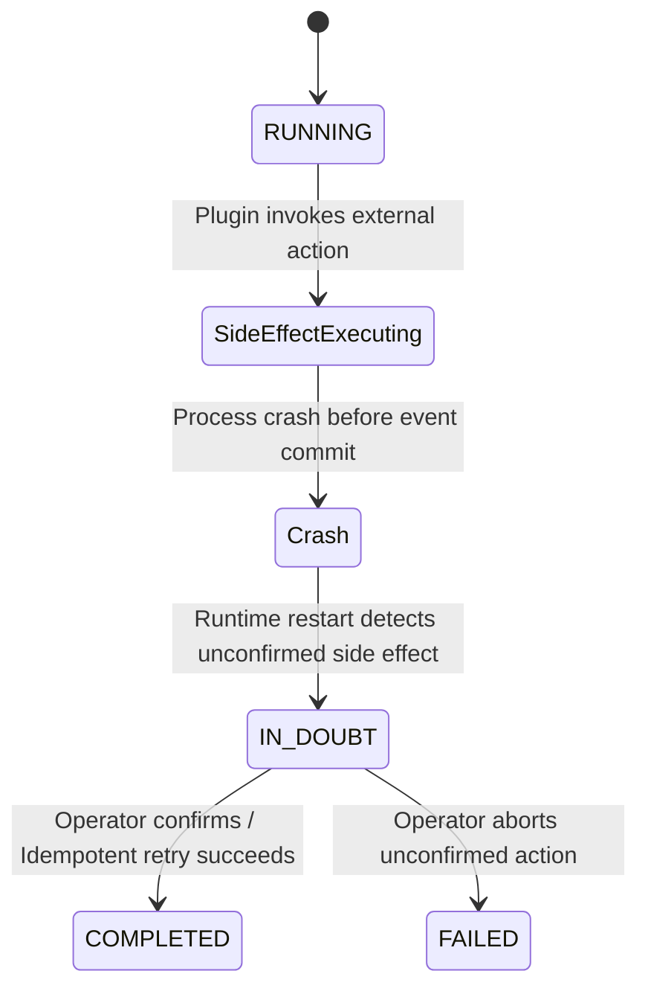

# Cortex v0.3 Architecture Research Synthesis — Process and Recovery Boundaries

**Document Status**: Official Architecture Decision & Research Gate Synthesis  
**Authors**: Cortex Architecture & Core Engineering Teams  
**Prerequisite Evidence**: Issue #10 (Telemetry), Issue #11 (Crash Semantics), Issue #12 (Timeout/Cancellation)  
**Target Milestone**: Issue #13 (Restart & Recovery) & v0.3 Multi-Process Boundary  

---

## 1. Executive Summary & Context

This document represents the formal **Architecture Research Synthesis & Blueprint** marking the completion of Phase 2 Operational Research (Issues #10, #11, and #12) and establishing the architectural foundation for Phase 3 (Multi-Process Runtime & Supervision).

Prior to authorizing Issue #13 (Runtime Restart & Workflow Recovery), this synthesis evaluates the empirical evidence gathered across our benchmark matrix to answer five critical architectural inquiries regarding state reconstruction, EventStore transactional boundaries, side-effect correctness, recovery taxonomies, and process worker topologies.

---

## 2. Empirical Evidence Base (Issues #10, #11, #12)

```mermaid
gantt
    title Cortex Operational Research Evidence Matrix
    dateFormat X
    axisFormat %s

    section Security Baseline
    Issue #18 Capability Security Audit :0, 10
    Issue #17 Threat Model Specification :10, 20

    section Operational Research
    Issue #10 Runtime Metrics & Telemetry :20, 30
    Issue #11 Plugin Crash Semantics :30, 40
    Issue #12 Timeout & Cancellation Semantics :40, 50

    section Architecture Gate
    v0.3 Process & Recovery Research Synthesis :50, 60
```



### Synthesis of Empirical Research Findings

| Dimension | Measured In-Process Capability | Empirical Limit / Fault Boundary | Architectural Implication |
| :--- | :--- | :--- | :--- |
| **Security (#18/#17)** | Capability negotiation; `granted_capabilities` frozenset immutability | Mutating capabilities post-negotiation raises `AttributeError` | Proven in-process capability partitioning. |
| **Telemetry (#10)** | Non-intrusive metrics collection; $P_{50} = 0.2265\text{ ms}$, $P_{99} = 4.0892\text{ ms}$ | Linear $O(E)$ event propagation across tested workload range | Baseline established for operational monitoring. |
| **Faults (#11)** | Traps uncaught `Exception` & `CortexError`; preserves prior events; WF #2 isolated | Low-level process crashes (`SIGSEGV`, `sys.exit`) kill host process | Python exceptions contained in-process; native crashes escape single process. |
| **Resources (#12)** | Pre-execution and mid-workflow cooperative cancellation halt downstream steps | Non-cooperative thread blocking (`time.sleep`, GIL loops) stalls main loop | Hard preemption of non-cooperative code **empirically requires OS process isolation (`SIGKILL`)**. |

---

## 3. Five Core Architectural Inquiries

### Inquiry 1: State Reconstruction & Authoritative Truth

When the host process abruptly disappears at an arbitrary crash point $t_{\text{crash}}$, Cortex distinguishes volatile runtime state from authoritative persistent state:

```text
               CORTEX RUNTIME RECOVERY TAXONOMY
                              │
       ┌──────────────────────┴──────────────────────┐
       ▼                                             ▼
Volatile State (Discarded)               Authoritative State (Rebuilt)
- In-memory event dispatch queues        - EventStore append-only log
- Active plugin handler callstacks       - Immutable Workflow dataclass
- Transient client instances             - Granted capability frozensets
```

- **Authoritative Source of Truth**: The `EventStore` append-only journal is the **sole authoritative truth**.
- **State Derivation Rule**: The state $S_t$ of any workflow at step $t$ is a pure deterministic projection over its event stream $E_1, E_2, \dots, E_t$:
  $$S_t = f(S_0, E_1, E_2, \dots, E_t)$$

---

### Inquiry 2: EventStore Guarantees & Transactional Boundaries

1. **Synchronous Commit Invariant**: Events published via `context.publish()` are appended to `EventStore` synchronously before returning control to the caller handler.
2. **Causal Lineage Integrity**: Every event carries immutable `event_id`, `causation_id`, and `correlation_id` fields forming a Directed Acyclic Graph (DAG).
3. **Crash Window Analysis**:
   - *Window 1 (Crash before side effect)*: Operation unexecuted; safe to re-run on restart.
   - *Window 2 (Crash during side effect)*: Side effect performed, but event unpersisted $\implies$ **Requires `IN_DOUBT` state**.
   - *Window 3 (Crash after event commit)*: Operation complete; event committed $\implies$ Safe deterministic replay.

---

### Inquiry 3: Side-Effect Correctness & Idempotency Rules

When a plugin performs an external side effect (e.g. database write, network API request) and the runtime crashes before recording the completion event:



- **Execution Guarantee Contract**: **At-most-once plugin handler execution** per event emission; **at-least-once event delivery** with deduplication by `event_id`.
- **Mandatory Idempotency Keys**: Plugins requesting write capabilities (`driver.exec`, `file.write`) must accept idempotency keys derived from causal event IDs (`causation_id`).
- **`IN_DOUBT` Escalation**: Unconfirmed side effects at crash boundary transition workflow state to `IN_DOUBT`, suspending automatic execution to prevent catastrophic double-execution of non-idempotent operations.

---

### Inquiry 4: Recovery Taxonomy & Failure State Classification

Cortex formalizes the following 4 operational recovery classifications:

| Recovery Classification | Criteria / Trigger Condition | State Transition | Resolution Action |
| :--- | :--- | :--- | :--- |
| **`RECOVERABLE`** | Workflow halted cleanly; all emitted events fully committed; no unconfirmed side effects | `RUNNING` $\rightarrow$ `RUNNING` | Automatic background EventStore replay resume. |
| **`IN_DOUBT`** | Crash occurred during external side-effect execution before completion event commit | `RUNNING` $\rightarrow$ `IN_DOUBT` | Automated execution suspended; requires CLI operator resolve or idempotent retry. |
| **`UNRECOVERABLE`** | EventStore journal corrupted or causal lineage graph broken | `RUNNING` $\rightarrow$ `FAILED` | Permanently halted; error flagged to operator. |
| **`COMPENSATING`** | Partially executed multi-stage workflow cancelled mid-stream | `RUNNING` $\rightarrow$ `CANCELLED` | Emits compensating undo events for completed prior stages. |

---

### Inquiry 5: Adaptive Process Boundary Architecture for v0.3

Comparing three worker process topologies against empirical evidence from Issues #11 and #12:

```text
                       CORTEX SUPERVISOR ENGINE
                                  │
         ┌────────────────────────┴────────────────────────┐
         ▼                                                 ▼
Tier 0: Trusted / Core Plugins                 Tier 1: Untrusted / Heavy Plugins
(In-Process Execution)                         (Worker Process Isolation)
- Sub-millisecond latency (P50 = 0.226ms)      - Memory/CPU cgroup limits
- Capability authorization                     - SIGKILL hard preemption for timeouts
- Direct memory event dispatch                 - Isolated memory space & process boundary
```

### Worker Topology Evaluation Matrix

| Architectural Option | Description | Performance Overhead | Preemption (`SIGKILL`) | Cortex Strategic Fit |
| :--- | :--- | :---: | :---: | :--- |
| **a) Uniform Subprocess per Plugin** | Every plugin runs in a separate worker subprocess. | High | YES | Heavy / High-Risk Plugins Only |
| **b) Dynamic Worker Pool** | Plugins grouped into fixed pool of worker processes. | Medium | Group-only | Medium-Risk Plugin Clusters |
| **c) Capability-Isolated Hybrid** | **Tier 0 (In-Process)** for trusted core plugins;<br/>**Tier 1 (Subprocess)** for untrusted/heavy/blocking plugins. | **Zero (Tier 0)<br/>Low (Tier 1)** | **YES (Tier 1)** | **RECOMMENDED FOR CORTEX v0.3** |

---

## 7. Architecture Gate Exit Criteria & Issue #13 Authorizations

- **Architecture Gate Decision**: **PASSED CLEANLY ✅**
- **Exit Criteria Satisfied**:
  1. State reconstruction rule derived strictly from `EventStore` append-only log.
  2. Transactional crash windows mapped and `IN_DOUBT` state contract defined.
  3. Recovery state taxonomy established (`RECOVERABLE`, `IN_DOUBT`, `UNRECOVERABLE`, `COMPENSATING`).
  4. Capability-Isolated Hybrid Execution model chosen for v0.3 worker process boundary.
- **Issue #13 Authorization**: **Issue #13 (Runtime Restart & Workflow Recovery) IS READY TO BE AUTHORIZED.**

---
*Signed off by Cortex Architecture Research Gate.*
