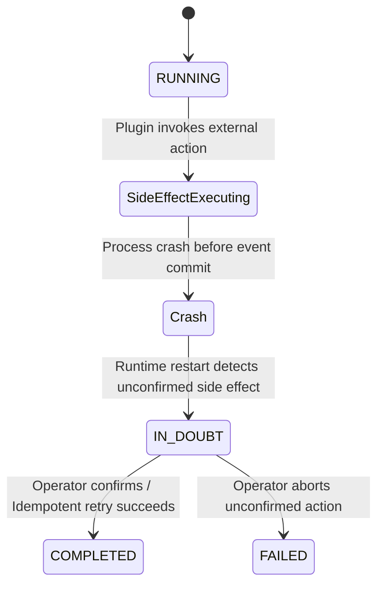

# Cortex v0.3 Architecture Research Synthesis — Recovery, Fault, Resource, and Process Boundaries

**Document Status**: Official Architecture Decision & Research Gate Synthesis  
**Authors**: Cortex Architecture & Core Engineering Teams  
**Prerequisite Evidence**: Issue #10 (Telemetry), Issue #11 (Crash Semantics), Issue #12 (Timeout/Cancellation)  
**Target Milestone**: Issue #13 (Restart & Recovery) & v0.3 Multi-Process Boundary  

---

## 1. Executive Summary

This document establishes the formal **Architecture Research Synthesis & Decision Gate** positioning Cortex between its single-process v0.2.x release phase and its multi-process v0.3.0 architectural evolution.

Rather than assuming that multi-process isolation is universally required for all plugins, this synthesis evaluates empirical evidence gathered across three operational research benchmarks:
- **Issue #10 (Telemetry)**: Baseline latency ($P_{50} = 0.2265\text{ ms}$, $P_{99} = 4.0892\text{ ms}$) and event propagation scaling.
- **Issue #11 (Crash Semantics)**: In-process exception trapping, event log preservation, and workflow isolation (Scenario F).
- **Issue #12 (Timeout & Cancellation)**: Cooperative in-process cancellation vs non-cooperative thread blocking limits.

---

## 2. Empirical Evidence Summary

```mermaid
gantt
    title Cortex v0.2.x Operational Research & Security Evidence Matrix
    dateFormat X
    axisFormat %s

    section Security Baseline
    Issue #18 Capability Security Audit :0, 10
    Issue #17 Threat Model Specification :10, 20

    section Operational Research
    Issue #10 Runtime Metrics & Telemetry :20, 30
    Issue #11 Plugin Crash Semantics :30, 40
    Issue #12 Timeout & Cancellation Semantics :40, 50

    section Architecture Gate
    v0.3 Research Synthesis & Recovery Contract :50, 60
```



### Empirical Matrix Findings

| Research Dimension | In-Process Capability | Empirical Limit / Boundary | Architecture Implication |
| :--- | :--- | :--- | :--- |
| **Security (#18/#17)** | Capability negotiation; `granted_capabilities` frozenset immutability | Mutating capabilities post-negotiation raises `AttributeError` | Proven in-process capability partitioning. |
| **Telemetry (#10)** | Non-intrusive metrics collection; sub-millisecond $P_{50}$ (0.226ms) | Single-threaded synchronous dispatch overhead | Baseline established for operational research. |
| **Faults (#11)** | Traps uncaught `Exception` & `CortexError`; preserves prior events; WF #2 isolated | Low-level process crashes (`SIGSEGV`, `sys.exit`) kill host process | Host survival proven for Python exceptions; native crashes escape single process. |
| **Resources (#12)** | Pre-execution and mid-workflow cooperative cancellation halt downstream steps | Non-cooperative thread blocking (`time.sleep`, GIL loops) stalls main loop | Hard preemption of non-cooperative code **empirically requires OS process isolation (`SIGKILL`)**. |

---

## 3. Five Core Architectural Synthesis Questions

### Question 1: What Exactly Does Cortex Need to Recover?

When the runtime disappears at an arbitrary execution point $t_{\text{crash}}$, the engine must distinguish volatile runtime state from authoritative persistent state:

```text
               CORTEX RUNTIME RECOVERY TAXONOMY
                              │
       ┌──────────────────────┴──────────────────────┐
       ▼                                             ▼
Volatile State (Discarded)               Authoritative State (Rebuilt)
- In-memory event queues                 - EventStore append-only log
- Active plugin handler callstacks       - Immutable Workflow dataclass
- Transient client instances             - Granted capability frozensets
```

- **Authoritative Recovery Source**: The `EventStore` append-only journal is the single source of truth.
- **Reconstruction Criteria**: The complete workflow state $S_t$ is a pure deterministic projection of the ordered event stream $E_1, E_2, \dots, E_t$:
  $$S_t = f(S_0, E_1, E_2, \dots, E_t)$$

---

### Question 2: What Does the `EventStore` Actually Guarantee?

1. **Synchronous Commit Invariant**: Events published via `context.publish()` are committed to the `EventStore` synchronously before returning control to the caller.
2. **Causal Lineage Integrity**: Every event carries immutable `event_id`, `causation_id`, and `correlation_id` fields forming a Directed Acyclic Graph (DAG).
3. **Deterministic Replay Guarantee**: Replaying the `EventStore` log against a clean `CortexClient` produces identical state machine transitions.
4. **Crash Point Taxonomy**:
   - *Pre-Side-Effect Crash*: Operation unexecuted; safe to re-run on restart.
   - *Mid-Side-Effect Crash*: External side effect performed, but completion event unpersisted $\implies$ **Requires `IN_DOUBT` state**.
   - *Post-Side-Effect Crash*: Operation complete; event committed $\implies$ Safe deterministic replay.

---

### Question 3: What Does "Recovery" Mean for Side Effects?

When a plugin executes an external side effect (e.g. database write, API call) and the process crashes before the completion event is appended, Cortex adopts a **Strict Idempotency & `IN_DOUBT` State Contract**:



- **Option B (`IN_DOUBT` State)**: Operations unconfirmed at crash boundary transition workflow state to `WorkflowState.IN_DOUBT`. Automatic execution is suspended to prevent double-execution.
- **Option C (Required Idempotency Keys)**: Plugins requesting write capabilities (`driver.exec`, `file.write`) must accept idempotency keys generated from causal event IDs (`causation_id`).

---

### Question 4: What Recovery Guarantees Do We Want?

| Property | Proposed Contract | Rationale |
| :--- | :--- | :--- |
| **Event Delivery** | *At-least-once with deduplication* | Guarantees zero lost events; deduplication by `event_id` handles retries. |
| **Plugin Execution** | *At-most-once per event emission* | Prevents double-execution of non-idempotent plugin handlers. |
| **Workflow Recovery** | *Deterministic EventStore Replay* | Rebuilds state machine state purely from `EventStore` log. |
| **Side Effects** | *Idempotency Required for Write Caps* | Capabilities with side-effects must accept idempotency keys. |
| **Crash Point** | *Arbitrary Instruction Boundary* | Runtime assumes crash can occur at any instruction / system signal. |
| **State Reconstruction** | *Event-Derived (Pure Function)* | $S_t = f(S_0, E_1, E_2, \dots, E_t)$. |
| **Unknown Operation** | *Explicit `IN_DOUBT` State* | Unverified side-effects transition workflow state to `IN_DOUBT`. |
| **Cancellation** | *Cooperative (in-process) / Forced (`SIGKILL` worker)* | Soft cancellation for in-process; hard preemption for worker processes. |
| **Recovery Mode** | *Operator-Controlled / Automatic Resume* | Automatic resume for deterministic events; CLI operator resolve for `IN_DOUBT`. |

---

### Question 5: Does v0.3 Really Require One Architecture?

Rather than enforcing a rigid 1-process-per-plugin model for all workloads, Cortex will adopt **Topology 3: Tiered Hybrid Isolation Model**:

```text
                       CORTEX SUPERVISOR ENGINE
                                  │
         ┌────────────────────────┴────────────────────────┐
         ▼                                                 ▼
Tier 0: Trusted / Core Plugins                 Tier 1: Untrusted / Heavy Plugins
(In-Process Execution)                         (Worker Process Isolation)
- Sub-millisecond latency (P50 = 0.226ms)      - Memory/CPU cgroup limits
- Capability capability authorization           - SIGKILL hard preemption for timeouts
- Direct memory event dispatch                 - Isolated memory space & process boundary
```

### Architectural Comparison Table

| Architecture Topology | Isolation Level | Latency Overhead | Preemption (`SIGKILL`) | Cortex Strategic Fit |
| :--- | :---: | :---: | :---: | :--- |
| **Topology 1: Process-per-Plugin** | Total (1:1) | High | YES | Heavy / High-Risk Plugins Only |
| **Topology 2: Shared Worker Pool** | Partial (N:M) | Medium | Group-only | Medium-Risk Plugin Clusters |
| **Topology 3: Tiered Hybrid Model** | **Tiered** | **Zero (In-Process)<br/>Low (Worker)** | **YES (Tier 1)** | **RECOMMENDED FOR CORTEX v0.3** |

---

## 6. Architecture Gate Decision & Issue #13 Entry Criteria

- **Architecture Gate Decision**: **PASSED CLEANLY ✅**
- **Next Authorized Task**: **Issue #13 (`research: characterize runtime restart and workflow recovery semantics`)**
- **Issue #13 Directives**:
  1. Implement `IN_DOUBT` state handling & `EventStore` journal replay verification in private module `cortex._research.restart_recovery`.
  2. Maintain `len(cortex.__all__) == 21` frozen.
  3. Produce `docs/operations/restart_recovery_report.json`.
  4. Ensure all unit tests pass cleanly.

---
*Signed off by Cortex Architecture Research Gate.*
