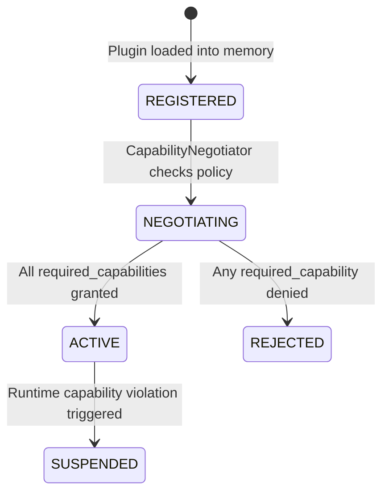

# PluginManifest & Capability Security Specification

The `PluginManifest` defines a plugin's identity, event contracts (consumed and produced events), and requested security capabilities. It acts as the foundational security contract between external plugins and the Cortex Kernel.

---

## 📋 Security Policy Schema

Plugins can declare manifests using JSON, YAML, or native Python dataclass structures.

### YAML Schema (`manifest.yaml`)
```yaml
name: "repository-auditor-plugin"
version: "0.3.0"
description: "Executes read-only repository hygiene and static analysis tools"

consumes_events:
  - "CommandIssuedEvent"

produces_events:
  - "DriverTelemetryEvent"
  - "VerificationResultEvent"

required_capabilities:
  - "fs:read"
  - "exec:git"
  - "exec:pytest"
  - "hardware.telemetry.read"
```

### JSON Schema (`manifest.json`)
```json
{
  "name": "repository-auditor-plugin",
  "version": "0.3.0",
  "description": "Executes read-only repository hygiene and static analysis tools",
  "consumes_events": ["CommandIssuedEvent"],
  "produces_events": ["DriverTelemetryEvent", "VerificationResultEvent"],
  "required_capabilities": [
    "fs:read",
    "exec:git",
    "exec:pytest",
    "hardware.telemetry.read"
  ]
}
```

---

## 🔒 Standard Capability Namespaces

Capabilities follow a namespaced convention (`domain:action` or `domain.subdomain:action`) to enforce granular permission boundaries:

| Namespace | Example Capability | Description | Permission Scope |
| :--- | :--- | :--- | :--- |
| `workflow.*` | `workflow.plan.create` | Generating plan events | Internal kernel workflow planning |
| `workflow.*` | `workflow.command.issue` | Issuing executable command events | Command dispatcher authorization |
| `fs:*` | `fs:read` | Read-only file system access | File reading & metadata inspection |
| `fs:*` | `fs:write` | Write / Edit file system access | File creation, modification, deletion |
| `exec:*` | `exec:git` | Git command execution | Invoking `git status`, `git diff`, etc. |
| `exec:*` | `exec:pytest` | Test suite execution | Invoking `pytest` test runners |
| `net:*` | `net:http:outbound` | Outbound HTTP/HTTPS requests | Web API and remote service integration |
| `db:*` | `db:read:users` | Database read queries | Table-level read operations |
| `hardware.*` | `hardware.telemetry.read` | Telemetry sensor access | Reading hardware telemetry metrics |

---

## 💡 Custom Capability Definitions

Developers can define custom capabilities for domain-specific applications (e.g., Slack integrations, LLM inference, drone navigation):

```python
from cortex import PluginManifest

CUSTOM_MANIFEST = PluginManifest(
    name="custom-slack-notifier",
    version="1.0.0",
    description="Sends security alerts to Slack",
    consumes_events=["VerificationResultEvent"],
    produces_events=["DriverTelemetryEvent"],
    required_capabilities=[
        "api:slack:send_message",  # Custom capability token
        "audit:alert:publish"      # Custom capability token
    ],
)
```

---

## 🔄 Negotiation Lifecycle State Machine

When a plugin is registered via `CortexClient.register_plugin(plugin)`, it moves through a strict 4-state lifecycle:



### Lifecycle States

1. **`REGISTERED`**: Plugin manifest is registered in the `PluginRegistry`.
2. **`NEGOTIATING`**: `CapabilityNegotiator` evaluates `manifest.required_capabilities` against the platform's `platform_capabilities` policy set.
3. **`ACTIVE`**: All requested capabilities are authorized. A scoped `PluginContext` is attached, and the plugin is granted access to the event bus.
4. **`REJECTED`**: One or more requested capabilities were denied by policy. The plugin is barred from publishing or consuming events.
5. **`SUSPENDED`**: An active plugin attempted an unauthorized operation at runtime, triggering an immediate security suspension.
