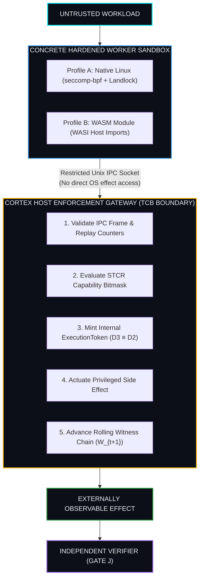
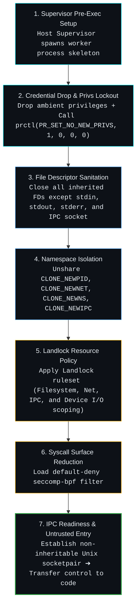

# Gate G Remediation Specification: Hardened Worker Isolation & IPC Boundary Architecture

**Author:** Iradukunda Fils <iradukundafils1@gmail.com>  
**Role:** Systems Architect & Hardware/Software Co-Designer  
**Status:** NORMATIVE SPECIFICATION (PHASE 13 GATE G REMEDIATION)  
**Date:** August 16, 2026 (Updated with 11-Point Closure Standard & PR_SET_NO_NEW_PRIVS)

---

## 1. Executive Summary & Security Invariant

An audit of the Cortex runtime (`docs/architecture/gate_g_complete_mediation_inventory.md`) demonstrated that while the mediated path through `ExecutionToken` ($P2$), `Rolling Witness Chain` ($P3$), and `Independent Verifier` ($P4$) is implementation-certified, untrusted plugins running inside the host process can bypass this boundary via standard library imports (`os`, `socket`, `subprocess`, `ctypes`).

**Gate G Remediation** defines the normative security boundary required to achieve complete mediation.

### 1.1 Technology-Neutral Core Invariant
> **Cortex Complete Mediation Invariant**:  
> An untrusted workload **MUST NOT** be capable of producing an externally observable side-effect except through the Cortex Enforcement Gateway.

---

## 2. Defense-in-Depth Responsibility Matrix & Profiles

Rather than embedding specific OS mechanisms into the core semantic definition of Cortex, Gate G separates the **Normative Semantic Invariant** from **Concrete Sandbox Profiles** across a 5-layer defense-in-depth matrix:

| Security Layer | Operational Mechanism | Architectural Security Function |
| :--- | :--- | :--- |
| **1. Privilege Reduction** | Drop `CAP_*`, set `PR_SET_NO_NEW_PRIVS` | Prevents privilege escalation and unprivileged seccomp bypass. |
| **2. FD Sanitation** | Close inherited handles except 0, 1, 2, & IPC | Eliminates capability leaks via inherited open file descriptors. |
| **3. Namespaces** | Unshare `CLONE_NEWPID/NET/NS/IPC` | Environmental visibility, network, and process handle isolation. |
| **4. Landlock LSM** | Apply Landlock ruleset (v1-v5 ABI) | Fine-grained object authorization (Filesystem, Net, `/dev/*`). |
| **5. Seccomp-BPF** | Default-deny BPF syscall filter | Low-level system call attack-surface reduction (`SIGSYS`). |
| **6. Cortex Gateway** | Host TCB Process over Unix IPC | Semantic intent evaluation, token issuance, and witness chaining. |



---

## 3. Mandatory Hardened Sandbox Initialization Lifecycle

To defeat race conditions where untrusted code executes before security filters are active, the Host Supervisor MUST enforce a **7-Step Sequential Initialization Order**:



---

## 4. Effect Classes & Syscall Interception Matrix

Restrictions are defined in terms of **Effect Classes**, with kernel mechanisms being implementation details:

| Effect Class | Normative Policy | Profile A Implementation (Linux) | Profile B Implementation (WASM) |
| :--- | :--- | :--- | :--- |
| **Outbound Network** | Permitted ONLY via Gateway IPC | Landlock Net + Trap `socket`, `connect`, `bind`, `sendto` | Zero socket host imports declared |
| **Filesystem Mutation** | Permitted ONLY via Gateway IPC | Landlock read-only root; trap `open` write, `unlink`, `rename` | No filesystem capabilities exposed |
| **Process Creation** | **FORBIDDEN** to worker | Trap `execve`, `execveat`, `fork`, `vfork`, `clone` (`SIGSYS`) | No process management imports |
| **Memory / FFI Inspection** | **FORBIDDEN** to worker | Trap `ptrace`, `process_vm_writev`; Native FFI disabled | WASM linear memory bounds enforced |
| **Device Access** | **FORBIDDEN** unless mediated | Unshare `/dev` mounts; Landlock device rules + trap `ioctl` | Zero device drivers accessible |

> **Note on Native FFI (`ctypes`)**: Native FFI is classified as an **unauthorized capability**. Rather than attempting to block `ctypes` at the language level, the sandbox traps the underlying Linux kernel operations (`mmap` with write+exec, `openat` for shared libraries, and raw socket calls).

---

## 5. Gateway as the Trusted Computing Base (TCB) & IPC Security Model

With complete mediation, the **Cortex Host Gateway becomes the TCB**. The worker process has **zero bearer capabilities**.

### 5.1 Bearer Token Isolation (Worker Token Non-Possession)
* Untrusted workers **NEVER receive, hold, or manage an `ExecutionToken`**.
* The worker submits a raw `SignedIntent` request over the restricted IPC channel.
* The Gateway validates capabilities, mints the internal `ExecutionToken`, actuates the effect inside its own permission envelope, updates the rolling witness $W_{t+1}$, and returns only the actuation result to the worker.

### 5.2 Gateway Fail-Closed & Tri-State Recovery Event Semantics
* **Uncertainty & Crash Handling**: Any IPC parse error, timeout, unhandled exception, or Gateway crash defaults to an **instant fail-closed state** (zero side-effect actuation).
* **Recovery Event Structure**: When a Gateway crash occurs during non-idempotent side-effect actuation, post-crash recovery logs an explicit recovery marker:
  $$\text{RecoveryEvent} = \langle \text{InvocationID}, \text{IntentHash}, \text{AuthStatus: VALID}, \text{ExecutionStatus: UNKNOWN}, \text{CrashEpoch} \rangle$$
* **Verifier Outcome**: Standalone verifier (`cortex_verifier` / Gate J) evaluates the tamper-evident chain $W_{t} \to W_{t+1}$ containing a `RecoveryEvent` and outputs `VERIFIED-INDETERMINATE`. The evidence chain is verified as cryptographically intact, while the physical effect outcome is explicitly recorded as unresolved.

### 5.3 Multi-Layer Device Containment & FD Sanitation Policy
Landlock LSM alone cannot prevent device access if inherited descriptors bypass open-time checks. Complete mediation relies on the Multi-Layer Device Containment Chain:
$$\text{DeviceContainment} = \text{FD Sanitation} \land \text{Landlock FS Policy} \land \text{Seccomp-BPF} \land \text{Mount Isolation / Devtmpfs Scoping}$$

* **`CLOSE_RANGE_UNSHARE` Policy**: Atomic descriptor sanitation executes `close_range(4, ~0U, CLOSE_RANGE_UNSHARE)` to unshare the descriptor table prior to closing. If `CLOSE_RANGE_UNSHARE` is unavailable (`EINVAL`), fallback executes `close_range(4, ~0U, 0)`. If `close_range` itself is missing (`ENOSYS`), the process immediately calls `_exit(127)` (fail-closed).
* **Inherited Descriptor Immunity**: Because Landlock's device ioctl restriction applies only to newly opened device files, pre-exec FD sanitation (`close_range`) guarantees no inherited device file descriptors survive into the worker process table.
* **PID 1 Namespace Containment**: Child B is PID 1 in the isolated PID namespace. Under Linux kernel semantics, terminating PID 1 automatically issues `SIGKILL` to all descendant processes residing in that PID namespace.

### 5.3 IPC Framing & Replay Defense Protocol
IPC requests travel over a dedicated Unix Domain Socket (`AF_UNIX`) using a 16-byte fixed header:

```text
 0                   1                   2                   3
 0 1 2 3 4 5 6 7 8 9 0 1 2 3 4 5 6 7 8 9 0 1 2 3 4 5 6 7 8 9 0 1
+-+-+-+-+-+-+-+-+-+-+-+-+-+-+-+-+-+-+-+-+-+-+-+-+-+-+-+-+-+-+-+-+
| Magic (0x4358) | Version (0x01)| MsgType (0x01)| PayloadLen (4B)|
+-+-+-+-+-+-+-+-+-+-+-+-+-+-+-+-+-+-+-+-+-+-+-+-+-+-+-+-+-+-+-+-+
|                 Monotonic IPC Request Counter                 |
+-+-+-+-+-+-+-+-+-+-+-+-+-+-+-+-+-+-+-+-+-+-+-+-+-+-+-+-+-+-+-+-+
|                 Causal Invocation UUID (32-bit Hash)          |
+-+-+-+-+-+-+-+-+-+-+-+-+-+-+-+-+-+-+-+-+-+-+-+-+-+-+-+-+-+-+-+-+
|                 CBE-Encoded Intent Request Payload            |
```

---

## 6. Expanded Gate G Adversarial Test Catalog

| Test Identifier | Adversarial Attack Scenario | Target Effect Class / Boundary | Expected Outcome |
| :--- | :--- | :--- | :--- |
| **G-TEST-001** | Legitimate mediated Intent over IPC | Mediated Gateway Path | `PASS` (Actuation succeeded, $W_{t+1}$ updated) |
| **G-TEST-002** | Direct `execve` / shell spawn attempt | Process Creation Class | `BLOCKED` (`SIGSYS` / Process terminated) |
| **G-TEST-003** | Direct `socket.connect` call attempt | Outbound Network Class | `BLOCKED` (`EACCES` / Syscall trapped) |
| **G-TEST-004** | Direct unmediated file write attempt | Filesystem Mutation Class | `BLOCKED` (`EACCES` / Landlock trap) |
| **G-TEST-005** | Native `ctypes` / `CDLL` memory bypass | Memory / FFI Class | `BLOCKED` (`EPERM` / Dynamic load blocked) |
| **G-TEST-006** | Unauthorized Intent without STCR bit | Gateway TCB Authority | `REJECTED` (`TRAP_CAPABILITY_DENIED`) |
| **G-TEST-007** | Corrupted / Oversized IPC Frame | IPC Protocol Framing | `TRAPPED` (`TRAP_IPC_FRAME_MALFORMED`) |
| **G-TEST-008** | Trace evidence verification by Gate J | Verification Oracle | `VALID` (`0`) for mediated, `INVALID` (`1`) for bypass |
| **G-TEST-009** | Worker Process `fork()` / `clone()` attempt | Privilege Escalation | `BLOCKED` (`SIGSYS` / Fork trapped) |
| **G-TEST-010** | Replay of previous IPC Request ID | IPC Replay Defense | `REJECTED` (`TRAP_IPC_REPLAY_DETECTED`) |
| **G-TEST-011** | Symlink / Path Traversal Escape attempt | Filesystem Mutation Class | `BLOCKED` (`EACCES` / Landlock path resolution) |
| **G-TEST-012** | Gateway Crash & IPC Reconnect | Gateway Recovery | `RECOVERABLE` (Clean fail-closed & resync) |

---

## 7. The 11-Point Gate G Closure Standard

Gate G will transition from **SPECIFIED / OPEN** to **IMPLEMENTATION-CERTIFIED** if and only if all eleven criteria are verified:

1. **Complete Effect Surface Inventory**: Every OS effect class (Filesystem, Net, Process, Memory, Device I/O) mapped to Gateway handlers.
2. **Deterministic Lifecycle Order**: Enforced sequence (`PR_SET_NO_NEW_PRIVS` $\to$ FD Sanitation $\to$ Namespaces $\to$ Landlock $\to$ Seccomp $\to$ IPC $\to$ Exec).
3. **Pre-Execution Active Boundary**: Isolation rules applied before loading or executing untrusted payloads.
4. **Complete Effect Interception**: All unauthorized direct OS operations trapped at kernel level.
5. **Legitimate Execution Path**: Validated intents successfully actuate via the Gateway and update witness states.
6. **Replay & Frame Invariance**: Duplicate `ipc_seq` or malformed CBE frames trigger instant drops without Gateway instability.
7. **Worker Crash Isolation**: Abnormal worker termination cannot trigger orphaned side-effects or leave Gateway state corrupted.
8. **Gateway Fail-Closed Guarantee**: Gateway unresponsiveness or crash defaults to complete actuation lockout.
9. **Zero Inherited FD Leaks**: No pre-sandbox open file handles accessible within worker context.
10. **Adversarial Suite Execution**: 100% pass rate across `G-TEST-001` through `G-TEST-012`.
11. **Boundary Re-Certification**: Full re-execution and pass of Gates H, I, and J pipelines routed through the active Profile A worker boundary.
