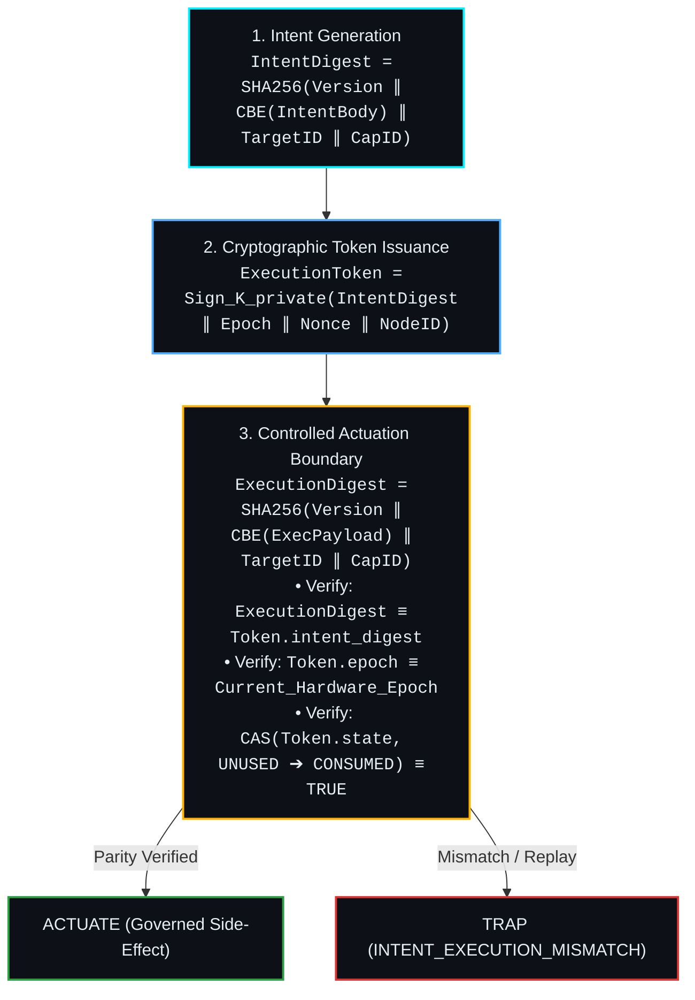
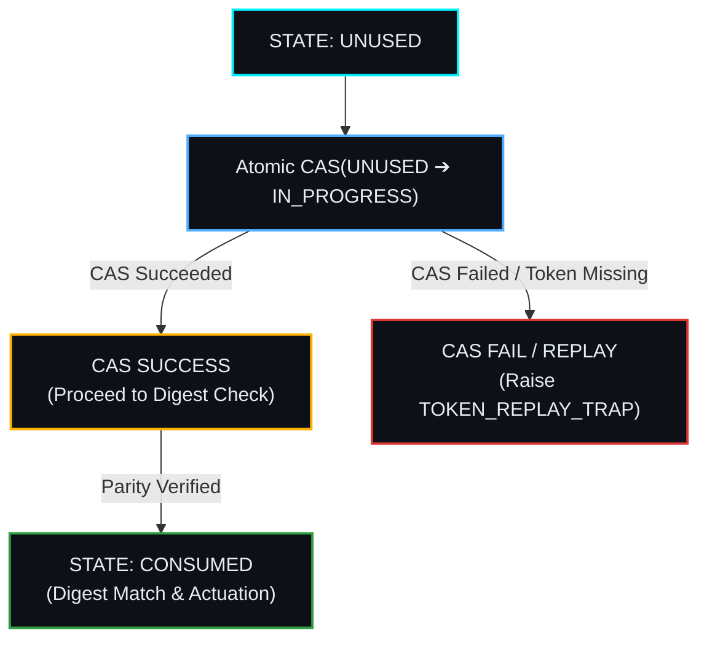

# Gate H: ExecutionToken Cryptographic Structure & Intent-Parity Specification
**Author:** Iradukunda Fils <iradukundafils1@gmail.com>  
**Role:** Systems Architect & Hardware/Software Co-Designer  
**Status:** NORMATIVE SPECIFICATION (PHASE 13 — GATE H)  
**Date:** August 15, 2026  

---

## 1. Executive Summary & Architectural Scope

This specification defines the cryptographic structure, canonical byte encoding, atomic single-use state transitions, and actuation boundary verification rules for the **Cortex ExecutionToken**.

Gate H enforces Invariant $P2$ (**Execution-Intent Cryptographic Parity**):
> The concrete effect that is about to occur at the actuation boundary MUST be cryptographically bound to the authorized `SignedIntent`, the intended authority state, and a single-use `ExecutionToken`. Any byte-level mismatch, epoch drift, or token replay MUST trigger an immediate hardware/kernel TRAP before irreversible execution occurs.

---

## 2. Cryptographic Digest & Binding Formulas



### 2.1 Intent Digest Formula ($D_I$)
$$\text{IntentDigest} = \text{SHA256}\left(\text{Version}_{\text{u8}} \parallel \text{CBE}(\text{IntentBody}) \parallel \text{TargetID}_{\text{u128}} \parallel \text{CapabilityID}_{\text{u128}} \parallel \text{AuthorityEpoch}_{\text{u64}}\right)$$

### 2.2 Execution Digest Formula ($D_E$)
$$\text{ExecutionDigest} = \text{SHA256}\left(\text{Version}_{\text{u8}} \parallel \text{CBE}(\text{ExecutionPayload}) \parallel \text{TargetID}_{\text{u128}} \parallel \text{CapabilityID}_{\text{u128}} \parallel \text{AuthorityEpoch}_{\text{u64}}\right)$$

### 2.3 Actuation Equivalence Invariant ($P2_{\text{local}}$)
$$\text{IntentDigest} == \text{ExecutionDigest}$$
At the controlled driver boundary, if $D_I \ne D_E$, the kernel MUST trigger an immediate `INTENT_EXECUTION_MISMATCH` trap and halt execution before reaching the OS syscall or hardware actuator.

---

## 3. ExecutionToken Structural Schema

```
ExecutionToken {
    version: uint8                      // Protocol version (0x01)
    token_id: UUIDv5                    // Unique token identity (UUIDv5)
    intent_digest: bytes[32]            // SHA-256 digest of authorized Intent (D_I)
    target_id: UUIDv5                   // Identity of actuation target/driver
    capability_id: UUIDv5               // Granted capability identity
    authority_epoch: uint64             // Valid hardware/kernel epoch ceiling
    execution_nonce: bytes[16]          // Cryptographic random nonce for replay defense
    subject_node_id: UUIDv5             // Identity of worker node/process
    issued_at_ns: int64                 // Observational issuing timestamp
    expires_at_ns: int64                // Absolute expiration timestamp
    signature: bytes[64]                // Ed25519 signature over token bytes
}
```

---

## 4. Atomic Consumption State Machine

Single-use enforcement MUST NOT rely on non-atomic boolean checks. The kernel token registry MUST execute an **atomic Compare-And-Swap (CAS)** state transition:



1. **Initial State**: `UNUSED`.
2. **Transition Trigger**: Presentation at actuation boundary.
3. **Atomic Operation**: `compare_and_swap(token.state, UNUSED, CONSUMED)`:
   - If `token.state == UNUSED`, set to `CONSUMED` and return `SUCCESS`.
   - If `token.state != UNUSED` (or token missing from registry), return `FAILED` and raise `EXECUTION_TOKEN_REPLAY_TRAP`.

---

## 5. Controlled Actuation Verification Algorithm

```python
def verify_and_actuate(token: ExecutionToken, execution_payload: dict, driver: DriverAdapter) -> ActuationResult:
    # Step 1: Verify Ed25519 token signature
    if not ed25519_verify(token.signature, token.to_signable_bytes(), PUBLIC_KEY_KERNEL):
        raise SecurityTrap("TOKEN_SIGNATURE_INVALID")
        
    # Step 2: Verify epoch validity against Hardware HEC
    current_epoch = get_hardware_hec_epoch()
    if token.authority_epoch < current_epoch:
        raise SecurityTrap("EXECUTION_TOKEN_EXPIRED_EPOCH")
        
    # Step 3: Compute Execution Digest (D_E) over concrete payload
    execution_digest = compute_execution_digest(
        version=token.version,
        payload=execution_payload,
        target_id=token.target_id,
        capability_id=token.capability_id,
        epoch=token.authority_epoch
    )
    
    # Step 4: Verify Intent Parity (D_I == D_E)
    if not constant_time_compare(token.intent_digest, execution_digest):
        raise SecurityTrap("INTENT_EXECUTION_PARITY_MISMATCH")
        
    # Step 5: Atomic Single-Use Token Consumption (CAS)
    if not token_registry.atomic_consume(token.token_id):
        raise SecurityTrap("EXECUTION_TOKEN_ALREADY_CONSUMED")
        
    # Step 6: Perform Irreversible Driver Actuation
    return driver.actuate(execution_payload)
```

---

## 6. H-Local vs H-Global Security Boundary

To maintain complete architectural honesty:

* **$P2_{\text{local}}$ (Controlled Boundary Parity)**: All execution calls passing through Cortex Guarded Drivers satisfy $D_I == D_E$ and single-use token consumption.
* **$P2_{\text{global}}$ (System-Wide Intent Parity)**: Requires Gate G's OS process sandboxing (`seccomp-bpf` / `landlock`) or WASM runtime isolation so un-mediated side paths (`os`, `socket`, `ctypes`) are physically blocked.
