# Gate I Specification: Cryptographic Causal Witness Chain ($P3$)

**Author:** Iradukunda Fils <iradukundafils1@gmail.com>  
**Role:** Systems Architect & Hardware/Software Co-Designer  
**Status:** NORMATIVE SPECIFICATION (PHASE 13 GATE I)  
**Date:** August 15, 2026  

---

## 1. Overview & Problem Definition

Prior to Gate I, event lineage across the Cortex substrate relied upon structural `causation_id` UUID pointers (Domain Model §4.2). While structural pointers link logical events in a DAG, they fail to provide cryptographic proof against retroactive history modification, re-ordering, event omission, or intent substitution by compromised nodes or local log storage engines.

**Gate I** resolves this gap by replacing structural UUID pointers with an **Append-Only Rolling Cryptographic State Witness Chain ($P3$)**. Every state transition $t \to t+1$ emits a `WitnessEntry` that binds the previous rolling witness $W(t)$, the canonical CBE encoding of the resulting `Event`, and the canonical CBE encoding of the authorizing `SignedIntent`.

---

## 2. Mathematical Definition & Rolling State Chain

### 2.1 Genesis Witness ($W_0$)
The genesis state witness for a node instance is deterministically initialized as:
$$W_0 = \text{SHA256}\left(\text{NS}_{\text{CORTEX}} \;\parallel\; \text{NodeID}_{\text{UUIDv5}} \;\parallel\; \text{Epoch}_{\text{genesis}}\right)$$

### 2.2 Rolling State Transition ($W_{t+1}$)
For any state transition from step $t$ to $t+1$:
$$W_{t+1} = \text{SHA256}\left(W_t \;\parallel\; \text{SHA256}(\text{CBE}(\text{Event}_{t+1})) \;\parallel\; \text{SHA256}(\text{CBE}(\text{SignedIntent}_{t+1}))\right)$$

Where:
* $W_t \in \mathbb{B}^{32}$: 32-byte rolling SHA-256 state witness at step $t$.
* $\text{CBE}(\text{Event}_{t+1})$: Deterministic Canonical Binary Encoding of the concrete execution event.
* $\text{CBE}(\text{SignedIntent}_{t+1})$: Deterministic Canonical Binary Encoding of the authorized intent payload.

---

## 3. Normative Witness Entry Wire Format

A `WitnessEntry` consists of the following fixed binary payload layout prior to signing:

```mermaid
flowchart LR
    subgraph Header["Header Envelope"]
        V["Version (1B)"]
        S["Sequence (8B)"]
        T["Timestamp (8B)"]
        PW["Prev Witness W_t (32B)"]
    end

    subgraph Digests["Cryptographic Digests"]
        ED["Event Digest D_E (32B)"]
        ID["Intent Digest D_I (32B)"]
    end

    subgraph Commitment["Rolling Commitment & Auth"]
        RW["Rolling Witness W_{t+1} (32B)"]
        SIG["Node Signature (32B/64B)"]
    end

    V --- S --- T --- PW
    PW --- ED --- ID
    ID --- RW --- SIG

    style V fill:#0d1117,stroke:#00f2fe,stroke-width:1px,color:#e6edf3
    style S fill:#0d1117,stroke:#00f2fe,stroke-width:1px,color:#e6edf3
    style T fill:#0d1117,stroke:#00f2fe,stroke-width:1px,color:#e6edf3
    style PW fill:#0d1117,stroke:#4facfe,stroke-width:1px,color:#e6edf3
    style ED fill:#0d1117,stroke:#ffb300,stroke-width:1px,color:#e6edf3
    style ID fill:#0d1117,stroke:#ffb300,stroke-width:1px,color:#e6edf3
    style RW fill:#0d1117,stroke:#2ea043,stroke-width:1px,color:#e6edf3
    style SIG fill:#0d1117,stroke:#a371f7,stroke-width:1px,color:#e6edf3
```

### 3.1 Field Specification

| Field | Type | Description |
| :--- | :--- | :--- |
| `version` | `uint8` | Protocol version (`0x01`). |
| `sequence` | `uint64` | Monotonically increasing sequence number ($t+1$). |
| `timestamp_ns` | `uint64` | POSIX nanosecond timestamp of state commit. |
| `prev_witness` | `bytes32` | Previous rolling witness $W_t$. |
| `event_digest` | `bytes32` | $\text{SHA256}(\text{CBE}(\text{Event}_{t+1}))$. |
| `intent_digest` | `bytes32` | $\text{SHA256}(\text{CBE}(\text{SignedIntent}_{t+1}))$. |
| `witness` | `bytes32` | Computed $W_{t+1} = \text{SHA256}(W_t \parallel D_E \parallel D_I)$. |
| `signature` | `bytes` | HMAC-SHA256 / Ed25519 signature over binary signable envelope. |

---

## 4. Verification Algorithm & Adversarial Traps

### 4.1 Verification Invariant
An independent verifier checking a witness log $L = [W_0, W_1, \dots, W_N]$ asserts:

1. **Genesis Parity**: $W_0 \equiv \text{SHA256}(\text{NS}_{\text{CORTEX}} \parallel \text{NodeID} \parallel \text{Epoch}_0)$.
2. **Sequence Monotonicity**: $\forall k \in [1..N], \text{Seq}_k == \text{Seq}_{k-1} + 1$.
3. **Chain Continuity**: $\forall k \in [1..N], W_k.\text{prev\_witness} \equiv W_{k-1}.\text{witness}$.
4. **Digest Parity**: $\forall k \in [1..N], W_k.\text{witness} \equiv \text{SHA256}(W_{k-1}.\text{witness} \parallel W_k.\text{event\_digest} \parallel W_k.\text{intent\_digest})$.
5. **Signature Authenticity**: $\forall k \in [1..N], \text{Verify}(W_k.\text{signable\_bytes}, W_k.\text{signature}, \text{PK}_{\text{node}}) == \text{TRUE}$.

### 4.2 Security Trap Taxonomy ($P3$)

| Attack Vector | Attempted Action | Trapping Mechanism | Security Result |
| :--- | :--- | :--- | :--- |
| **I-TEST-001** | Valid sequential chain | Chain verification passes | `PASS` |
| **I-TEST-002** | Event payload modification | $D_E$ mismatch $\implies W_{t+1}$ re-computation failure | `TRAP_WITNESS_DIGEST_MISMATCH` |
| **I-TEST-003** | Intent payload substitution | $D_I$ mismatch $\implies W_{t+1}$ re-computation failure | `TRAP_INTENT_DIGEST_MISMATCH` |
| **I-TEST-004** | Event deletion / omission | $\text{Seq}_{k} \neq \text{Seq}_{k-1} + 1$ or $W_k.\text{prev\_witness} \neq W_{k-1}$ | `TRAP_WITNESS_CHAIN_BROKEN` |
| **I-TEST-005** | Event re-ordering | Parent witness mismatch at swap boundary | `TRAP_WITNESS_CHAIN_BROKEN` |
| **I-TEST-006** | Signature tampering | Signature verification failure | `TRAP_WITNESS_SIGNATURE_INVALID` |
| **I-TEST-007** | Genesis state tampering | $W_0$ mismatch against node identity | `TRAP_GENESIS_WITNESS_INVALID` |
