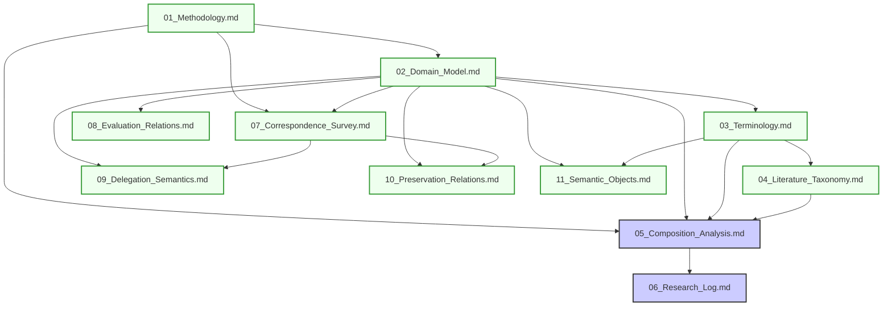

# Documentation Master Plan: Cortex Semantic Layer
**Version:** 1.0.0-Plan  
**Status:** APPROVED  
**Author:** Principal Standards Specification Author & Documentation Architect  

---

## 1. Project Vision

### 1.1 Long-term Objective
Cortex is a vendor-neutral, technology-neutral semantic layer that defines the minimum semantic obligations and contract clauses required whenever autonomous systems exercise delegated authority to produce externally observable, potentially irreversible effects.

Cortex acts similarly to HTTP or OAuth: it does not execute actions or reason about goals; rather, it establishes the formal grammar, invariants, and evidence constraints that conforming runtimes and agents must satisfy to remain safe, verifiable, and bounded.

### 1.2 Intended Audience
*   **Standards Specification Authors:** Individuals authoring extensions or profiles of Cortex.
*   **Systems Architects & Security Officers:** Engineers defining the trust boundary and verification profiles for autonomous systems.
*   **Implementors:** Developers building runtime hosts, authorization agents, event-sourcing engines, or validation gateways conforming to Cortex.
*   **Academic and Policy Reviewers:** Experts evaluating capability systems, safety bounds, and delegated authority controls.

### 1.3 Scope
*   Formalization of delegation bounds (validity, scope limitations, constraints).
*   Definition of "irreversible autonomous effects" and the state validations required preceding them.
*   Required semantic obligations mapping external environments to internal safety properties.
*   Evidentiary standards (proofs of delegation, audit trails, state checkpoints).
*   Observable conformance criteria for execution systems.

### 1.4 Non-Scope
*   Agent reasoning systems, LLM architectures, planning loops, and prompt safety.
*   Orchestration frameworks, workflow schedulers (e.g., Temporal), or thread runtimes.
*   Concrete database structures, storage layers, and network routing protocols.
*   Concrete authorization engines (e.g., OPA, Cedar) or token formats (e.g., Biscuit, JWT) — these represent implementation targets, not the semantic Layer.
*   System deployment, cluster scheduling, or container management.

### 1.5 Documentation Philosophy
The core tenet of the documentation repository is: **Documentation is infrastructure.** 
Documentation must exhibit strict hierarchy, version control, semantic stability, trace links, and clear isolation of domains. No text shall be written without a traceable requirement path.

---

## 2. Documentation Philosophy & Domain Separation

To prevent domain pollution and enforce scientific neutrality, documentation is strictly separated into a sequentially locked Research evidence pipeline. The architecture is frozen. Meta-design discussions are terminated.

```
└── Research/
    ├── 01_Methodology.md          <-- Operational rules & strict stopping criteria
    ├── 02_Domain_Model.md         <-- ICU Baseline, Safety Properties Catalog, Formal Model
    ├── 03_Terminology.md          <-- Formal CS-grounded glossary
    ├── 04_Literature_Taxonomy.md  <-- The 20 intersecting computer science disciplines
    ├── 05_Composition_Analysis.md <-- Standardized analytical testing matrix (CC-05+ FROZEN)
    ├── 06_Research_Log.md         <-- Cumulative evidence, logs, and case updates
    ├── 07_Correspondence_Survey.md <-- Baseline correspondence survey
    ├── 08_Evaluation_Relations.md   <-- Disambiguation of computation and planning systems
    ├── 09_Delegation_Semantics.md   <-- Authority propagation boundaries
    ├── 10_Preservation_Relations.md <-- Taxonomy of CS preservation theorems
    └── 11_Semantic_Objects.md       <-- Categories of mathematical structures
```

*   **Research Domain:** Governed by `01_Methodology.md` and its mandatory stopping rule. Documents 01–04 and 07–11 are locked. Mathematical notation is grounded in established CS primitives (lattice theory, type theory, compiler construction). The name "Cortex" is scrubbed from the active research vocabulary—it functions strictly as a non-normative placeholder for a hypothetical semantic layer that would only exist if adversarial analysis exhaustively proves no existing composition satisfies the domain's safety properties.

---

## 3. Repository Information Architecture

```
/
├── master_plan.md
└── Research/
    ├── 01_Methodology.md
    ├── 02_Domain_Model.md
    ├── 03_Terminology.md
    ├── 04_Literature_Taxonomy.md
    ├── 05_Composition_Analysis.md
    ├── 06_Research_Log.md
    ├── 07_Correspondence_Survey.md
    ├── 08_Evaluation_Relations.md
    ├── 09_Delegation_Semantics.md
    ├── 10_Preservation_Relations.md
    └── 11_Semantic_Objects.md
```

### 3.1 Document Declarations

#### 1. Methodology (`Research/01_Methodology.md`)
*   **Purpose:** Define the epistemological framework (Adversarial Falsification and Elimination), the mandatory Semantic Inversion Stopping Rule, vocabulary discipline, and the status of the target architecture.
*   **Status:** LOCKED.

#### 2. Domain Model (`Research/02_Domain_Model.md`)
*   **Purpose:** Define system boundaries, mutability cases, safety properties (P1–P4), and the SOS derivation rules using the Operational Artifact ($\mathcal{A}$) abstraction.
*   **Dependencies:** `01_Methodology.md`
*   **Status:** LOCKED.

#### 3. Terminology (`Research/03_Terminology.md`)
*   **Purpose:** Ground core domain concepts in reproducible CS primitives, pivoting from synthesis/derivations to Operational Artifacts ($\mathcal{A}$).
*   **Dependencies:** `02_Domain_Model.md`
*   **Status:** LOCKED.

#### 4. Literature Taxonomy (`Research/04_Literature_Taxonomy.md`)
*   **Purpose:** Map 20 foundational computer science disciplines, identifying their theoretical primitives, core guarantees, and boundary limitations.
*   **Dependencies:** `03_Terminology.md`
*   **Status:** LOCKED.

#### 5. Composition Analysis (`Research/05_Composition_Analysis.md`)
*   **Purpose:** Subject the Null Hypothesis to adversarial testing using the Safety Properties Catalog (P1–P4) and Evaluation Relation ($\Sigma; \Lambda \vdash I \Longrightarrow e$) framework against candidate compositions.
*   **Dependencies:** `01_Methodology.md`, `02_Domain_Model.md`, `03_Terminology.md`, `04_Literature_Taxonomy.md`, `07_Correspondence_Survey.md`
*   **Status:** Active.

#### 6. Research Log (`Research/06_Research_Log.md`)
*   **Purpose:** Cumulative evidence log tracking composition evaluations, discoveries, strategic pivots, and cross-composition pattern analysis.
*   **Status:** Active.

#### 7. Correspondence Survey (`Research/07_Correspondence_Survey.md`)
*   **Purpose:** Map semantic correspondence relations across 8 major CS paradigms to verify whether the proof obligation in $H_0$ is unmapped.
*   **Dependencies:** `01_Methodology.md`, `02_Domain_Model.md`
*   **Status:** LOCKED.

#### 8. Evaluation Relations (`Research/08_Evaluation_Relations.md`)
*   **Purpose:** Disambiguate big-step, small-step, and trace semantics, and partition Operational Artifacts ($\mathcal{A}$) into Trees, Traces, and Plans.
*   **Dependencies:** `02_Domain_Model.md`
*   **Status:** LOCKED.

#### 9. Delegation Semantics (`Research/09_Delegation_Semantics.md`)
*   **Purpose:** Taxonomize delegation models (O-Caps, Token delegation, PCA) and identify where they lose coupling with runtimes.
*   **Dependencies:** `02_Domain_Model.md`, `07_Correspondence_Survey.md`
*   **Status:** LOCKED.

#### 10. Preservation Relations (`Research/10_Preservation_Relations.md`)
*   **Purpose:** Catalog preservation theorems (type safety, invariants, refinement, secure compilation, robust safety preservation) to classify the target relation $\Sigma \models \text{Preserves}(\Lambda, e)$.
*   **Dependencies:** `02_Domain_Model.md`, `07_Correspondence_Survey.md`
*   **Status:** LOCKED.

#### 11. Semantic Objects (`Research/11_Semantic_Objects.md`)
*   **Purpose:** Catalog mathematical and logical structures manipulated by different communities to avoid category errors.
*   **Dependencies:** `02_Domain_Model.md`, `03_Terminology.md`
*   **Status:** LOCKED.

---

## 4. Documentation Dependency Graph



---

## 5. Documentation Generation Order

Documents must be authored and individually locked in the sequence below:

1.  **Phase I: Methodology** *(LOCKED)* -> `Research/01_Methodology.md`
2.  **Phase II: Domain Model** *(LOCKED)* -> `Research/02_Domain_Model.md`
3.  **Phase III: Terminology** *(LOCKED)* -> `Research/03_Terminology.md`
4.  **Phase IV: Literature Taxonomy** *(LOCKED)* -> `Research/04_Literature_Taxonomy.md`
5.  **Phase V: Baseline Surveys** *(LOCKED)*
    *   `Research/07_Correspondence_Survey.md`
    *   `Research/08_Evaluation_Relations.md`
    *   `Research/09_Delegation_Semantics.md`
    *   `Research/10_Preservation_Relations.md`
    *   `Research/11_Semantic_Objects.md`
6.  **Phase VI: Composition Analysis** *(Active)* -> `Research/05_Composition_Analysis.md`
7.  **Phase VII: Research Log** *(Active)* -> `Research/06_Research_Log.md`

---

## 6. Repository Governance

### 6.1 Ownership
*   **Documentation Maintainers:** A Technical Steering Committee (TSC) composed of Lead Editors and Domain Experts.
*   **Domain Owners:**
    *   *Research Domain:* Cryptographers / Academic Liaisons.
    *   *Specification Domain:* TSC Editors.
    *   *Architecture Domain:* Systems Architects.
    *   *Implementation Domain:* Developer Working Group.

### 6.2 Versioning
Documents are versioned using a double standard:
1.  **Individual Document State:** Standardized version labels: `v[Major].[Minor].[Patch]-[Maturity Stage]`.
2.  **Repository SemVer:** Releases of the entire specification suite as a coherent package (e.g., `Cortex Spec v1.0.0-RC1`).

### 6.3 Semantic Stability
Once a specification document reaches the `Frozen` state:
*   No breaking modifications can be introduced without incrementing the Major version.
*   Clarifications and typos require a Patch increment.
*   Minor changes (e.g., adding a new non-breaking sub-obligation) require a Minor version increment.

### 6.4 Change Management Process
1.  **Drafting:** Authors create a branch, submit a draft, and trace requirements.
2.  **Linting & Consistency Checks:** Automated validation of links, glossary checks, and capitalization guidelines.
3.  **ADR Phase:** If making an architectural impact, a corresponding ADR must be accepted.
4.  **TSC Review & Promotion:** Gradual transition through the Review Workflow.

---

## 7. ADR Strategy

Every system-defining decision must be backed by an Architectural Decision Record (ADR) stored in `/adrs/`.

### 7.1 ADR Document Schema

```markdown
# ADR [Number]: [Descriptive Title]

## Metadata
*   **Status:** [PROPOSED | ACCEPTED | REJECTED | DEPRECATED | SUPERSEDED]
*   **Date:** YYYY-MM-DD
*   **Authors:** Name <email>
*   **Decisions Impacted:** [Links to other ADRs]
*   **Supersedes:** [Links to superseded ADRs]

## Context
Describe the forces at play, requirements, user requests, or system boundaries driving this decision.

## Decision
Clear, crisp declaration of the direction selected. Use exact, unambiguous statements.

## Alternatives Considered
1. [Alternative 1] - Description, pros, cons, and why rejected.
2. [Alternative 2] - Description, pros, cons, and why rejected.

## Rationale
Why the selected approach is mathematically, semantically, or structurally superior for Cortex.

## Consequences
*   **Positive:** [Benefits]
*   **Negative:** [Drawbacks, limitations]
*   **Risks:** [Security threat model changes]

## Traceability
*   **Requirements Impacted:** [Links to SP elements]
*   **Implementation Impact:** [What conforming runtimes must change]

## References
[Bullet list of RFCs, academic papers, or prior discussions]
```

---

## 8. Documentation Standards

Every document added to `/research/`, `/specification/`, `/architecture/`, or `/implementation/` must structure its markdown matching the layout below:

```markdown
# [Short Domain Identifier]-[Sequence]: [Title in Proper Case]

## Purpose
A one-sentence statement of what this document establishes.

## Audience
Specific target reader groups for this file.

## Scope
Boundaries of definitions within this file.

## Assumptions
Assumed prerequisite conditions (e.g., presence of network layer, valid client cryptographic identities).

## Non-goals
Explicit statements defining what this document does NOT seek to solve.

## Dependencies
*   [Links to preceding documents]

## Decision History
*   **ADR Link:** [ADR-00X]

## Technical Content / Core Logic
[The main body of the document goes here - structured appropriately for the domain]

## Open Questions
Outstanding design questions needing review.

## Future Work
Expected logical expansions of this text.

## References
*   [Citation links]

## Review Checklist
- [ ] Glossary alignment checked
- [ ] No mixed domain concepts
- [ ] All RFC 2119 keywords capitalized
- [ ] Invariants traced to threat model properties
```

---

## 9. Traceability Strategy

No isolated requirements may exist. Every semantic requirement in `/specification/` must trace back to the foundational reasoning that justifies it.

### 9.1 Traceability Flow

```
Domain (e.g., Delegation Verification)
  │
  ▼
Problem (e.g., Unauthenticated state mutation)
  │
  ▼
Threat (e.g., Eavesdropper replays a delegation payload)
  │
  ▼
Safety Property (e.g., Freshness & Signature Integrity)
  │
  ▼
Invariant (e.g., Delegation tokens must contain nonces and valid cryptosignatures)
  │
  ▼
Residual Obligation (e.g., Enforcement runtime must parse, signature-validate, and de-duplicate nonces)
  │
  ▼
Semantic Requirement (e.g., SP-001.2: "The Host MUST verify ...")
```

### 9.2 Tracing Implementation Matrix
Each requirement block in `SP-XXX` must append a traceability footnote:
`[Trace: Problem-X -> Threat-Y -> Safety-Z -> Invariant-W]`

---

## 10. Terminology Strategy

### 10.1 Glossary Ownership
`Research/03_Terminology.md` is owned by the TSC. No document may define a term that is not listed in `Research/03_Terminology.md`.

### 10.2 Naming Protocol
*   Terms must use **CamelCase** or **ScreamingSnake** when referring to protocol variables/states, and standard lowercase in text.
*   Terms must remain strictly consistent across documents (e.g., do not alternate between "Agent Host", "Execution Host", and "Execution Plan"; pick one and enforce it).

### 10.3 Entry Template
```markdown
### [Term Name]
*   **Definition:** [Unambiguous description of the term]
*   **Related Concepts:** [Links to other terms]
*   **Examples:** [Concrete representation]
*   **Non-Examples:** [What this is often confused with, and why it is not that]
```

---

## 11. Review Workflow

All documents progress through the following status states before freezing:

```
┌─────────┐     ┌──────────────────┐     ┌─────────────────┐
│  Draft  ├────>│ Technical Review ├────>│ Semantic Review │
└─────────┘     └────────┬─────────┘     └────────┬────────┘
                         │                        │
                         ▼                        ▼
┌─────────┐     ┌──────────────────┐     ┌─────────────────┐
│ Frozen  │<────│     Approved     │<────│ Normative Conv. │
└─────────┘     └──────────────────┘     └─────────────────┘
```

1.  **Draft:** Initial layout, open tags, subject to rapid structure changes.
2.  **Technical Review:** Reviewed by subject matter experts (e.g., security logic audited).
3.  **Semantic Review:** Reviewed for proper domain separation and absence of conceptual invention.
4.  **Consistency Review (Normative Conv.):** Check glossary compliance and RFC 2119 keywords.
5.  **Approved:** Ratified by the TSC. Ready for active build integration.
6.  **Frozen:** Read-only historical specification state, mutable only via major standard release revisions.

---

## 12. Documentation Maturity Model

Each document must display its maturity rating prominently at the top:

| Maturity Stage | Description | Exit Requirements |
|---|---|---|
| **Draft**| Exploratory / unstable content | Complete technical coverage. |
| **Reviewed** | Logic validated | Verification by independent audit. |
| **Stable** | Standard semantic contracts | Zero modifications for 90 days. |
| **Normative** | Complete official rule book | Formal ratification by TSC. |
| **Frozen** | Unchanging standard | Immutable except via major versioning change rules. |

---

## 13. Documentation Quality Rules

1.  **Objective Tone:** Do not use marketing adjectives (e.g., "fast", "powerful", "innovative", "agentic"). State properties quantitatively or semantically (e.g., "The Host MUST verify signature integrity in less than O(N) operations").
2.  **Evidence-Based:** Every claim of safety must be backed by a theoretical safety property or a mathematical proof.
3.  **Technology Neutrality:** Keep details focused on abstract contracts. Do not assume any programming language (e.g., Go, Rust), runtime platform, or cloud host unless in the specific Implementation domain.
4.  **Semantic Stability Check:** If a proposed change in a specification file modifies an implementation requirement, you must increment the minor or major version of that document.

---

## 14. Review Questions

Every technical document must conclude with a "Reviewer Questions" section containing baseline testing prompts to stimulate peer critique:
*   *What are the fallback behaviors when this safety invariant is broken?*
*   *What are the potential performance bottlenecks that conforming systems might face under these safety obligations?*
*   *How does this requirement behave in partially disconnected or split-brain networking topologies?*
*   *Does this obligation contradict or duplicate any requirement defined in SP-00X?*

---

## 15. Future Documentation Roadmap

The progression of Cortex documentation is structured into the following sequential milestones:

*   **Milestone A: Constitutional Agreement**
    *   *Deliverables:* `master_plan.md`, `Research/03_Terminology.md`.
    *   *Exit Gate:* Complete validation framework approval by TSC.
*   **Milestone B: Security Core Foundations (Research)**
    *   *Deliverables:* Baseline semantic surveys (`Research/07_Correspondence_Survey.md`, `Research/08_Evaluation_Relations.md`, `Research/09_Delegation_Semantics.md`, `Research/10_Preservation_Relations.md`, `Research/11_Semantic_Objects.md`).
    *   *Exit Gate:* External CS reviewers validate baseline survey gaps.
*   **Milestone C: Contract Normative Release (Specification)**
    *   *Deliverables:* Core semantic obligations, verification protocol, and conformance metrics.
    *   *Exit Gate:* Release of version 1.0.0-Normative suite.
*   **Milestone D: Blueprint Topologies (Architecture & Implementation)**
    *   *Deliverables:* Security topological diagrams, reference blueprints.
    *   *Exit Gate:* Verification suite confirms reference implementations meet all SP requirements.
