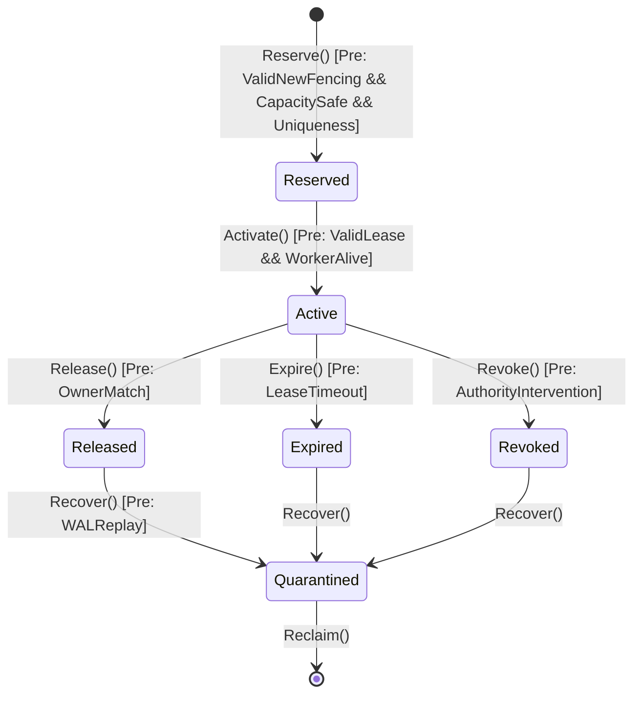

# Research Note 21: Phase 7.3 Concrete Python Resource Authority Refinement Specification & Abstraction Mapping

**Author:** Cortex Formal Verification & Subsystem Architecture Team  
**Date:** August 27, 2026  
**Status:** Authorized Research / Concrete Refinement Contract ($R(C_{\text{Python}}, A_{\text{Coq}})$)  
**Prerequisite:** Phase 7.2 Coq Model (`verification/Phase7Reservation.v`) — **MACHINE-CHECKED PROVEN (0 Axioms, 0 Admits)**

---

## 1. Governance & Boundary Formalization

### 1.1 Formal Separation of Governance Domains
$$\boxed{ \text{Telemetry} \neq \text{Authority} \neq \text{Enforcement} \neq \text{Execution} }$$

```
Hardware / OS Substrate
          │ (Hardware metrics / NVML / /proc)
          ▼
     Telemetry / Observation Layer (Non-Authoritative)
          │ (Normalized vectors: obs_r, epsilon, delta_max)
          ▼
     Resource Authority Kernel (C_Python)  <─── α ───> Coq Formal FSM (A_Coq)
          │ (Authoritative S_R: R, U, Q_R, E_A, E_L, G, D)
          ▼
     Reservation Contracts & Fencing Tokens (Epochs, Gens, Leases)
          │
          ▼
     Physical Placement Engine (Phase 7.6 Scheduler)
          │
          ▼
     Runtime Enforcement Substrate (Phase 7.4 cgroups / CUDA stream fences)
          │
          ▼
     Worker Execution Substrate (Go / Rust / Sandboxed PTY)
```

### 1.2 Formal Proof Scope & Exclusive GPU Ownership Boundaries
$$\boxed{ \text{Phase 7.2 GPU Safety Theorem} = \text{Exclusive Logical Device Ownership} }$$

$$\boxed{ \forall g \in \text{GPUId},\quad |\{r \in R \mid \text{Owner}(g) = r \land \text{Active}(r)\}| \le 1 }$$

> [!IMPORTANT]
> The Phase 7.2 Coq proof guarantees single-owner safety for exclusive logical device assignment. It **does not** automatically prove fine-grained hardware sharing models (e.g., NVIDIA MIG partitions, CUDA time-slicing, or vGPU contexts). Extensions to shared GPU contexts require a multi-capacity vector extension in Phase 7.4.

---

## 2. Concrete-to-Abstract Mapping Table & Abstraction Function $\alpha$

### 2.1 State Field Mapping & Proof Obligations

| Python Field ($C_{\text{Python}}$) | Abstract Coq Field ($A_{\text{Coq}}$) | Authoritative? | Derived? | Proof / Invariant Obligation |
| :--- | :--- | :--- | :--- | :--- |
| `self._reservations: Dict[ResID, ReservationRecord]` | $R \in \text{list Reservation}$ | **Yes** | No | $P_{1a}$ (Inv Uniqueness), $P_{1b}$ (Att Uniqueness), $P_{12}$ (ID Stability) |
| `self._used_capacity: Dict[ResType, int]` | $U \in \mathbb{N}$ | **Yes** | No | $P_2$ (Capacity Safety), $P_3$ (Conservation) |
| `self._quarantine: Dict[ResID, QuarantineRecord]` | $Q_R \in \text{list Quarantine}$ | **Yes** | No | $P_5, P_{10}$ (Durable Replay & Non-Resurrection) |
| `self._authority_epoch: int` | $E_A \in \text{Epoch}$ | **Yes** | No | $P_6$ (Invalid Fencing Rejection), $P_{14}$ (Auth Monotonicity) |
| `self._lease_epochs: Dict[InvID, Epoch]` | $E_L \in \text{list } (\text{InvID} \times \text{Epoch})$ | **Yes** | No | $P_6, P_{14}$ (Lease Monotonicity & Fencing) |
| `self._worker_generations: Dict[WorkerID, Gen]` | $G \in \text{list } (\text{WorkerID} \times \text{Gen})$ | **Yes** | No | $P_7$ (Worker Incarnation Fencing) |
| `self._gpu_owners: Dict[GPUId, ResID]` | $D \in \text{list } (\text{GPUId} \times \text{ResID})$ | **Yes** | No | $P_{11}$ (Single GPU Ownership) |
| `self._capability_index: CapabilityIndex` | $f(S_R)$ | No | **Yes** | Read-View Consistency w.r.t. $S_R$ |
| `self._telemetry_cache: TelemetryCache` | External Observation | No | **Yes** | $P_8, P_9$ (Conservative Telemetry Bound) |

---

### 2.2 Abstraction Function $\alpha: C_{\text{Python}} \to A_{\text{Coq}}$

For any concrete Python Resource Authority instance $c \in C_{\text{Python}}$, the abstraction function $\alpha(c)$ constructs the abstract state $s = \langle R, U, Q_R, E_A, E_L, G, D \rangle \in A_{\text{Coq}}$ via:

1. $\alpha(c).R = \text{values}(c.\mathtt{\_reservations})$ translated to Coq `Reservation` records.
2. $\alpha(c).U = c.\mathtt{\_used\_capacity}[\text{scalar\_resource}]$.
3. $\alpha(c).Q_R = \text{entries}(c.\mathtt{\_quarantine})$.
4. $\alpha(c).E_A = c.\mathtt{\_authority\_epoch}$.
5. $\alpha(c).E_L = \text{pairs}(c.\mathtt{\_lease\_epochs})$.
6. $\alpha(c).G = \text{pairs}(c.\mathtt{\_worker\_generations})$.
7. $\alpha(c).D = \text{pairs}(c.\mathtt{\_gpu\_owners})$.

---

## 3. Concrete Simulation Relation $R(C_{\text{Python}}, A_{\text{Coq}})$ & Transition Contracts

### 3.1 Simulation Relation Definition
$$\boxed{ R(c, a) \iff \alpha(c) = a \;\land\; \text{Invariant}(a) }$$

Forward simulation theorem to be established by the Python runtime FSM monitor:
$$\boxed{ R(c, a) \land c \xrightarrow{op} c' \implies \exists a',\; a \xrightarrow{op^*} a' \land R(c', a') }$$

---

### 3.2 Pre/Post Condition Contracts & Linearization Points



#### Operation Pre/Post Contracts

1. **`Reserve(r)` / `ReserveGPU(r, g)`**:
   - **Preconditions**:
     - $\text{ValidNewReservationFencing}(s, r) \equiv (e_A(r) = E_A) \land (g(r) = G(w)) \land (e_L(r) > E_L(i))$
     - $\text{sum\_active\_demand}(s) + d_r + U \le \text{Capacity} - M^{\text{safety}} - E^{\text{uncertainty}}$
     - $\text{count\_active\_for\_inv}(s, i) = 0 \land \text{count\_active\_for\_attempt}(s, a) = 0$
     - $\text{gpu\_owned\_by}(s, g) = \text{None}$ (for `ReserveGPU`)
   - **Linearization Point ($LP$)**: Atomic mutation of $c.\mathtt{\_reservations}$ under the authority state mutex.
   - **Postconditions**:
     - $r \in \alpha(c').R \land \text{res\_status}(r) = \text{StatusActive}$
     - $E'_L(i) = e_L(r)$
     - $D' = (g, \text{res\_id}(r)) :: D$ (for `ReserveGPU`)

2. **`Release(target_id)`**:
   - **Preconditions**: $\text{res\_id}(r) = \text{target\_id} \land \text{res\_status}(r) = \text{StatusActive}$
   - **Linearization Point ($LP$)**: Atomic update of reservation status to `StatusReleased` and removal from $c.\mathtt{\_gpu\_owners}$.
   - **Postconditions**:
     - $\text{res\_status}(\text{target\_id}) = \text{StatusReleased}$
     - $\text{demand\_contribution}(\text{target\_id}) = 0$
     - $\text{gpu\_release}(D, \text{target\_id})$ removes target from GPU map.

3. **`Expire(target_id)`**:
   - **Preconditions**: $\text{now}() > \text{lease\_expiry}(\text{target\_id})$
   - **Postconditions**: Status transitions to `StatusExpired`, GPU released, capacity reclaimed.

4. **`Revoke(target_id)`**:
   - **Preconditions**: Preempted or fence invalidated ($e_A(r) < E_A$).
   - **Postconditions**: Status transitions to `StatusRevoked`, immediate quarantine.

5. **`AuthoritySuccession(new_epoch)`**:
   - **Preconditions**: $\text{new\_epoch} > E_A$
   - **Postconditions**: $E'_A = \text{new\_epoch}$, stale authority tokens rejected ($P_6$).

---

## 4. Phase 7.3 Adversarial Concrete Test Matrix (18 Test Vectors)

| Test Vector ID | Category | Scenario / Fault Vector | Expected Behavioral & Invariant Result |
| :--- | :--- | :--- | :--- |
| **TV-73-01** | Concurrency | Two simultaneous `Reserve` requests for same InvocationId | 1 succeeds, 1 rejected ($P_{1a}$) |
| **TV-73-02** | Concurrency | Two simultaneous `Reserve` requests for same AttemptId | 1 succeeds, 1 rejected ($P_{1b}$) |
| **TV-73-03** | Fencing | `Reserve` with stale authority epoch ($e_A < E_A$) | Rejected with `InvalidFencingError` ($P_6$) |
| **TV-73-04** | Fencing | `Reserve` with non-monotonic lease epoch ($e_L \le E_L$) | Rejected with `StaleLeaseEpochError` ($P_{14}$) |
| **TV-73-05** | Fencing | `Reserve` with stale worker generation ($g \neq G(w)$) | Rejected with `StaleGenerationError` ($P_7$) |
| **TV-73-06** | GPU Safety | `ReserveGPU` on already owned GPU | Rejected with `GPUCollisionError` ($P_{11}$) |
| **TV-73-07** | GPU Safety | `Release` of GPU reservation | GPU returned to unassigned pool ($P_{11}$) |
| **TV-73-08** | Accounting | Exceed capacity safety limit ($d_r + U > \text{Schedulable}$) | Rejected with `InsufficientCapacityError` ($P_2$) |
| **TV-73-09** | Release | Release by unauthorized caller ID | Rejected; state untouched |
| **TV-73-10** | Release | Double release of same ReservationId | Idempotent / Second release is no-op |
| **TV-73-11** | Expiry | Expiry triggered during active worker execution | Status $\to$ `StatusExpired`, capacity reclaimed ($P_{13}$) |
| **TV-73-12** | Revocation | Revoke triggered by epoch succession | Status $\to$ `StatusRevoked`, fenced out ($P_6$) |
| **TV-73-13** | Recovery | Process crash and WAL replay | Rebuilt state satisfies $\alpha(C) = A$ ($P_{10}$) |
| **TV-73-14** | Recovery | Terminal reservation resurrection attempt | Blocked during recovery ($P_{10}$) |
| **TV-73-15** | Accounting | Reservation leak check after 100k transitions | Total memory / reservation count bounded ($P_4$) |
| **TV-73-16** | Telemetry | Stale telemetry update during admission | Schedulable capacity bound strictly holds ($P_9$) |
| **TV-73-17** | Stress | 10,000 concurrent threads acquiring/releasing | Zero race conditions; FSM monitor invariants hold |
| **TV-73-18** | Authority | Multi-phase `AuthoritySuccession` burst | Authority epoch monotonically increments ($P_{14}$) |

---

## 5. Acceptance & Phase Sign-Off Chain

$$\boxed{ \text{Phase7Reservation.v (PROVEN)} \rightarrow \alpha(C_{\text{Python}}) \rightarrow R(C,A) \rightarrow \text{Python Runtime Monitor} \rightarrow \text{18-Vector Test Suite} }$$
