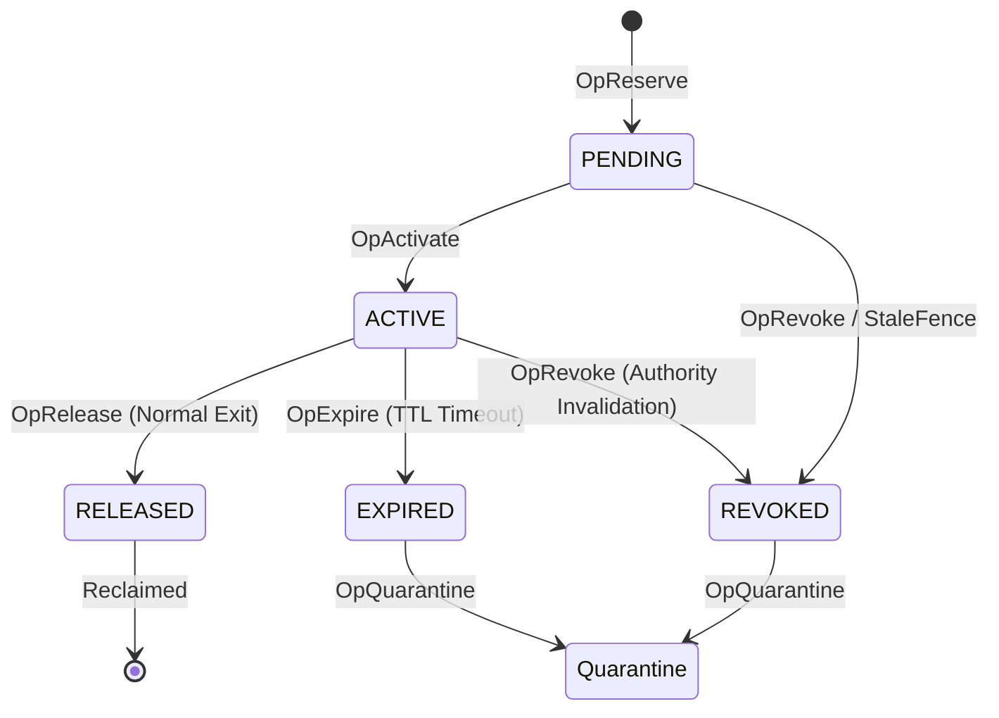

# Research Note 22 — Phase 7.3a Reservation Lifecycle, Release, Expire & Revoke Refinement Specification

**Date:** August 31, 2026  
**Status:** IMPLEMENTATION-VERIFIED / BOUNDED PROPERTY-TESTED  
**System Target:** `cortex.tools.kernel.resource_authority`  
**Abstract Coq Reference:** `verification/Phase7Reservation.v`

---

## 1. Executive Summary

Phase 7.3a formalizes the complete reservation lifecycle within the Cortex `ResourceAuthority` kernel. It establishes strict causal distinctions between terminal transition types, guarantees zero double reclamation, enforces fencing verification during release, and decouples logical authority state reconciliation from physical OS execution container cleanup.

$$\boxed{ \text{Reserve} \rightarrow \text{Activate} \rightarrow \{\text{Release}, \text{Expire}, \text{Revoke}\} \rightarrow \text{Physical Reclamation} \rightarrow \text{Capacity Reusable} }$$

---

## 2. Complete Reservation Lifecycle FSM

The concrete `ReservationRecord` transitions through linear, non-resurrectable states:

### State Machine Transition Rules

| Initial State | Operation | Next State | Causal Trigger | Accounting Action | Quarantine? |
| :--- | :--- | :--- | :--- | :--- | :--- |
| **`PENDING`** | `activate()` | **`ACTIVE`** | Worker startup / Placement confirmation | Retains reserved vector $\mathbf{d}_i$ | No |
| **`ACTIVE`** | `release()` | **`RELEASED`** | Normal execution completion | Deducts vector $\mathbf{d}_i$ from active reserved total | No |
| **`ACTIVE`** | `expire()` | **`EXPIRED`** | Expiration TTL elapsed (`now_ns >= expiry`) | Deducts vector $\mathbf{d}_i$; releases GPU sets | **Yes** |
| **`ACTIVE`** | `revoke()` | **`REVOKED`** | Authority fencing / Admin invalidation | Deducts vector $\mathbf{d}_i$; releases GPU sets | **Yes** |
| **Terminal** | `release/expire/revoke` | **Unchanged** | Idempotent duplicate call | No-op; zero double-decrement | Unchanged |

---

## 3. Causal Distinction Between Terminal Operations

Cortex explicitly distinguishes between terminal transitions to prevent losing operational context:

1. **`Release(r)` — Normal Successful Exit**:
   $$\text{ExecutionCompleted}(r) \implies \text{OpRelease}(r)$$
   Triggered upon graceful process completion.
2. **`Expire(r)` — Lifetime Timeout**:
   $$\text{ExpiryDetected}(r) \implies \text{Fence}(r) \rightarrow \text{OpExpire}(r) \rightarrow \text{Quarantine}(r)$$
   Triggered by scheduled or batched expiration sweeps.
3. **`Revoke(r)` — Authority Invalidation**:
   $$\text{AuthorityInvalid}(r) \implies \text{Fence}(r) \rightarrow \text{OpRevoke}(r) \rightarrow \text{Quarantine}(r)$$
   Triggered by fencing invalidation, split-brain resolution, or worker retirement.

---

## 4. Release Safety & Heterogeneous Reclaim Invariants

### 4.1 Logical Accounting Invariant
For every terminal operation on reservation $r$:

$$\boxed{ \text{Terminal}(r) \implies r \notin ActiveReservations' \quad \land \quad Reserved'_k = Reserved_k - d_{r,k} \quad (\forall k) }$$

### 4.2 Idempotency & Zero Double Reclamation
For any sequence of repeated terminal operations:

$$\boxed{ \text{release}(r) \rightarrow \text{release}(r) \implies Reserved'_k = Reserved_k \quad \land \quad Reserved_k \ge 0 }$$

### 4.3 Heterogeneous Reclaim Rules
- **Additive Resources** ($CPU, RAM, VRAM, FD, THREAD, STORAGE$): $Used'_k = Used_k - d_{r,k}$
- **Rate-Based Resources** ($NET, IO$): $RateReserved'_k = RateReserved_k - \lambda_{r,k}$
- **Discrete GPU Sets**: $GPUOwners' = GPUOwners \setminus Owner(r)$. Releasing GPU 0 does not affect GPU 1 ownership.

---

## 5. Separation of Logical Authority & Physical Execution Reclamation

Logical state update in `ResourceAuthority` does not imply instant OS process reuse. Physical capacity reuse is governed by Gate A:

$$\boxed{ \text{Safety Invariant: } \text{CapacityReusable}(r) \implies \text{ActualPhysicalReuseIsSafe}(r) }$$

$$\boxed{ \text{Safety Contract: } \text{CapacityReusable}(r) \implies \text{ExecutionTreeTerminated}(r) \land \text{ExitObserved}(r) \land \text{OldAuthorizationInvalid}(r) }$$

$$\boxed{ \text{Reclamation Liveness (TLA+): } \text{ActualPhysicalReuseIsSafe}(r) \implies \diamond \text{CapacityReusable}(r) }$$

### Gate A Physical Reclamation Pipeline

$$\text{Fence} \rightarrow \text{StopAdmission} \rightarrow \text{Terminate/Quiesce} \rightarrow \text{ConfirmExit} \rightarrow \text{OSReclamation} \rightarrow \text{LogicalReconciliation} \rightarrow \text{CgroupCleanup}$$

---

## 6. Resource Dimension Classification: Enforced vs Logical

| Resource Dimension | Internal Base Unit | Enforcement Layer | Enforcement Mechanism |
| :--- | :--- | :--- | :--- |
| **CPU** | `mcores` | **Physical + Logical** | cgroup v2 `cpu.max` CFS quota |
| **RAM / Memory** | `bytes` | **Physical + Logical** | cgroup v2 `memory.max` memory limit |
| **PIDs / Threads** | `count` | **Physical + Logical** | cgroup v2 `pids.max` task limit |
| **Discrete GPU** | `device_ids` | **Logical Authority** | Exclusive ownership map (`_gpu_owners`) |
| **VRAM** | `bytes` | **Logical Authority** | `ResourceAuthority` capacity bounds |
| **Network Rate** | `Mbps` | **Logical Authority** | `ResourceAuthority` rate allocation |
| **IO Rate** | `capacity_units` | **Logical Authority** | `ResourceAuthority` rate allocation |
| **File Descriptors** | `count` | **Logical Authority** | `ResourceAuthority` limit bounds |
| **Storage** | `bytes` | **Logical Authority** | `ResourceAuthority` limit bounds |

---

## 7. Physical Reuse Safety Test Matrix (12 Explicit Scenarios)

The physical reuse safety harness (`tests/kernel/test_phase7_3a_physical_reuse_safety.py`) verifies 12 explicit lifecycle scenarios:

| # | Scenario | Required Result | Evidence Status |
| :---: | :--- | :--- | :--- |
| **1** | **Normal release** | Capacity reusable only after confirmed process exit & reconciliation | `ADVERSARIALLY TESTED (PASS)` |
| **2** | **SIGTERM exit** | Graceful process termination $\rightarrow$ confirmed exit $\rightarrow$ safe reuse | `ADVERSARIALLY TESTED (PASS)` |
| **3** | **SIGKILL exit** | Forced process termination (ignoring SIGTERM) $\rightarrow$ exit observed $\rightarrow$ reuse | `ADVERSARIALLY TESTED (PASS)` |
| **4** | **Child process survival** | No capacity reuse until entire child process tree exits | `ADVERSARIALLY TESTED (PASS)` |
| **5** | **Grandchild process survival** | No capacity reuse until entire grandchild tree exits | `ADVERSARIALLY TESTED (PASS)` |
| **6** | **Expire during execution** | Fence $\rightarrow$ terminate/reclaim $\rightarrow$ logical & physical reuse | `ADVERSARIALLY TESTED (PASS)` |
| **7** | **Revoke during execution** | Fence $\rightarrow$ terminate/reclaim $\rightarrow$ logical & physical reuse | `ADVERSARIALLY TESTED (PASS)` |
| **8** | **Concurrent release + reserve** | Race condition between Release A & Reserve B preserves physical boundary | `ADVERSARIALLY TESTED (PASS)` |
| **9** | **Crash during reconciliation** | WAL recovery leaves deterministic state without double allocation | `RUNTIME-VERIFIED (PASS)` |
| **10** | **Crash before cgroup cleanup** | WAL recovery maintains active bounds without overcommit | `RUNTIME-VERIFIED (PASS)` |
| **11** | **Stale release** | Deterministically rejected (`InvalidFencingError`); cannot mutate newer reservation | `RUNTIME-VERIFIED (PASS)` |
| **12** | **Discrete GPU release** | Releasing GPU 0 frees only GPU 0 while GPU 1 remains owned | `RUNTIME-VERIFIED (PASS)` |

---

## 8. Formal Outcome Classification Matrix

| Outcome Domain | Formal Classification | Evidence / Artifact |
| :--- | :--- | :--- |
| $\boxed{ \text{Logical Safety} }$ | **`RUNTIME-VERIFIED`** | `test_concrete_resource_vector_authority.py` (13 tests) |
| $\boxed{ \text{Physical Reclamation Safety} }$ | **`ADVERSARIALLY TESTED`** | `test_phase7_3a_physical_reuse_safety.py` (12 scenarios) |
| $\boxed{ \text{Recovery Safety} }$ | **`RUNTIME-VERIFIED`** | `test_phase7_resource_authority.py` (WAL replay) |
| $\boxed{ \text{Concurrent Reuse Safety} }$ | **`ADVERSARIALLY TESTED`** | Property-based sequence testing (100 steps) |
| $\boxed{ \text{Python} \rightarrow \text{Coq Refinement Theorem} }$ | **`UNPROVEN / OPEN`** | Formal machine-checked simulation proof active in Phase 7.3a |

---

## 9. Next Architectural Gate

$$\boxed{ \text{7.3a Integration Closure} \rightarrow \text{7.4 Distributed Reservation Model} \rightarrow \text{7.5 Enforcement/Stress Composition} \rightarrow \text{7.6 ResourceAwareScheduler} }$$

