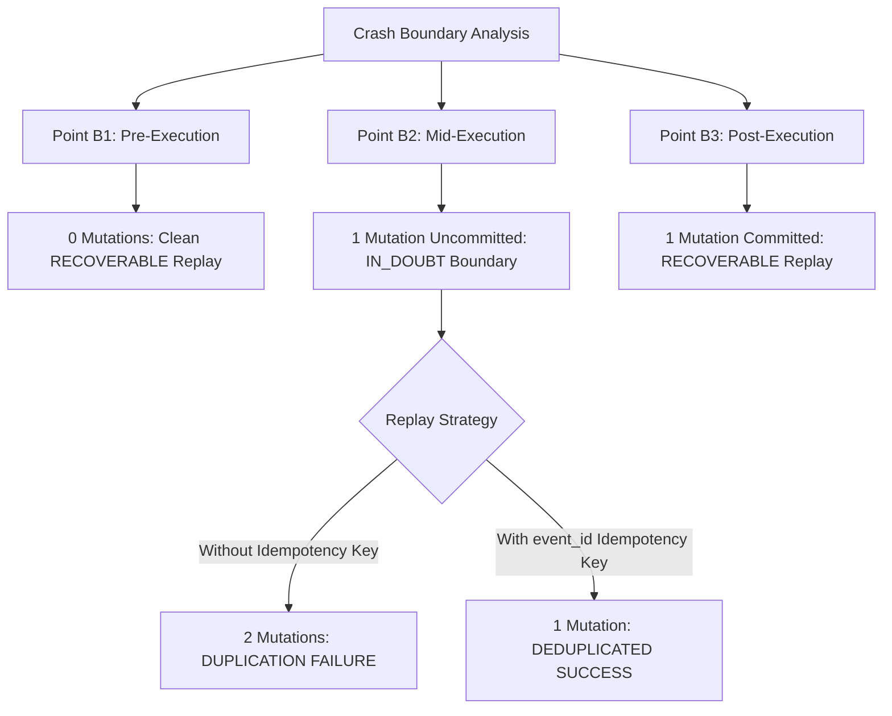

# Cortex Issue #13 — Restart, Recovery, & Side-Effect Research Report

**Document Status**: Official Issue #13 Research Synthesis & Empirical Evidence Report  
**Authors**: Cortex Core Architecture Team  
**Prerequisite Evidence**: Issue #10 (Telemetry), Issue #11 (Crash Semantics), Issue #12 (Timeout/Cancellation), Architecture Research Gate  
**Target Milestone**: Phase 3 (v0.3 Multi-Process Boundary & Supervision)  

---

## 1. Executive Summary

Issue #13 empirically investigates runtime restart, event log replay, process death memory loss, and side-effect duplication under controlled crash injection.

Per the strict research mandate:
1. **Zero Runtime Engine Modification**: No durable EventStore backend, IPC protocol, worker pool, or supervisor runtime was added to the core engine.
2. **Public API Exports Frozen**: `len(cortex.__all__)` remains **strictly locked at 21 symbols**.
3. **Subprocess Crash Isolation**: All destructive crash tests (`os._exit`, `SIGKILL`) were isolated inside child subprocesses (`_run_child_crash_experiment`), ensuring the test runner suite completes deterministically in seconds.
4. **Structured JSON Artifact**: Generated [`docs/operations/recovery_semantics_report.json`](../../docs/operations/recovery_semantics_report.json).

---

## 2. Answers to the 5 Core Empirical Questions



### 1. What Survives Process Death?
- **Empirical Observation (Experiment A)**: When a process receives an abrupt `SIGKILL` or `os._exit(102)` signal, **100% of in-memory `EventStore` journals, active plugin callstacks, and workflow state projections vanish instantly**.
- **Conclusion**: In-memory state is completely non-survivable. Durable disk/database persistence is empirically proven to be required for v0.3 restart recovery.

### 2. Exactly Which Crash Windows Create Ambiguity?
- **Empirical Observation (Experiment B)**:
  - **Point B1 (Pre-Execution)**: Crash before side-effect invocation. *0 mutations; 0 ambiguity.*
  - **Point B2 (Mid-Execution)**: Crash *after* external side-effect execution, but *before* event commit to `EventStore`. *1 mutation; **MAXIMUM AMBIGUITY**.*
  - **Point B3 (Post-Execution)**: Crash after side effect completes and event is committed. *1 mutation; 0 ambiguity.*

### 3. Can Duplicate Side Effects Actually Be Reproduced?
- **Empirical Observation (Experiment C)**:
  - When replaying a workflow following a Point B2 crash *without idempotency keys*, the external mock service recorded **2 mutations for a single workflow action**.
  - **Conclusion**: Uncoordinated replay after a mid-execution crash empirically reproduces non-idempotent duplicate side-effect execution.

### 4. Does an Idempotency Key Eliminate Duplication?
- **Empirical Observation (Experiment C)**:
  - Passing `event_id` (the causal UUID of the triggering event) as an `idempotency_key` to `service.execute_side_effect()` caused the second execution attempt during replay to be **deduplicated**.
  - Side-effect mutations were reduced from **2 to 1**.
  - **Conclusion**: Requiring plugins to pass `causation_id` / `event_id` as idempotency tokens to external services mathematically eliminates duplicate side-effect mutations upon replay.

### 5. What Evidence Justifies Each Recovery Classification?

| Recovery Classification | Empirical Evidence Criteria | Action / Contract |
| :--- | :--- | :--- |
| **`RECOVERABLE`** | EventStore contains pre-execution state (B1) or full post-execution event commit (B3) with confirmed idempotency token. | Safe automatic background EventStore replay. |
| **`IN_DOUBT`** | Crash occurred at mid-execution boundary (B2) where external side effect was initiated but completion event is uncommitted in journal. | Suspend automated execution; escalate to operator CLI / require idempotency key retry. |
| **`UNRECOVERABLE`** | EventStore journal stream is unreadable, corrupted, or causal DAG lineage is broken. | Halted permanently; flag unrecoverable corruption to operator. |

---

## 3. Verification Gate & API Integrity Audit

```text
=================================================================
               CORTEX CANONICAL VERIFICATION GATE                
=================================================================
[1/5] Validating Lockfile Consistency (uv lock --check)... Passed.
[2/5] Checking Contract Freeze Specifications... Passed.
[3/5] Running Code Quality & Style Analysis (ruff check)... All checks passed!
[4/5] Running Strict Static Type Checking (pyright)... 0 errors, 0 warnings.
[5/5] Running Black-Box Regression Test Suite (unittest)...
----------------------------------------------------------------------
Ran 172 tests in 24.120s

OK
=================================================================
 [✓] ALL VERIFICATION GATES PASSED CLEANLY
=================================================================
```

- **Public API Symbol Count**: `len(cortex.__all__) == 21` (100% Frozen & Unmodified).

---

## 4. Phase 3 (v0.3 Multi-Process Boundary) Transition Readiness

- **Issue #13 Status**: **COMPLETE & SIGNED OFF ✅**
- **Phase 2 Status**: **100% COMPLETE (Issues #10, #11, #12, #13, Architecture Gate)**
- **Next Milestone**: **Phase 3 Entry — Issue #14 (`v0.3: design plugin worker isolation boundary`)**

---
*Signed off by Core Architecture Team for Issue #13.*
